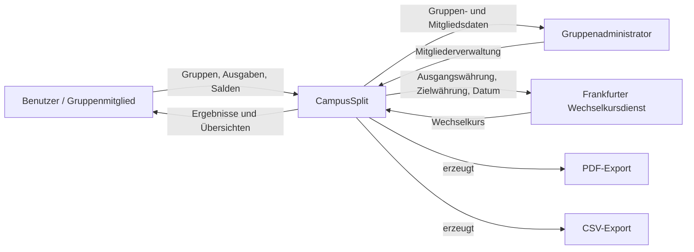
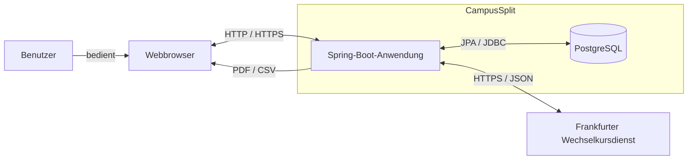
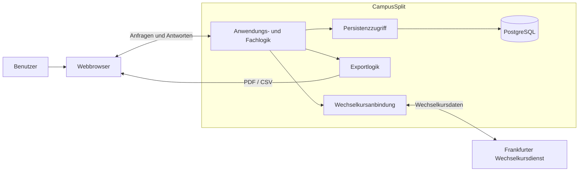

# 3 Kontextabgrenzung

Kapitel 3 beschreibt, wie CampusSplit mit seiner Umgebung interagiert. Dabei wird zwischen fachlichem und technischem Kontext unterschieden:

1. **Fachlicher Kontext:** Welche Akteure und externen Systeme tauschen Informationen mit CampusSplit aus?
2. **Technischer Kontext:** Über welche technischen Wege findet dieser Austausch statt?

Die fachliche Abgrenzung basiert auf [`P2 — Architekturüberblick`](../Spezifikation/P2_Architekturueberblick.md) und [`S1 — Nachbarsysteme`](../Spezifikation/S1_Nachbarsysteme.md).

---

## 3.1 Fachlicher Kontext

CampusSplit unterstützt Benutzer bei der Verwaltung gemeinsamer Ausgaben in Gruppen. Gruppenadministratoren besitzen zusätzliche Rechte zur Mitgliederverwaltung. Wird eine Ausgabe in einer anderen Währung als der Gruppenwährung erfasst, verwendet CampusSplit den Frankfurter Wechselkursdienst zur Umrechnung.

PDF und CSV sind dabei keine eigenständigen Nachbarsysteme, sondern Ausgaben von CampusSplit.

---

### 3.1.1 Fachliche Kommunikationspartner und Datenflüsse

| Typ | Element | Informationsfluss | Auslöser |
|---|---|---|---|
| Akteur | Benutzer / Gruppenmitglied | Registrierung, Anmeldung, Gruppen, Ausgaben, Salden und Export | Benutzer führt eine Aktion aus. |
| Akteur | Gruppenadministrator | Verwaltung von Gruppenmitgliedern und Gruppenrechten | Administrator verwaltet eine Gruppe. |
| Nachbarsystem | Frankfurter Wechselkursdienst | Ausgangswährung, Zielwährung und Datum werden gesendet; ein Wechselkurs wird zurückgegeben. | Eine Ausgabe wird in einer anderen Währung als der Gruppenwährung erfasst oder bearbeitet. |
| Datenfluss | PDF-Export | Übersicht über Gruppen-, Ausgaben-, Salden- und Ausgleichsdaten | Benutzer fordert einen PDF-Export an. |
| Datenfluss | CSV-Export | Gruppenausgaben werden tabellarisch bereitgestellt. | Benutzer fordert einen CSV-Export an. |

Der Webbrowser ist kein fachlicher Akteur, sondern der technische Zugangsweg zur Anwendung. PostgreSQL gehört zur internen Persistenz von CampusSplit und ist daher ebenfalls kein externes Nachbarsystem.

---

### 3.1.2 Nicht Bestandteil des Systemkontexts

CampusSplit besitzt keine Anbindung an Banken oder Zahlungsanbieter und führt keine echten Zahlungen aus. Auch externe OCR-, KI-, Chat- oder E-Mail-Dienste sind für die erste Version nicht vorgesehen. Weitere Nichtziele sind in [`P1 — Ziele und Rahmenbedingungen`](../Spezifikation/P1_Ziele_und_Rahmenbedingungen.md) beschrieben.

---

## 3.2 Technischer Kontext

Technisch greifen Benutzer über einen Webbrowser auf CampusSplit zu. Die serverseitige Anwendung wird mit Spring Boot umgesetzt und verwendet PostgreSQL zur internen Persistenz. Der Frankfurter Wechselkursdienst ist das externe technische Nachbarsystem.

Die konkrete Umsetzung der Weboberfläche ist noch nicht endgültig entschieden. Deshalb wird an dieser Stelle weder ein separates React-Frontend noch eine REST-Schnittstelle zwischen Frontend und Backend vorausgesetzt.

PostgreSQL liegt innerhalb der Systemgrenze von CampusSplit. Der Browser befindet sich außerhalb der Systemgrenze und dient als technische Umgebung für die Nutzung der Anwendung.

---

### 3.2.1 Technische Kanäle

| Kanal | Transport / Technik | Nutzdaten | Schutz |
|---|---|---|---|
| Browser ↔ CampusSplit | HTTP / HTTPS | Anmeldung, Gruppen-, Mitglieder- und Ausgabendaten sowie Ansichten und Fehlermeldungen | Geschützte Funktionen erfordern eine gültige Anmeldung. |
| CampusSplit ↔ PostgreSQL | JPA / JDBC | Benutzer, Gruppen, Mitgliedschaften, Ausgaben, Kostenanteile und weitere persistente Daten | Datenbankzugangsdaten werden serverseitig konfiguriert. |
| CampusSplit ↔ Frankfurter Wechselkursdienst | HTTPS / JSON | Ausgangswährung, Zielwährung, Datum und Wechselkurs | Es werden keine personenbezogenen Daten übertragen. |
| CampusSplit → Browser | HTTP-Dateiantwort | PDF- oder CSV-Export | Export nur für berechtigte Gruppenmitglieder. |

Die genaue Form der Kommunikation zwischen Browser und Anwendung hängt von der noch offenen Entscheidung zur Oberflächentechnologie ab.

---

### 3.2.2 Kanalregeln

| ID | Regel | Begründung |
|---|---|---|
| CH-01 | Geschützte Zugriffe benötigen eine erfolgreiche Authentifizierung. | Gruppendaten dürfen nicht öffentlich zugänglich sein. |
| CH-02 | Bei gruppenbezogenen Zugriffen wird die Gruppenmitgliedschaft geprüft. | Benutzer dürfen nur auf eigene Gruppen zugreifen. |
| CH-03 | Rollen und Berechtigungen werden serverseitig geprüft. | Eine Einschränkung nur über die Benutzeroberfläche reicht nicht aus. |
| CH-04 | Geldbeträge, Kostenanteile und Salden werden serverseitig geprüft und berechnet. | Die fachliche Korrektheit darf nicht allein von der Benutzeroberfläche abhängen. |
| CH-05 | Wechselkursanfragen werden ausschließlich durch CampusSplit ausgeführt. | Die externe Integration bleibt von der Benutzeroberfläche getrennt. |
| CH-06 | An den Wechselkursdienst werden keine personenbezogenen Daten übertragen. | Es sollen nur die für die Umrechnung notwendigen Daten weitergegeben werden. |
| CH-07 | Ohne gültigen Wechselkurs wird keine Fremdwährungsausgabe mit einem erfundenen Kurs verarbeitet. | Falsche Salden und Abrechnungen müssen verhindert werden. |
| CH-08 | Exporte enthalten keine Passwörter, Sitzungsdaten oder technischen Geheimnisse. | Sicherheitsrelevante Daten dürfen CampusSplit nicht über Exporte verlassen. |
| CH-09 | Die Erstellung eines Exports verändert keine fachlichen Daten. | Ein Export ist ein lesender Vorgang. |
| CH-10 | Auf PostgreSQL wird nur durch die serverseitige Anwendung zugegriffen. | Browser und externe Systeme erhalten keinen direkten Datenbankzugriff. |

---

## 3.3 Systemgrenze

Die Systemgrenze trennt CampusSplit von seinen Benutzern, deren Browser und externen Diensten. Die PostgreSQL-Datenbank gehört zur internen Persistenz und liegt daher innerhalb der Systemgrenze.

Innerhalb von CampusSplit liegen die Anwendungs- und Fachlogik, die Persistenz, die Exportfunktion und die Anbindung an den Wechselkursdienst. PostgreSQL ist Teil der internen Datenhaltung.

Außerhalb liegen die Benutzer, deren Webbrowser sowie der Frankfurter Wechselkursdienst. PDF- und CSV-Dateien sind Ausgaben des Systems und keine eigenständigen Nachbarsysteme.

---

## 3.4 Fachliche Schnittstellenübersicht

| Schnittstelle | Kommunikationspartner | Fachlicher Zweck |
|---|---|---|
| Authentifizierung | Benutzer ↔ CampusSplit | Registrierung, Anmeldung und Abmeldung |
| Gruppenverwaltung | Benutzer ↔ CampusSplit | Gruppen erstellen, anzeigen und verwalten |
| Mitgliederverwaltung | Gruppenadministrator ↔ CampusSplit | Mitglieder einer Gruppe verwalten |
| Ausgabenverwaltung | Benutzer ↔ CampusSplit | Ausgaben erfassen, bearbeiten, löschen und anzeigen |
| Saldenberechnung | Benutzer ↔ CampusSplit | Salden und Ausgleichsvorschläge anzeigen |
| Export | Benutzer ↔ CampusSplit | PDF- oder CSV-Export anfordern |
| Wechselkurs | CampusSplit ↔ Frankfurter Wechselkursdienst | Wechselkurs für Fremdwährungsausgaben abrufen |

Die interne Kommunikation mit PostgreSQL wird im technischen Kontext beschrieben und ist keine fachliche externe Schnittstelle.

---

## 3.5 Webschnittstelle

Wie Browser und serverseitige Anwendung technisch miteinander kommunizieren, hängt von der noch offenen Entscheidung zur Oberflächentechnologie ab.

Bei einer Umsetzung mit Spring Boot und Thymeleaf werden Ansichten serverseitig erzeugt und über HTTP bereitgestellt. Bei einem getrennten React-/TypeScript-Frontend wäre dagegen eine Schnittstelle über HTTP und JSON erforderlich.

Die endgültige Entscheidung wird in einem Architecture Decision Record dokumentiert. Bis dahin werden keine konkreten REST-Endpunkte als verbindlicher Bestandteil der Architektur festgelegt.

---

## 3.6 Wechselkursdienst

Der Frankfurter Wechselkursdienst wird verwendet, wenn die Währung einer Ausgabe von der Gruppenwährung abweicht.

| Aspekt | Festlegung |
|---|---|
| Anbieter | Frankfurter API |
| Protokoll | HTTPS |
| Datenformat | JSON |
| Richtung | CampusSplit ↔ Frankfurter API |
| Gesendete Daten | Ausgangswährung, Zielwährung und Datum |
| Empfangene Daten | Wechselkurs |
| Nicht gesendete Daten | Benutzername, E-Mail, Gruppenname, Ausgabenbeschreibung oder Mitgliederliste |
| Fehlerverhalten | Ohne gültigen Wechselkurs wird keine Umrechnung mit einem erfundenen oder ungültigen Kurs durchgeführt. |

Die technische Anbindung wird von der fachlichen Berechnungslogik getrennt. Dadurch bleiben Details des externen Dienstes möglichst unabhängig von der übrigen Anwendung.

---

## 3.7 Exportkontext

CampusSplit kann Ausgabenübersichten als PDF oder CSV bereitstellen. Die Dateien verlassen die Systemgrenze als Ergebnisse einer Benutzeranfrage, sind jedoch keine eigenständigen Nachbarsysteme.

| Exportformat | Zweck | Bereitstellung |
|---|---|---|
| PDF | Lesbare Übersicht für Benutzer | Datei über den Webbrowser |
| CSV | Tabellarische Weiterverarbeitung | Datei über den Webbrowser |

Die Exportdaten werden aus den fachlichen Gruppendaten zusammengestellt. Passwörter, Sitzungsdaten und technische Geheimnisse werden nicht exportiert.

---

## 3.8 Abgrenzung dieses Kapitels

Dieses Kapitel beschreibt den fachlichen und technischen Kontext, die Systemgrenze, externe Kommunikationspartner und relevante Datenflüsse. Die interne Bausteinstruktur, konkrete Klassen, Datenbankmigrationen und die Deployment-Infrastruktur werden in späteren Architekturkapiteln beschrieben.
