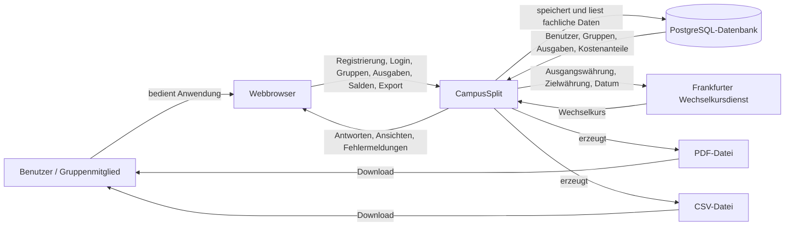
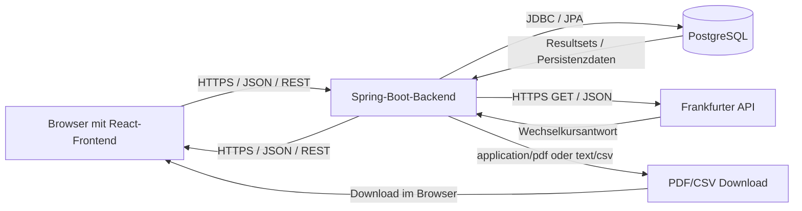
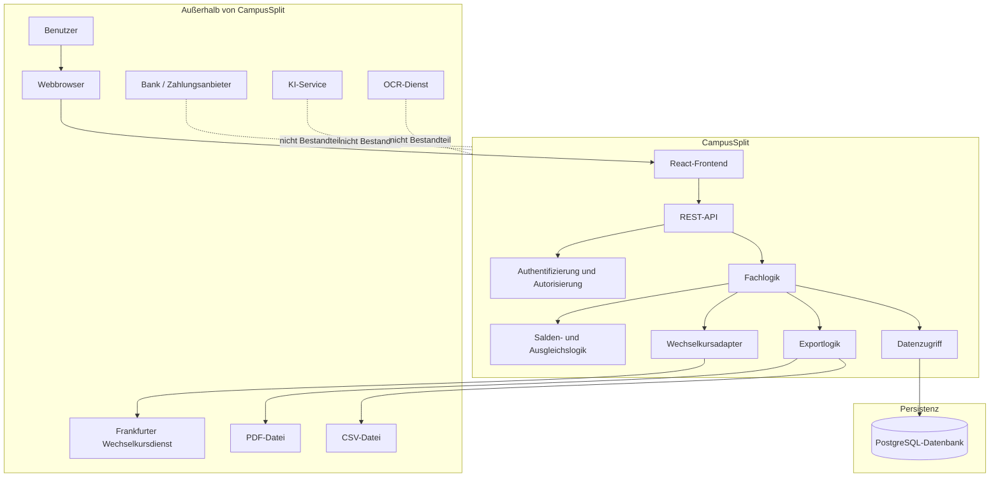

# 3 Kontextabgrenzung

Kapitel 2 beschreibt die Randbedingungen der Architektur. Kapitel 3 ordnet CampusSplit in seine Umgebung ein und beantwortet zwei Fragen:

1. **Fachlicher Kontext:** Wer oder was tauscht Informationen mit CampusSplit aus, und welche fachliche Bedeutung haben diese Informationen?
2. **Technischer Kontext:** Über welche technischen Kanäle, Protokolle und Formate findet dieser Austausch statt?

Die fachliche Kontextabgrenzung ist bereits in der Spezifikation durch [`P2 — Architekturüberblick`](../Spezifikation/P2_Architekturueberblick.md) und [`S1 — Nachbarsysteme`](../Spezifikation/S1_Nachbarsysteme.md) vorbereitet. Dieses Kapitel übernimmt diese Abgrenzung und ergänzt die technischen Bindungen, die bewusst nicht vollständig in der Spezifikation festgelegt werden.

---

## 3.1 Fachlicher Kontext

CampusSplit unterstützt Gruppen bei der Verwaltung gemeinsamer Ausgaben. Die Anwendung steht zwischen den Benutzern, der persistenten Datenhaltung, optionalen Exportdateien und dem externen Wechselkursdienst.

---

## 3.1.1 Fachliche Nachbarn und Datenflüsse

| ID | Nachbar / Element | Fachlicher Informationsfluss | Auslösendes Ereignis |
|---|---|---|---|
| NB-01 | Benutzer / Webbrowser | Eingaben zu Registrierung, Anmeldung, Gruppen, Mitgliedern, Ausgaben, Salden und Export | Benutzer führt eine Aktion im Browser aus. |
| NB-02 | PostgreSQL-Datenbank | Benutzer, Gruppen, Mitgliedschaften, Ausgaben, Kostenanteile, Kategorien und Wechselkursinformationen werden gelesen oder gespeichert. | Backend verarbeitet eine Benutzeraktion. |
| NB-03 | Frankfurter Wechselkursdienst | Ausgangswährung, Zielwährung und Datum werden gesendet; Wechselkurs wird empfangen. | Ausgabe wird in anderer Währung als der Gruppenwährung erfasst oder bearbeitet. |
| DF-01 | PDF-Datei | Gruppen-, Ausgaben-, Kostenanteils-, Salden- und Ausgleichsdaten werden als lesbare Datei bereitgestellt. | Benutzer fordert PDF-Export an. |
| DF-02 | CSV-Datei | Gruppenausgaben werden tabellarisch exportiert. | Benutzer fordert CSV-Export an. |

PDF und CSV sind keine aktiven Fremdsysteme, sondern ausgehende Datenflüsse. Sie werden hier dennoch aufgeführt, weil sie die Systemgrenze verlassen und für die Architektur relevant sind.

---

## 3.1.2 Nicht vorhandene Nachbarn

CampusSplit besitzt in der ersten Version bewusst keine Anbindung an folgende Systeme:

| Nicht vorhandener Nachbar | Grund |
|---|---|
| Bankensystem | Bankintegration ist kein Bestandteil des Projektumfangs. |
| Zahlungsanbieter | CampusSplit führt keine echten Zahlungen aus. |
| E-Mail-Dienst | Es sind keine E-Mail-Benachrichtigungen oder Einladungslinks vorgesehen. |
| OCR- oder Belegerkennungsdienst | Belege werden nicht automatisch ausgelesen. |
| KI-Service zur Laufzeit | KI wird nicht als Funktion der Anwendung genutzt. |
| Chatdienst | Kommunikation zwischen Gruppenmitgliedern ist nicht Kernfunktion. |
| Altsystem | CampusSplit ist ein Greenfield-Projekt ohne Datenmigration. |

---

## 3.2 Technischer Kontext

Technisch besteht CampusSplit aus einem browserbasierten Frontend, einem Spring-Boot-Backend, einer PostgreSQL-Datenbank, einer optionalen externen Wechselkurs-API und Exportdateien.

---

## 3.2.1 Technische Kanäle

| Kanal | Transport / Protokoll | Nutzdaten | Authentifizierung / Schutz |
|---|---|---|---|
| Browser → Backend | HTTP/HTTPS, REST, JSON | Login-Daten, Gruppenformulare, Ausgabendaten, Exportanforderungen | Öffentliche Endpunkte nur für Registrierung/Login; sonst Sitzung oder Token. |
| Backend → Browser | HTTP/HTTPS, JSON oder Dateiantwort | API-Antworten, Fehlermeldungen, PDF-/CSV-Dateien | Nur nach erfolgreicher Authentifizierung bei geschützten Daten. |
| Backend → PostgreSQL | JDBC/JPA | Entitäten und Abfragen für User, Group, Membership, Expense, ExpenseShare, Category | Datenbankzugangsdaten serverseitig konfiguriert. |
| Backend → Frankfurter API | HTTPS, REST, JSON | Ausgangswährung, Zielwährung, Datum | Öffentliche API ohne Benutzergeheimnisse; keine personenbezogenen Daten. |
| Backend → Exportdatei | Interne Dateierzeugung / HTTP-Response | Fachlich aufbereitete Exportdaten | Export nur für Gruppenmitglieder. |

---

## 3.2.2 Kanalregeln

| ID | Regel | Begründung |
|---|---|---|
| CH-01 | Geschützte REST-Endpunkte prüfen immer Authentifizierung. | Gruppendaten dürfen nicht öffentlich zugänglich sein. |
| CH-02 | Gruppenbezogene REST-Endpunkte prüfen immer Mitgliedschaft. | Benutzer dürfen nur eigene Gruppen sehen. |
| CH-03 | Backend prüft Rollen, nicht nur das Frontend. | Versteckte Buttons reichen nicht als Zugriffsschutz. |
| CH-04 | Geldbeträge werden nicht ausschließlich im Frontend berechnet. | Fachliche Korrektheit muss serverseitig abgesichert sein. |
| CH-05 | Externe Wechselkursanfragen laufen nur über das Backend. | Der Browser soll keine unnötigen externen Integrationsdetails kennen. |
| CH-06 | An den Wechselkursdienst werden keine personenbezogenen Daten übertragen. | Datenschutz und minimale Datenweitergabe. |
| CH-07 | Fehler der Wechselkurs-API erzeugen keine unvollständige Ausgabe. | Keine erfundenen Wechselkurse und keine falschen Salden. |
| CH-08 | Exportantworten enthalten keine Passwörter, Tokens oder technischen Interna. | Exportsicherheit. |
| CH-09 | PDF/CSV-Erzeugung verändert keine fachlichen Daten. | Export ist ein lesender Datenfluss. |
| CH-10 | Datenbankzugriffe laufen ausschließlich über das Backend. | Das Frontend greift nie direkt auf die Datenbank zu. |

---

## 3.3 Systemgrenze

Die Systemgrenze trennt CampusSplit von externen Akteuren, Datenflüssen und technischen Nachbarn.

Zur Anwendung gehören Frontend, REST-API, Authentifizierung, Autorisierung, Fachlogik, Saldenberechnung, Exportlogik, Wechselkursadapter und Datenzugriff. Außerhalb liegen der Browser des Benutzers, der Wechselkursdienst, erzeugte Exportdateien und alle bewusst ausgeschlossenen Dienste wie Bank, Zahlungsanbieter, OCR und KI.

---

## 3.4 Fachliche Schnittstellenübersicht

| Schnittstelle | Richtung | Fachlicher Zweck |
|---|---|---|
| Authentifizierung | Browser ↔ CampusSplit | Registrierung, Anmeldung, Abmeldung, aktuelle Sitzung. |
| Gruppenverwaltung | Browser ↔ CampusSplit | Gruppen erstellen, anzeigen und verwalten. |
| Mitgliederverwaltung | Browser ↔ CampusSplit | Mitglieder zu Gruppen hinzufügen. |
| Ausgabenverwaltung | Browser ↔ CampusSplit | Ausgaben erfassen, bearbeiten, löschen und anzeigen. |
| Saldenberechnung | Browser ↔ CampusSplit | Salden und Ausgleichsvorschläge abrufen. |
| Export | Browser ↔ CampusSplit | PDF- oder CSV-Datei anfordern und herunterladen. |
| Wechselkurs | CampusSplit ↔ Frankfurter API | Wechselkurs für Fremdwährungsausgaben abrufen. |
| Persistenz | CampusSplit ↔ PostgreSQL | Fachliche Daten speichern und lesen. |

---

## 3.5 REST-API als interne Anwendungsschnittstelle

Die REST-API verbindet Frontend und Backend. Sie ist keine externe Fremdsystemintegration, aber für die technische Architektur zentral.

Beispielhafte Endpunktgruppen:

| Bereich | Beispielhafte Endpunkte |
|---|---|
| Auth | `POST /api/auth/register`, `POST /api/auth/login`, `POST /api/auth/logout`, `GET /api/auth/me` |
| Gruppen | `GET /api/groups`, `POST /api/groups`, `GET /api/groups/{groupId}` |
| Mitglieder | `GET /api/groups/{groupId}/members`, `POST /api/groups/{groupId}/members` |
| Ausgaben | `GET /api/groups/{groupId}/expenses`, `POST /api/groups/{groupId}/expenses`, `PUT /api/groups/{groupId}/expenses/{expenseId}`, `DELETE /api/groups/{groupId}/expenses/{expenseId}` |
| Salden | `GET /api/groups/{groupId}/balances`, `GET /api/groups/{groupId}/settlements` |
| Export | `GET /api/groups/{groupId}/export?format=pdf`, `GET /api/groups/{groupId}/export?format=csv` |

Die konkrete API-Spezifikation kann später über OpenAPI/Swagger dokumentiert werden.

---

## 3.6 Wechselkursdienst

Der externe Wechselkursdienst wird nur verwendet, wenn die Währung einer Ausgabe von der Gruppenwährung abweicht.

| Aspekt | Festlegung |
|---|---|
| Anbieter | Frankfurter API |
| Protokoll | HTTPS |
| Datenformat | JSON |
| Richtung | CampusSplit → Frankfurter API → CampusSplit |
| Gesendete Daten | Ausgangswährung, Zielwährung, Datum |
| Nicht gesendete Daten | Benutzername, E-Mail, Gruppenname, Ausgabenbeschreibung, Mitgliederliste |
| Fehlerverhalten | Ohne gültigen Kurs wird die Fremdwährungsausgabe nicht gespeichert. |

Die technische Anbindung wird im Backend über einen eigenen Adapter gekapselt. Dadurch bleibt die Fachlogik unabhängig von Details des konkreten API-Anbieters.

---

## 3.7 Exportkontext

PDF und CSV verlassen CampusSplit als erzeugte Dateien. Sie sind deshalb relevante ausgehende Datenflüsse.

| Exportformat | Zweck | Technische Bereitstellung |
|---|---|---|
| PDF | Lesbare Übersicht für Menschen | HTTP-Dateidownload mit PDF-Inhalt |
| CSV | Tabellarische Weiterverarbeitung | HTTP-Dateidownload mit CSV-Inhalt |

Exportdaten werden aus Gruppen-, Ausgaben-, Kostenanteils-, Salden- und Ausgleichsdaten zusammengestellt. Passwörter, Passwort-Hashes, Tokens, interne IDs ohne fachliche Bedeutung und technische Geheimnisse werden nicht exportiert.

---

## 3.8 Abgrenzung dieses Kapitels

Dieses Kapitel beschreibt Kontext, Nachbarsysteme, Datenflüsse und technische Kanäle. Es beschreibt noch nicht die interne Bausteinsicht, konkrete Klassen, Datenbankmigrationen oder Deployment-Infrastruktur. Diese Themen folgen in späteren Architekturkapiteln.

