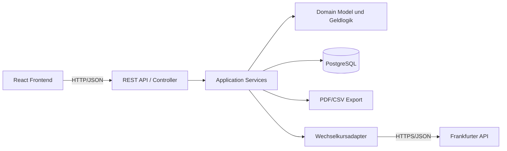

# 4 Lösungsstrategie

Dieses Kapitel fasst die grundlegenden Architekturentscheidungen für CampusSplit zusammen. Die technischen Randbedingungen stehen in [A02 — Architecture Constraints](A02-architecture-constraints.md). Die konkrete Zerlegung in Bausteine folgt in [A05 — Building Block View](A05-building-block-view.md), die wichtigsten Laufzeitszenarien in [A06 — Runtime View](A06-runtime-view.md).

CampusSplit wird als browserbasierte Webanwendung mit getrenntem Frontend und Backend umgesetzt. Das Frontend kommuniziert über eine eigene REST-API mit dem Backend. Das Backend kapselt die fachliche Logik, Persistenz, Wechselkursanbindung und Exporterzeugung.

---

## 4.1 Technologie

| Bereich | Entscheidung | Begründung |
|---|---|---|
| Frontend | React mit TypeScript und Vite | Moderne Weboberfläche, gute Komponentenstruktur, geeignet für responsive Dialoge aus B1. |
| Backend | Java 21 mit Spring Boot | Passt zur Projektvorgabe Java, bietet REST, Validierung, Security und Datenbankzugriff. |
| Schnittstelle Frontend/Backend | REST über HTTPS/HTTP im Projektkontext | Klare Trennung zwischen Oberfläche und Anwendungslogik; gut testbar und dokumentierbar. |
| Persistenz | PostgreSQL | Relationale Daten passen gut zu User, Group, Membership, Expense und ExpenseShare. |
| Datenzugriff | Spring Data JPA | Standardisierte Repository-Struktur und Abbildung der fachlichen Entitäten. |
| Geldbeträge | Centgenaue Verarbeitung, fachlich als MoneyAmountDT | Keine Gleitkommafehler bei Kostenanteilen, Salden und Exportdaten. |
| Externe API | Frankfurter Wechselkursdienst über REST/JSON | Einfache externe Schnittstelle für Fremdwährungsausgaben ohne personenbezogene Daten. |
| Export | Backendseitige PDF- und CSV-Erzeugung | Exportdaten entstehen aus gespeicherten Gruppen-, Ausgaben- und Saldendaten. |
| Dokumentation | Markdown, Mermaid, arc42-Kapitelstruktur | Versionierbar in Git und passend zur vorhandenen Spezifikation. |

Nicht gewählt werden echte Zahlungsanbieter, Bank-APIs, OCR-Dienste, Chatdienste oder KI-Services zur Laufzeit. Diese Funktionen gehören nicht zum fachlichen Kern von CampusSplit.

---

## 4.2 Zerlegung auf oberster Ebene

Die Anwendung wird in klar getrennte Verantwortungsbereiche zerlegt:

| Bereich | Verantwortung |
|---|---|
| React Frontend | Dialoge anzeigen, Formulare erfassen, REST-API aufrufen, Ergebnisse darstellen. |
| REST API / Controller | HTTP-Anfragen entgegennehmen, Eingaben validieren, angemeldeten Benutzer ermitteln, Services aufrufen. |
| Application Services | Use-Case-nahe Abläufe koordinieren, z. B. Gruppe erstellen, Ausgabe speichern, Export erzeugen. |
| Domain Model und Geldlogik | Fachliche Regeln für Kostenanteile, Salden, Debitor/Kreditor und Ausgleichsvorschläge. |
| Persistenz | Dauerhafte Speicherung von Benutzer-, Gruppen-, Mitgliedschafts- und Ausgabendaten. |
| Wechselkursadapter | Externe Wechselkurse abrufen und technische API-Details kapseln. |
| Export | Exportdaten fachlich aufbereiten und als PDF oder CSV bereitstellen. |

---

## 4.3 Strategie je Qualitätsziel

| Qualitätsziel | Lösungsansatz | Verankert in |
|---|---|---|
| [QG-01](A01-introduction-and-goals.md#12-qualitätsziele) Korrekte Geldberechnung | Geldberechnung ausschließlich backendseitig; centgenaue Verarbeitung; Split-, Balance- und Settlement-Logik als testbare Services. | [F3](../Spezifikation/F3-anwendungsfunktionen.md), [D2](../Spezifikation/D2_Datentypenverzeichnis.md), [N2](../Spezifikation/N2_Querschnittskonzepte.md) |
| [QG-02](A01-introduction-and-goals.md#12-qualitätsziele) Nachvollziehbare Salden | Saldo = gezahlte Beträge minus eigene Kostenanteile; positive Salden als Kreditoren, negative Salden als Debitoren. | [F3](../Spezifikation/F3-anwendungsfunktionen.md), [E2](../Spezifikation/E2_Glossar.md) |
| [QG-03](A01-introduction-and-goals.md#12-qualitätsziele) Sicherer Gruppenzugriff | Jede gruppenbezogene Anfrage prüft Authentifizierung und Membership; Adminrechte werden backendseitig geprüft. | [N2](../Spezifikation/N2_Querschnittskonzepte.md), [D1](../Spezifikation/D1_Datenmodell.md) |
| [QG-04](A01-introduction-and-goals.md#12-qualitätsziele) Wartbare Struktur | Schichten und fachliche Pakete: auth, user, group, membership, expense, balance, export, currency, common. | [A05](A05-building-block-view.md) |
| [QG-05](A01-introduction-and-goals.md#12-qualitätsziele) Responsive Webnutzung | Dialoge werden als React-Seiten/Komponenten umgesetzt; Backend bleibt unabhängig von UI-Details. | [B1](../Spezifikation/B1_Dialogspezifikation.md), [N1](../Spezifikation/N1_Nichtfunktionale%20Anforderungen.md) |
| [QG-06](A01-introduction-and-goals.md#12-qualitätsziele) Robuster Umgang mit externer API | Frankfurter API hinter eigenem Adapter; kein Speichern einer Fremdwährungsausgabe ohne gültigen Kurs; verständliche Fehler. | [S1](../Spezifikation/S1_Nachbarsysteme.md), [N2](../Spezifikation/N2_Querschnittskonzepte.md) |
| [QG-07](A01-introduction-and-goals.md#12-qualitätsziele) Einfacher Betrieb | Lokale Startbarkeit, klare Konfiguration, Datenbankverbindung über Umgebungsvariablen, Startanleitung im Repo. | [S3](../Spezifikation/S3_Inbetriebnahme.md), [A07](A07-deployment-view.md) |
| [QG-08](A01-introduction-and-goals.md#12-qualitätsziele) Export ohne sensible Daten | Exportdaten werden aus fachlichen DTOs erzeugt; Passwörter, Tokens und technische Interna werden ausgeschlossen. | [B3](../Spezifikation/B3_Druckausgaben.md), [N2](../Spezifikation/N2_Querschnittskonzepte.md) |

---

## 4.4 Organisatorischer Ansatz

CampusSplit wird als Hochschulprojekt durch ein Team aus fünf Personen umgesetzt. Deshalb muss die Architektur verständlich, arbeitsteilig umsetzbar und nicht unnötig komplex sein.

| Organisationsregel | Architekturwirkung |
|---|---|
| Kleine, fachliche Pakete | Teammitglieder können getrennt an Auth, Gruppen, Ausgaben, Salden, Export oder Währung arbeiten. |
| Conventional Commits | Änderungen bleiben in Git nachvollziehbar. |
| Spezifikation und Architektur getrennt | Fachliche Anforderungen bleiben in `Spezifikation/`, technische Struktur in `Architektur/`. |
| Erst MVP, dann Erweiterungen | Kernfunktionen haben Vorrang vor Zusatzideen wie Einkaufsliste, Chat oder Zahlungsabwicklung. |
| Tests für Kernlogik | Besonders Geldberechnung, Rundung, Salden und Autorisierung müssen abgesichert werden. |

