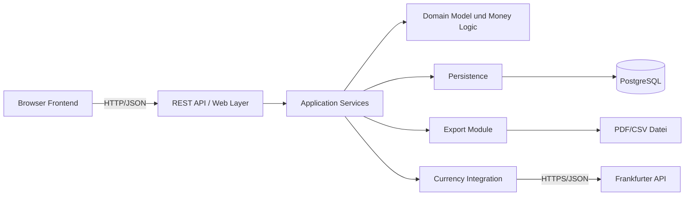
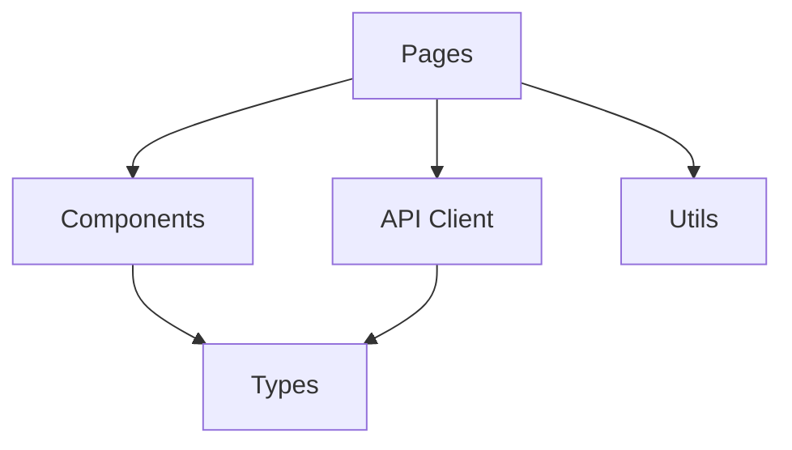
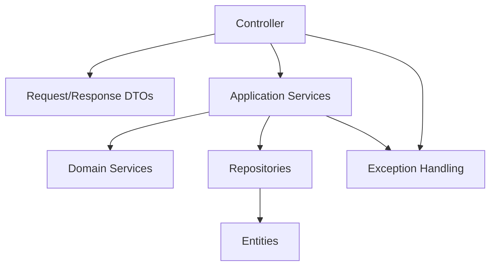
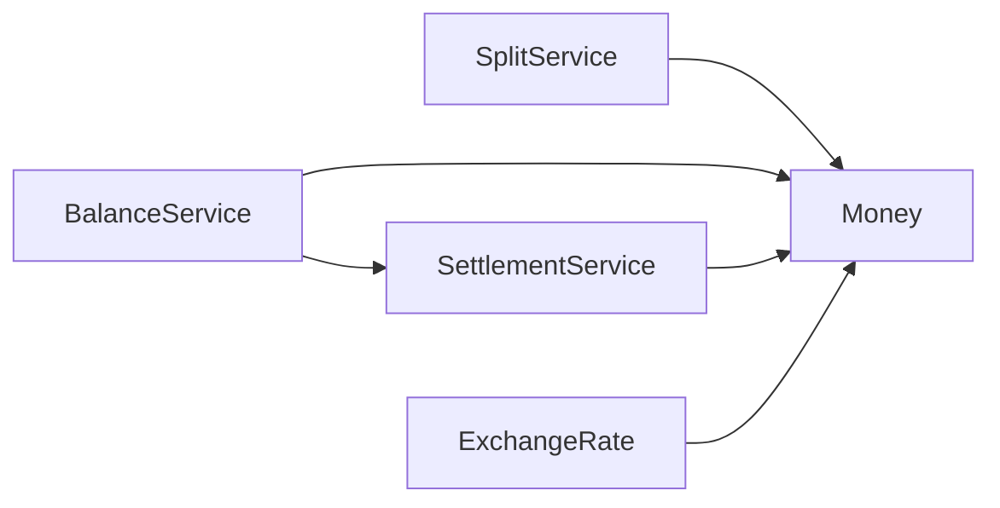
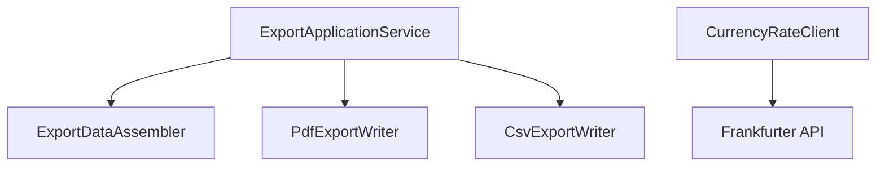
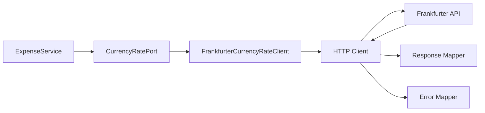

# 5 Bausteinsicht

Die Bausteinsicht zerlegt CampusSplit schrittweise in fachliche und technische Bausteine. Sie zeigt, welche Teile des Systems zusammenarbeiten und welche Verantwortung jeder Baustein besitzt.

Level 0 ist der Systemkontext aus [A03 — Context and Scope](A03-context-and-scope.md): CampusSplit als Blackbox zwischen Browser, Datenbank, Exportdatei und Wechselkursdienst.

Level 1 öffnet diese Blackbox und zeigt die wichtigsten Architekturbausteine. Level 2 verfeinert die für die Umsetzung wichtigsten Bausteine. Level 3 öffnet den Wechselkursadapter, weil dort die externe API-Anbindung architektonisch relevant ist.

---

## 5.1 Whitebox Gesamtsystem

| Whitebox | Inhalt |
|---|---|
| Whitebox von | CampusSplit — die System-Blackbox aus Kapitel 3. |
| Enthaltene Bausteine | Browser Frontend, REST API/Web Layer, Application Services, Domain Model/Money Logic, Persistence, Export Module, Currency Integration. |
| Lokale Beziehungen | Frontend ruft REST API auf; API ruft Services auf; Services nutzen Domainlogik, Persistenz, Export und Wechselkursadapter. |
| Designentscheidung | Fachlogik liegt im Backend; Frontend bleibt UI-orientiert; externe API wird isoliert angebunden. |
| Verworfene Alternativen | Geldlogik im Frontend, Bank-/Payment-Integration, monolithische Vermischung von UI und Fachlogik. |
| Referenzen | [A04](A04-solution-strategy.md), [A06](A06-runtime-view.md), [D1](../Spezifikation/D1_Datenmodell.md), [D2](../Spezifikation/D2_Datentypenverzeichnis.md), [F3](../Spezifikation/F3-anwendungsfunktionen.md), [N2](../Spezifikation/N2_Querschnittskonzepte.md). |
| Offene Punkte | Konkrete Framework-Konfiguration, Security-Mechanismus und Bibliotheken werden bei der Implementierung finalisiert. |

### Enthaltene Bausteine

| Nr. | Baustein | Geplante Code-Artefakte | Verantwortung |
|---|---|---|---|
| 5.1.1 | Browser Frontend | `frontend/src/` | Dialoge anzeigen, Eingaben erfassen, API aufrufen, Ergebnisse darstellen. |
| 5.1.2 | REST API / Web Layer | `backend/src/main/java/.../controller/`, `.../dto/` | HTTP-Endpunkte, Request/Response-DTOs, Validierung, Statuscodes. |
| 5.1.3 | Application Services | `.../service/` | Use-Case-nahe Abläufe koordinieren. |
| 5.1.4 | Domain Model und Money Logic | `.../domain/`, `.../money/`, `.../balance/` | Fachliche Regeln, Kostenaufteilung, Salden, Ausgleichsvorschläge. |
| 5.1.5 | Persistence | `.../entity/`, `.../repository/`, `backend/src/main/resources/db/` | Dauerhafte Speicherung über PostgreSQL. |
| 5.1.6 | Export Module | `.../export/` | PDF- und CSV-Export erzeugen. |
| 5.1.7 | Currency Integration | `.../currency/` | Frankfurter API anbinden und Wechselkurse kapseln. |

### Lokale Beziehungen

| Beziehung | Vertrag |
|---|---|
| Browser Frontend → REST API | HTTP/JSON; alle Änderungen laufen über Backend-Endpunkte. |
| REST API → Application Services | Controller validieren und delegieren an Services. |
| Application Services → Domain Model | Services verwenden Fachlogik für Kostenanteile, Salden und Ausgleichsvorschläge. |
| Application Services → Persistence | Services laden und speichern Entitäten über Repositories. |
| Application Services → Export Module | Export wird auf Benutzeranforderung erzeugt. |
| Application Services → Currency Integration | Wechselkurs wird nur bei Fremdwährungsausgaben benötigt. |
| Currency Integration → Frankfurter API | Ausgehender HTTPS/JSON-Aufruf ohne personenbezogene Daten. |

---

## 5.1.1 Blackbox Browser Frontend

| Blackbox | Inhalt |
|---|---|
| Zweck / Verantwortung | Umsetzung der Dialoge aus B1 im Browser. Das Frontend erfasst Benutzereingaben und zeigt Gruppen, Ausgaben, Salden, Fehler und Exporteinstiege an. |
| Bereitgestellte Schnittstelle | Grafische Benutzeroberfläche für Gast, Nutzer, Gruppenmitglied und Administrator. |
| Benötigte Schnittstellen | REST API des Backends; keine direkten Datenbank- oder Drittanbieterzugriffe. |
| Qualität | Responsive Bedienung, verständliche Fehlermeldungen, keine fachliche Geldberechnung als verbindliche Quelle. |
| Abhängigkeiten | Moderner Webbrowser, JavaScript/TypeScript, HTTP-Verbindung zum Backend. |
| Geplante Code-Artefakte | `frontend/src/pages/`, `frontend/src/components/`, `frontend/src/api/`, `frontend/src/types/`. |
| Erfüllte Anforderungen | B1-Dialoge, N1-Bedienbarkeit, N2-Fehlerdarstellung. |
| Variabilität | Neue Dialoge können als neue Seiten/Komponenten ergänzt werden. |
| Tests | Komponenten- und API-Mock-Tests; manuelle UI-Tests für die Präsentation. |
| Offene Punkte | Konkretes UI-Design und CSS-Details werden später festgelegt. |
| Verfeinert in | [5.2.1](#521-whitebox-browser-frontend). |

---

## 5.1.2 Blackbox REST API / Web Layer

| Blackbox | Inhalt |
|---|---|
| Zweck / Verantwortung | Nimmt HTTP-Anfragen entgegen, prüft Requestdaten, ermittelt Benutzerkontext und ruft Application Services auf. |
| Bereitgestellte Schnittstelle | REST-Endpunkte für Auth, Groups, Members, Expenses, Balances, Settlements, Export und Currency. |
| Benötigte Schnittstellen | Application Services, Validierung, Fehlerbehandlung, Authentifizierung. |
| Qualität | Einheitliche Statuscodes, verständliche Fehlermeldungen, keine ungeprüfte Speicherung. |
| Abhängigkeiten | Spring Web, Spring Validation, später Spring Security. |
| Geplante Code-Artefakte | `controller`, `dto/request`, `dto/response`, `exception`. |
| Erfüllte Anforderungen | F2-Use-Cases, B1-Aktionen, N2-Validierung und Fehlerbehandlung. |
| Variabilität | Neue Use Cases erhalten eigene Endpunkte oder Erweiterungen bestehender Controller. |
| Tests | Controller-Tests mit MockMvc oder Integrationstests. |
| Offene Punkte | Authentifizierungstechnik final festlegen: Session oder JWT. |
| Verfeinert in | [5.2.2](#522-whitebox-backend). |

---

## 5.1.3 Blackbox Application Services

| Blackbox | Inhalt |
|---|---|
| Zweck / Verantwortung | Koordiniert fachliche Abläufe, z. B. Gruppe erstellen, Mitglied hinzufügen, Ausgabe speichern, Salden anzeigen, Export erzeugen. |
| Bereitgestellte Schnittstelle | Methoden für Use-Case-nahe Operationen. |
| Benötigte Schnittstellen | Domainlogik, Repositories, Export Module, Currency Integration. |
| Qualität | Transaktional, nachvollziehbar, testbar. |
| Abhängigkeiten | Spring Services, Transaktionen, Repositories. |
| Geplante Code-Artefakte | `GroupService`, `MembershipService`, `ExpenseService`, `BalanceApplicationService`, `ExportApplicationService`. |
| Erfüllte Anforderungen | UC-04 bis UC-12, F3-Anwendungsfunktionen. |
| Variabilität | Neue fachliche Abläufe können als weitere Services ergänzt werden. |
| Tests | Service-Tests mit Testdaten für Gruppen, Ausgaben und Salden. |
| Offene Punkte | Granularität einzelner Services während Implementierung prüfen. |
| Verfeinert in | [5.2.2](#522-whitebox-backend). |

---

## 5.1.4 Blackbox Domain Model und Money Logic

| Blackbox | Inhalt |
|---|---|
| Zweck / Verantwortung | Bildet fachliche Regeln ab: MoneyAmount, Currency, ExchangeRate, SplitMethod, Kostenanteile, Salden, Debitor/Kreditor und Ausgleichsvorschläge. |
| Bereitgestellte Schnittstelle | Rechenfunktionen und fachliche Modelle für Split, Balance und Settlement. |
| Benötigte Schnittstellen | Keine externen Systeme; arbeitet mit fachlichen Eingaben. |
| Qualität | Centgenau, deterministisch, unabhängig von UI und Datenbank testbar. |
| Abhängigkeiten | Java `BigDecimal` oder centbasierte Integer-Darstellung; keine Gleitkommazahlen. |
| Geplante Code-Artefakte | `Money`, `ExchangeRate`, `SplitService`, `BalanceService`, `SettlementService`. |
| Erfüllte Anforderungen | F3, D1, D2, N2-Geldbetragsverarbeitung. |
| Variabilität | Weitere Aufteilungsarten können ergänzt werden, ohne UI und Persistenz komplett umzubauen. |
| Tests | Unit-Tests für Rundung, Equal Split, Custom Split, Salden und Ausgleichsvorschläge. |
| Offene Punkte | Exakte technische Darstellung von Money wird in ADR festgelegt. |
| Verfeinert in | [5.2.3](#523-whitebox-domain-model-und-money-logic). |

---

## 5.1.5 Blackbox Persistence

| Blackbox | Inhalt |
|---|---|
| Zweck / Verantwortung | Speichert Benutzer, Gruppen, Mitgliedschaften, Ausgaben, Kostenanteile, Kategorien und Wechselkursinformationen dauerhaft. |
| Bereitgestellte Schnittstelle | Repository-API für Application Services. |
| Benötigte Schnittstellen | PostgreSQL-Datenbank. |
| Qualität | Konsistente Datenhaltung, keine unvollständigen fachlichen Zustände. |
| Abhängigkeiten | Spring Data JPA, PostgreSQL, Datenbankverbindung. |
| Geplante Code-Artefakte | `entity`, `repository`, Migrations-/Schema-Dateien. |
| Erfüllte Anforderungen | D1-Datenmodell, S3-Inbetriebnahme, N1-Datenkonsistenz. |
| Variabilität | Schemaänderungen erfolgen kontrolliert über Migrationen. |
| Tests | Repository-Tests und Integrationstests gegen Testdatenbank. |
| Offene Punkte | Konkretes Migrationstool final festlegen, z. B. Flyway oder Liquibase. |
| Verfeinert in | Nicht weiter verfeinert; Datenmodell ist in D1/D2 fachlich beschrieben. |

---

## 5.1.6 Blackbox Export Module

| Blackbox | Inhalt |
|---|---|
| Zweck / Verantwortung | Erzeugt PDF- und CSV-Dateien aus Gruppendaten, Ausgaben, Kostenanteilen, Salden und Ausgleichsvorschlägen. |
| Bereitgestellte Schnittstelle | Exportfunktion für PDF und CSV. |
| Benötigte Schnittstellen | Exportdaten aus Application Services und Domainlogik. |
| Qualität | Keine sensiblen Daten im Export, Beträge korrekt formatiert, Export entspricht aktueller Saldenberechnung. |
| Abhängigkeiten | Bibliothek für PDF-Erzeugung und CSV-Ausgabe. |
| Geplante Code-Artefakte | `ExportService`, `PdfExportWriter`, `CsvExportWriter`, `ExportData`. |
| Erfüllte Anforderungen | B3, UC-12, N2-Exportsicherheit. |
| Variabilität | Weitere Exportformate können später ergänzt werden. |
| Tests | Exportdaten-Tests, CSV-Strukturtests, ggf. PDF-Smoke-Test. |
| Offene Punkte | Konkrete PDF-Bibliothek final auswählen. |
| Verfeinert in | [5.2.4](#524-whitebox-export-und-integration). |

---

## 5.1.7 Blackbox Currency Integration

| Blackbox | Inhalt |
|---|---|
| Zweck / Verantwortung | Ruft Wechselkurse beim Frankfurter Wechselkursdienst ab und kapselt technische Details der externen REST-API. |
| Bereitgestellte Schnittstelle | Methode zur Ermittlung eines Wechselkurses für Ausgangswährung, Zielwährung und Datum. |
| Benötigte Schnittstellen | HTTPS-Zugriff auf Frankfurter API. |
| Qualität | Keine personenbezogenen Daten nach außen, keine erfundenen Kurse, kontrollierte Fehlerbehandlung. |
| Abhängigkeiten | HTTP-Client des Backends, Erreichbarkeit des Wechselkursdienstes. |
| Geplante Code-Artefakte | `CurrencyRateClient`, `FrankfurterCurrencyRateClient`, `ExchangeRateResponse`. |
| Erfüllte Anforderungen | S1, D2 ExchangeRateDT, N2 Fehlerbehandlung. |
| Variabilität | Wechselkursanbieter kann später durch anderen Adapter ersetzt werden. |
| Tests | Adaptertests mit Mock-HTTP-Server oder Testdouble. |
| Offene Punkte | Timeout- und Cache-Strategie final festlegen. |
| Verfeinert in | [5.3.1](#531-whitebox-currency-integration). |

---

## 5.2 Level 2

Level 2 öffnet die wichtigsten Level-1-Bausteine. Die Verfeinerung endet dort, wo weitere Details nur noch konkrete Implementierung wiederholen würden.

---

## 5.2.1 Whitebox Browser Frontend

| Baustein | Verantwortung |
|---|---|
| `pages/` | Seiten für Registrierung, Anmeldung, Dashboard, Gruppe, Ausgabe, Salden und Export. |
| `components/` | Wiederverwendbare UI-Elemente wie Formularfelder, Tabellen, Saldenkarten und Fehlermeldungen. |
| `api/` | Kapselt REST-Aufrufe an das Backend. |
| `types/` | TypeScript-Typen für DTOs und UI-Daten. |
| `utils/` | Formatierung von Geldbeträgen, Datum und Anzeigezuständen. |

Lokale Beziehungen:

| Beziehung | Vertrag |
|---|---|
| Pages → API Client | Seiten lösen Use-Case-Aktionen aus. |
| API Client → REST API | Einheitliche HTTP-Kommunikation. |
| Pages → Components | Seiten setzen wiederverwendbare Komponenten zusammen. |
| Components → Types | Komponenten verwenden gemeinsame DTO-/View-Typen. |

---

## 5.2.2 Whitebox Backend

| Baustein | Verantwortung |
|---|---|
| Controller | REST-Endpunkte für Auth, Groups, Members, Expenses, Balances und Export. |
| Request/Response DTOs | Struktur der ein- und ausgehenden JSON-Daten. |
| Application Services | Use-Case-nahe Abläufe und Transaktionen. |
| Domain Services | Rechenlogik für Kostenanteile, Salden und Ausgleich. |
| Repositories | Zugriff auf gespeicherte Daten. |
| Entities | Persistente Abbildung des Datenmodells. |
| Exception Handling | Einheitliche Fehlerantworten für Frontend und API. |

Lokale Beziehungen:

| Beziehung | Vertrag |
|---|---|
| Controller → DTO | Eingaben und Ausgaben werden klar typisiert. |
| Controller → Application Service | Controller enthalten keine Fachlogik. |
| Application Service → Repository | Laden und Speichern erfolgt über Repositories. |
| Application Service → Domain Service | Fachliche Berechnung bleibt unabhängig von HTTP. |
| Exception Handling → Controller/Service | Fehler werden einheitlich in HTTP-Antworten übersetzt. |

---

## 5.2.3 Whitebox Domain Model und Money Logic

| Baustein | Schnittstelle | Verantwortung |
|---|---|---|
| `Money` | Betrag + Währung | Fachliche Darstellung eines Geldbetrags. |
| `ExchangeRate` | fromCurrency, toCurrency, rate, date | Wechselkurswert für Fremdwährungsausgaben. |
| `SplitService` | `calculateShares(...)` | Berechnet Kostenanteile für `EQUAL` und `CUSTOM_AMOUNT`. |
| `BalanceService` | `calculateBalances(groupId)` | Berechnet Salden pro Gruppenmitglied. |
| `SettlementService` | `calculateSettlements(balances)` | Erzeugt Ausgleichsvorschläge zwischen Debitoren und Kreditoren. |

Wichtige Regeln:

| Regel | Umsetzung |
|---|---|
| Keine Gleitkommazahlen für Geld | `BigDecimal` oder centbasierte Integer-Darstellung. |
| EQUAL Split muss exakt aufgehen | Rundungsreste werden deterministisch verteilt. |
| CUSTOM_AMOUNT muss Summe treffen | Speichern nur, wenn Summe exakt dem Abrechnungsbetrag entspricht. |
| Salden müssen auf 0 summieren | Unit-Test für jede zentrale Berechnungsvariante. |
| Debitor/Kreditor eindeutig | Negativer Saldo = Debitor, positiver Saldo = Kreditor. |

---

## 5.2.4 Whitebox Export und Integration

| Baustein | Verantwortung |
|---|---|
| `ExportApplicationService` | Koordiniert Exporterzeugung für PDF oder CSV. |
| `ExportDataAssembler` | Stellt Gruppendaten, Ausgaben, Anteile, Salden und Vorschläge zusammen. |
| `PdfExportWriter` | Erzeugt lesbare PDF-Datei. |
| `CsvExportWriter` | Erzeugt tabellarische CSV-Datei. |
| `CurrencyRateClient` | Liefert Wechselkursdaten für Fremdwährungsausgaben. |

---

## 5.3 Level 3

Level 3 öffnet den Wechselkursadapter, weil er die wichtigste externe technische Schnittstelle von CampusSplit darstellt.

## 5.3.1 Whitebox Currency Integration

| Baustein | Realisierung | Vertrag |
|---|---|---|
| CurrencyRatePort | Interface | Fachliche Schnittstelle: `getRate(from, to, date)`. |
| FrankfurterCurrencyRateClient | Adapter | Kennt URL-Struktur, Requestparameter und Antwortformat der Frankfurter API. |
| HTTP Client | Spring WebClient oder RestClient | Führt synchronen HTTPS-Aufruf aus. |
| Response Mapper | Mapping-Komponente | Wandelt JSON-Antwort in `ExchangeRate` um. |
| Error Mapper | Fehlerkomponente | Wandelt technische Fehler in fachlich verständliche Fehler um. |

Wichtige Invarianten:

| ID | Invariante |
|---|---|
| FX-A01 | Der Adapter wird nur aufgerufen, wenn Originalwährung und Gruppenwährung verschieden sind. |
| FX-A02 | Es werden nur Währungscodes und Datum übertragen, keine personenbezogenen Daten. |
| FX-A03 | Ohne gültige Antwort wird kein Wechselkurs erfunden. |
| FX-A04 | Eine Fremdwährungsausgabe wird nicht unvollständig gespeichert. |
| FX-A05 | Providerdetails bleiben im Adapter und gelangen nicht in Domain Services. |

