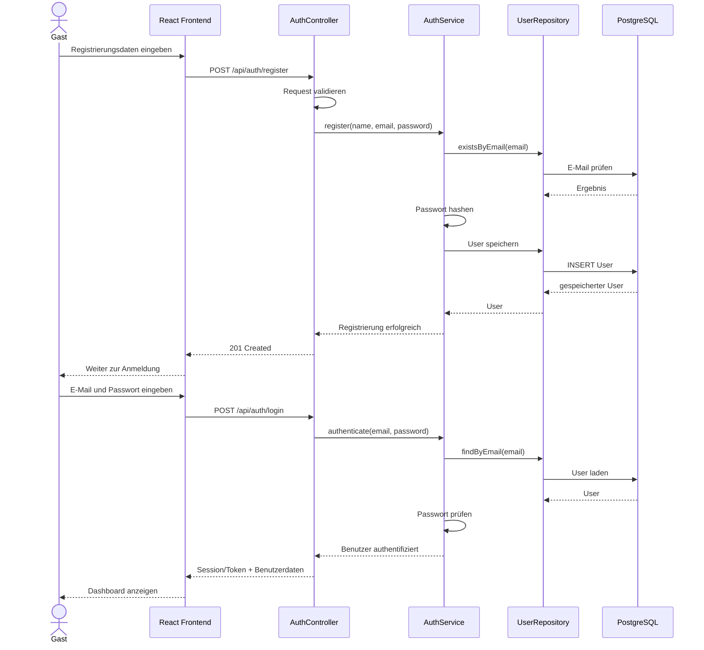
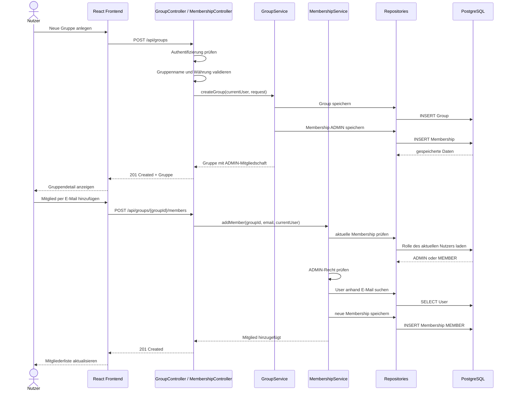
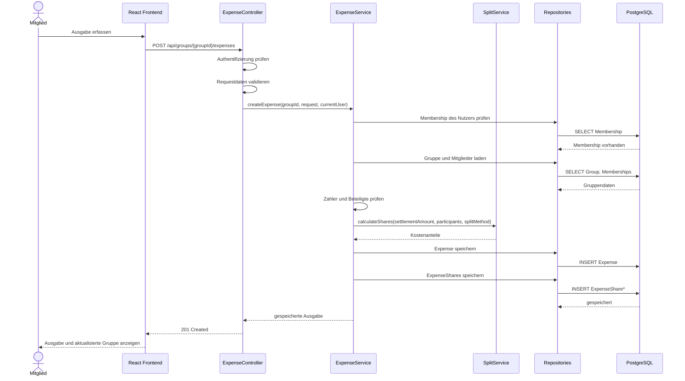
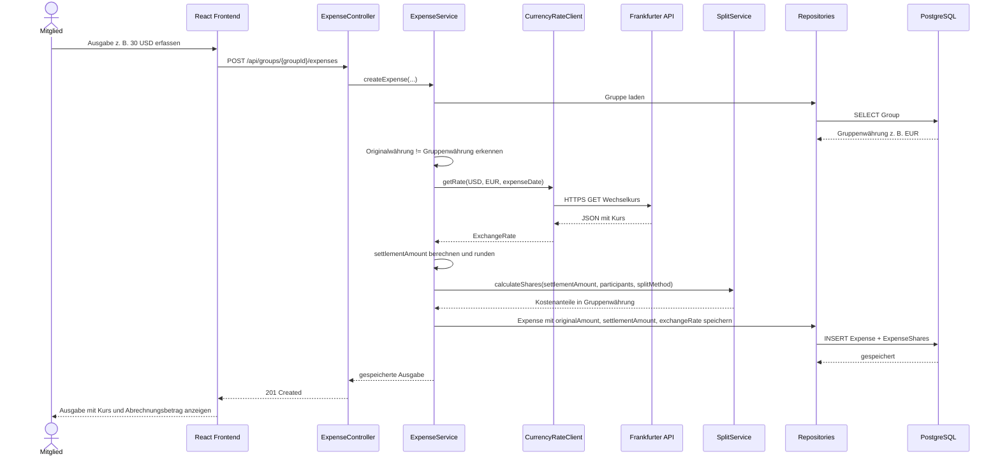
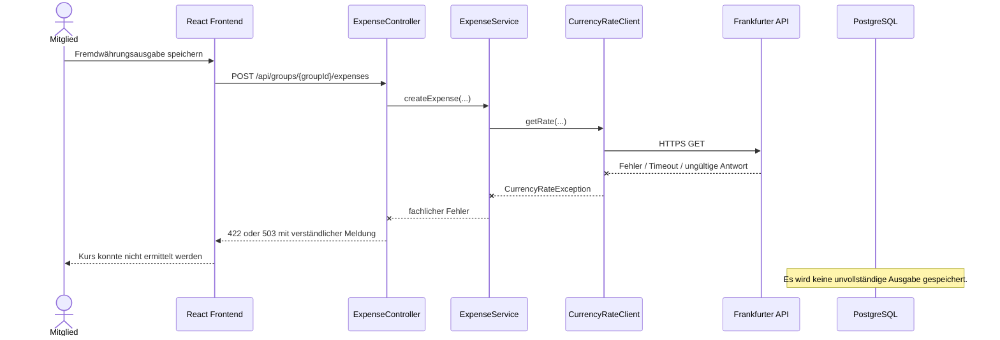
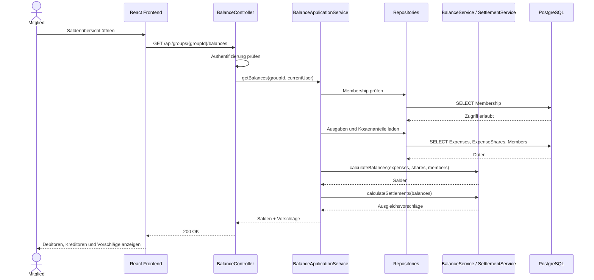
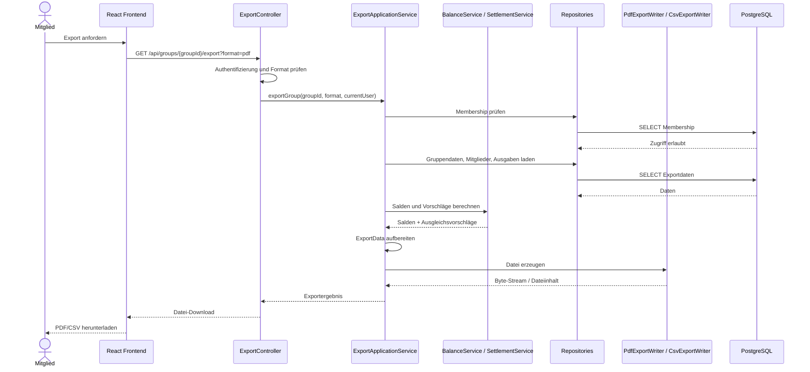

# 6 Laufzeitsicht

Die Laufzeitsicht zeigt, wie die Bausteine aus [A05 — Building Block View](A05-building-block-view.md) in wichtigen Szenarien zusammenarbeiten. Es werden nicht alle CRUD-Abläufe vollständig wiederholt, sondern nur die Abläufe, die architektonisch besonders relevant sind.

Ausgewählt wurden Szenarien, die zentrale Architekturentscheidungen sichtbar machen: Authentifizierung, Gruppenzugriff, Kostenaufteilung, Fremdwährungsumrechnung, Saldenberechnung und Export.

---

## 6.0 Übersicht der Szenarien

| Szenario | Use Case | Warum architektonisch relevant? |
|---|---|---|
| [6.1](#61-registrierung-und-anmeldung) Registrierung und Anmeldung | UC-01, UC-02 | Öffentlicher Zugriff, Passwortschutz, Start einer Sitzung. |
| [6.2](#62-gruppe-erstellen-und-mitglied-hinzufügen) Gruppe erstellen und Mitglied hinzufügen | UC-05, UC-07 | Membership, Rollen, Adminrechte und Zugriffsschutz. |
| [6.3](#63-ausgabe-in-gruppenwährung-erfassen) Ausgabe in Gruppenwährung erfassen | UC-08 | Validierung, Kostenanteile, transaktionales Speichern. |
| [6.4](#64-fremdwährungsausgabe-erfassen) Fremdwährungsausgabe erfassen | UC-08, S1 | Externe API, Wechselkurs, Fehlerfall ohne unvollständige Speicherung. |
| [6.5](#65-salden-und-ausgleichsvorschläge-anzeigen) Salden und Ausgleichsvorschläge anzeigen | UC-11 | Backendseitige Geldlogik, Debitor/Kreditor, deterministische Berechnung. |
| [6.6](#66-pdf-oder-csv-export-erzeugen) PDF- oder CSV-Export erzeugen | UC-12 | Exportdaten, Exportsicherheit, Datei als Datenfluss. |

Alle fachlichen Aktionen werden durch Benutzerinteraktionen ausgelöst. Es gibt keine Batch-Verarbeitung, keine Queue und keine Hintergrundjobs.

---

## 6.1 Registrierung und Anmeldung

Wichtige Aspekte:

| Aspekt | Bedeutung |
|---|---|
| Öffentliche Endpunkte | Registrierung und Anmeldung sind ohne vorherige Sitzung erreichbar. |
| Passwortschutz | Klartextpasswörter werden nie gespeichert; nur Hashwerte liegen in der Datenbank. |
| Generische Loginfehler | Bei falschen Zugangsdaten wird nicht verraten, ob E-Mail oder Passwort falsch war. |
| Startpunkt | Nach erfolgreicher Anmeldung ist das Dashboard der Einstieg in die Anwendung. |

Fehlerfälle:

| Fehler | Verhalten |
|---|---|
| E-Mail ungültig | 400/422 mit verständlicher Meldung. |
| E-Mail bereits vergeben | Registrierung wird abgelehnt. |
| Passwort falsch | Allgemeine Fehlermeldung. |
| Datenbank nicht erreichbar | Technischer Fehler, kein Login und keine halbe Registrierung. |

---

## 6.2 Gruppe erstellen und Mitglied hinzufügen

Wichtige Aspekte:

| Aspekt | Bedeutung |
|---|---|
| Automatische ADMIN-Rolle | Der Gruppenersteller wird direkt Mitglied und erhält ADMIN. |
| Membership als Zugriffsbasis | Zugriff auf Gruppen wird immer über Membership geprüft. |
| Adminpflicht | Nur ADMIN darf neue Mitglieder hinzufügen. |
| Keine Doppelmitgliedschaft | Ein Benutzer darf in derselben Gruppe nicht mehrfach Mitglied sein. |

Fehlerfälle:

| Fehler | Verhalten |
|---|---|
| Nicht angemeldet | Anfrage wird abgelehnt. |
| Gruppenname leer | Gruppe wird nicht gespeichert. |
| Nutzer ist kein ADMIN | Mitglied wird nicht hinzugefügt. |
| E-Mail existiert nicht | Verständliche Fehlermeldung. |
| Person ist bereits Mitglied | Keine doppelte Membership. |

---

## 6.3 Ausgabe in Gruppenwährung erfassen

Wichtige Aspekte:

| Aspekt | Bedeutung |
|---|---|
| Backend entscheidet verbindlich | Frontend sendet Eingaben; Backend prüft und berechnet verbindlich. |
| Keine Fremdwährungs-API nötig | Wenn Originalwährung = Gruppenwährung, wird kein Wechselkursdienst aufgerufen. |
| Kostenanteile entstehen im Backend | Equal Split und Custom Amount werden zentral berechnet/geprüft. |
| Transaktionales Speichern | Expense und ExpenseShares müssen zusammen gespeichert werden. |

Fehlerfälle:

| Fehler | Verhalten |
|---|---|
| Zahler ist kein Gruppenmitglied | Ausgabe wird abgelehnt. |
| Keine beteiligte Person | Ausgabe wird abgelehnt. |
| Betrag <= 0 | Ausgabe wird abgelehnt. |
| Custom-Anteile passen nicht zur Summe | Ausgabe wird nicht gespeichert. |
| Datenbankfehler nach Teiloperation | Transaktion wird zurückgerollt. |

---

## 6.4 Fremdwährungsausgabe erfassen

Wichtige Aspekte:

| Aspekt | Bedeutung |
|---|---|
| API-Aufruf nur bei Bedarf | Frankfurter API wird nur verwendet, wenn Originalwährung und Gruppenwährung abweichen. |
| Keine personenbezogenen Daten | An den Dienst gehen nur Ausgangswährung, Zielwährung und Datum. |
| Originalbetrag bleibt erhalten | Die Ausgabe speichert Originalbetrag, Originalwährung, Kurs und Abrechnungsbetrag. |
| Salden in Gruppenwährung | Kostenanteile, Salden und Ausgleichsvorschläge werden in Gruppenwährung berechnet. |
| Kein erfundener Kurs | Ohne gültigen Kurs wird keine Fremdwährungsausgabe gespeichert. |

Fehlerfall: Wechselkursdienst nicht erreichbar

---

## 6.5 Salden und Ausgleichsvorschläge anzeigen

Wichtige Aspekte:

| Aspekt | Bedeutung |
|---|---|
| Berechnung bei Anzeige | Salden werden aus aktuellen Ausgaben und Kostenanteilen berechnet. |
| Keine echten Zahlungen | Ausgleichsvorschläge sind nur Empfehlungen. |
| Debitor/Kreditor | Negativer Saldo = schuldet Geld; positiver Saldo = bekommt Geld. |
| Summe 0,00 | Die Summe aller Gruppensalden muss 0,00 ergeben. |
| Backend als Quelle | Frontend stellt nur dar, berechnet aber nicht verbindlich. |

Beispiel:

| Mitglied | Gezahlt | Eigener Anteil | Saldo | Rolle |
|---|---:|---:|---:|---|
| Anna | 30,00 EUR | 10,00 EUR | +20,00 EUR | Kreditor |
| Max | 0,00 EUR | 10,00 EUR | -10,00 EUR | Debitor |
| Lisa | 0,00 EUR | 10,00 EUR | -10,00 EUR | Debitor |

Ausgleichsvorschläge:

| Debitor | Kreditor | Betrag |
|---|---|---:|
| Max | Anna | 10,00 EUR |
| Lisa | Anna | 10,00 EUR |

---

## 6.6 PDF- oder CSV-Export erzeugen

Wichtige Aspekte:

| Aspekt | Bedeutung |
|---|---|
| Export als Datenfluss | PDF/CSV ist keine aktive externe Anwendung, sondern eine erzeugte Datei. |
| Zugriffsschutz | Nur Gruppenmitglieder dürfen einen Export erzeugen. |
| Aktuelle Berechnung | Exportierte Salden müssen zur aktuellen Saldenberechnung passen. |
| Keine sensiblen Daten | Passwort-Hashes, Tokens, technische Interna und Sitzungsdaten werden nie exportiert. |
| Formatabhängigkeit | PDF ist lesbar für Menschen, CSV für Tabellenkalkulation geeignet. |

Fehlerfälle:

| Fehler | Verhalten |
|---|---|
| Nutzer ist kein Gruppenmitglied | Export wird verweigert. |
| Format nicht `pdf` oder `csv` | Anfrage wird abgelehnt. |
| Exportbibliothek erzeugt Fehler | Verständliche Fehlermeldung; Daten bleiben unverändert. |
| Keine Ausgaben vorhanden | Export kann eine leere Übersicht mit Hinweis erzeugen oder Benutzer erhält einen Hinweis. |

---

## 6.7 Gemeinsame Laufzeitregeln

| Regel | Gilt für |
|---|---|
| Authentifizierung vor geschützten Aktionen | Gruppen, Mitglieder, Ausgaben, Salden, Export. |
| Membership-Prüfung bei Gruppenbezug | Jede Anfrage mit `groupId`. |
| Validierung vor Speicherung | Registrierung, Gruppen, Mitglieder, Ausgaben, Export. |
| Keine Teilzustände | Expense und ExpenseShares werden zusammen gespeichert oder gar nicht. |
| Keine Frontend-Fachhoheit | Verbindliche Berechnungen passieren im Backend. |
| Verständliche Fehler | Technische Details werden nicht ungefiltert an Benutzer ausgegeben. |
| Keine sensiblen Daten nach außen | Exporte und Wechselkurs-API erhalten keine Passwörter, Tokens oder privaten Gruppendetails. |

