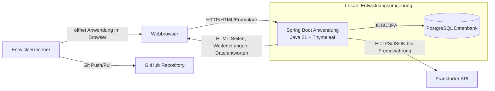
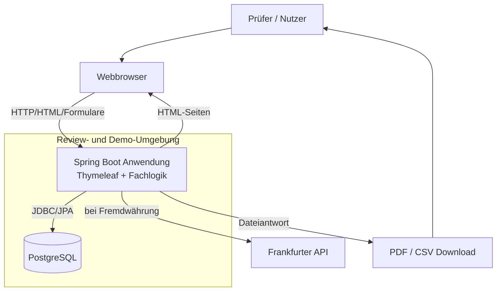

# 7 Verteilungssicht

Die Verteilungssicht ordnet die wichtigsten Architekturbausteine von CampusSplit den vorgesehenen Ausführungsumgebungen zu. Für CampusSplit sind vor allem zwei Umgebungen relevant: die lokale Entwicklungsumgebung und eine Review-/Demo-Umgebung für Präsentation und Abnahme im Hochschulprojekt.

CampusSplit wird in der aktuellen Teamentscheidung als Spring-Boot-Webanwendung mit Thymeleaf umgesetzt. Das bedeutet: Die Anwendung besteht nicht aus einem getrennten React-/Vite-Frontend und einem separaten Backend, sondern aus einer Spring-Boot-Anwendung, die HTML-Seiten serverseitig mit Thymeleaf rendert, fachliche Aktionen verarbeitet, Daten in PostgreSQL speichert und bei Bedarf externe Wechselkurse abruft.

Eine produktive Hochverfügbarkeitsumgebung ist nicht Bestandteil des Projektumfangs. CampusSplit wird als Hochschulprojekt entwickelt und muss nachvollziehbar lokal startbar, testbar und präsentierbar sein. Die Inbetriebnahmebedingungen sind fachlich in [`S3 — Inbetriebnahme`](../Spezifikation/S3_Inbetriebnahme.md) beschrieben.

---

## 7.1 Infrastruktur Level 1

### 7.1.1 Lokale Entwicklungsumgebung

Die lokale Entwicklungsumgebung unterstützt die Entwicklung einer Spring-Boot-Anwendung mit Java 21, Thymeleaf und PostgreSQL.



| Element | Realisierung | Zweck |
|---|---|---|
| Entwicklerrechner | Lokale IDE-Umgebung, z. B. IntelliJ IDEA oder VS Code | Entwicklung, Test und Start der Anwendung. |
| Webbrowser | Browser des Benutzers/Entwicklers | Nutzung der durch Thymeleaf gerenderten HTML-Oberfläche. |
| Spring-Boot-Anwendung | Java 21, Spring MVC, Thymeleaf, Spring Data JPA, Spring Security | Weboberfläche, Controller, Fachlogik, Validierung, Autorisierung, Persistenz, Export und Wechselkursanbindung. |
| PostgreSQL | Lokale PostgreSQL-Datenbank | Dauerhafte Speicherung der fachlichen Anwendungsdaten. |
| Frankfurter API | Externer REST-Dienst | Wechselkurse für Fremdwährungsausgaben. |
| GitHub | Repository des Projektteams | Versionierung von Spezifikation, Architektur und Code. |

**Zuordnung der Bausteine:**

| Architekturbaustein | Laufzeitort |
|---|---|
| Thymeleaf-Oberfläche | Wird von der Spring-Boot-Anwendung serverseitig gerendert und im Browser angezeigt. |
| Web Controller | Spring-Boot-Prozess; nimmt Seitenaufrufe und Formularaktionen entgegen. |
| Application Services | Spring-Boot-Prozess; koordiniert fachliche Abläufe. |
| Domain Model und Money Logic | Spring-Boot-Prozess; berechnet Kostenanteile, Salden und Ausgleichsvorschläge. |
| Persistence | Spring-Boot-Prozess plus PostgreSQL-Datenbank. |
| Export Module | Spring-Boot-Prozess; erzeugt PDF/CSV als Dateiantwort. |
| Currency Integration | Spring-Boot-Prozess; ruft den externen Wechselkursdienst auf. |

---

### 7.1.2 Review- und Demo-Umgebung

Für Vorführung, Review und Abgabe kann CampusSplit lokal oder auf einem einfachen Server gestartet werden. Entscheidend ist, dass alle Kernfunktionen demonstrierbar sind: Registrierung/Anmeldung, Gruppen, Mitglieder, Ausgaben, Salden, Ausgleichsvorschläge, Fremdwährung und Export.



| Aspekt | Festlegung |
|---|---|
| Startbarkeit | Spring-Boot-Anwendung und PostgreSQL müssen mit dokumentierten Schritten startbar sein. |
| Testdaten | Für die Präsentation können Beispielbenutzer, Gruppen, Ausgaben und Salden vorbereitet werden. |
| Externe API | Internetzugriff ist nur für Fremdwährungsausgaben nötig. Ausgaben in Gruppenwährung funktionieren ohne Wechselkursdienst. |
| Export | PDF/CSV wird auf Anforderung erzeugt und heruntergeladen. |
| Datenbestand | Kein Altdatenimport; CampusSplit startet als Greenfield-System. |

---

## 7.2 Infrastruktur Level 2 — Build und Start

### 7.2.1 Anwendung

| Schritt | Ergebnis |
|---|---|
| Java 21 bereitstellen | Die Spring-Boot-Anwendung kann gestartet werden. |
| PostgreSQL bereitstellen | Die Datenbank ist erreichbar und kann fachliche Daten speichern. |
| Abhängigkeiten über Maven laden | Der Build ist reproduzierbar. |
| Konfiguration setzen | Datenbankzugang, Port und Wechselkurs-API-Basis-URL stehen bereit. |
| Datenbankschema erzeugen oder migrieren | Tabellen für Benutzer, Gruppen, Mitgliedschaften, Ausgaben, Kostenanteile usw. existieren. |
| Anwendung starten | CampusSplit ist im Browser erreichbar. |

Beispielhafte technische Struktur:

```text
campussplit/
├── pom.xml
├── src/main/java/de/thm/campussplit/
├── src/main/resources/application.yml
├── src/main/resources/templates/
└── src/main/resources/static/
```

| Verzeichnis | Zweck |
|---|---|
| `src/main/java/de/thm/campussplit/` | Java-Code für Controller, Services, Entities, Repositories und Konfiguration. |
| `src/main/resources/templates/` | Thymeleaf-Templates für HTML-Seiten. |
| `src/main/resources/static/` | Statische Dateien wie CSS, JavaScript und Bilder. |
| `src/main/resources/application.yml` | Konfiguration der Anwendung. |

---

### 7.2.2 Datenbank

| Aspekt | Festlegung |
|---|---|
| Datenbankprodukt | PostgreSQL |
| Zugriff | Spring Boot über JDBC/Spring Data JPA |
| Persistente Daten | Benutzer, Gruppen, Mitgliedschaften, Ausgaben, Kostenanteile, Kategorien und verwendete Wechselkursdaten |
| Nicht persistent | Berechnete Salden und Ausgleichsvorschläge; sie werden aus Ausgaben und Kostenanteilen berechnet. |
| Migration aus Altsystem | Nicht vorgesehen; siehe S2. |

---

## 7.3 Ports und lokale Erreichbarkeit

Die konkreten Ports können in der Implementierung angepasst werden. Für Entwicklung und Präsentation sollten sie jedoch einheitlich dokumentiert werden.

| Komponente | Typischer Port | Bemerkung |
|---|---:|---|
| Spring-Boot-Anwendung | `8080` | Einstiegspunkt für Browseraufrufe, Formularaktionen, Login, Gruppen, Ausgaben, Salden und Export. |
| PostgreSQL | `5432` | Nur für die Anwendung bzw. lokale Entwicklung erreichbar, nicht direkt für Endnutzer. |
| Frankfurter API | `443` | Externer HTTPS-Aufruf nur bei Fremdwährungsausgaben. |

Da Thymeleaf serverseitig durch Spring Boot gerendert wird, ist kein separater Vite- oder React-Entwicklungsserver notwendig.

---

## 7.4 Konfiguration

Die Konfiguration muss zwischen Entwicklungsumgebung und Demo-Umgebung unterscheidbar sein. Sensible Werte dürfen nicht im Repository stehen.

| Konfiguration | Beispiel | Ort |
|---|---|---|
| Anwendungsport | `SERVER_PORT=8080` | Umgebungsvariable oder `application.yml` |
| Datenbank-URL | `jdbc:postgresql://localhost:5432/campussplit` | Umgebungsvariable oder lokales Profil |
| Datenbankbenutzer | `campussplit` | Umgebungsvariable oder lokales Profil |
| Datenbankpasswort | nicht im Klartext im Repository | Umgebungsvariable |
| Wechselkurs-API Base URL | `https://api.frankfurter.dev` | Backend-Konfiguration |
| Aktives Spring-Profil | `dev`, `test` oder `demo` | Umgebungsvariable oder Startparameter |

Beispielhafte Startlogik:

```text
java -jar campussplit.jar --spring.profiles.active=demo
```

---

## 7.5 Persistente und nicht persistente Flächen

| Bereich | Persistent? | Begründung |
|---|---:|---|
| PostgreSQL-Datenbank | Ja | Fachliche Daten müssen dauerhaft erhalten bleiben. |
| Verwendeter Wechselkurs je Fremdwährungsausgabe | Ja | Der zur Abrechnung genutzte Kurs muss nachvollziehbar bleiben. |
| Logdateien | Teilweise | Fehleranalyse; keine sensiblen Inhalte. |
| PDF/CSV-Dateien | Nein | Werden bei Bedarf erzeugt und heruntergeladen, aber nicht dauerhaft als eigene Fachobjekte verwaltet. |
| API-Rohantwort des Wechselkursdienstes | Optional | Für die fachliche Nachvollziehbarkeit reicht der verwendete Kurs; die komplette Rohantwort muss nicht zwingend gespeichert werden. |

---

## 7.6 Qualitäts- und Sicherheitsaspekte

| Thema | Umsetzung in der Verteilung |
|---|---|
| Gruppenzugriff | Zugriff wird in der Spring-Boot-Anwendung geprüft; ausgeblendete Schaltflächen allein reichen nicht aus. |
| Passwörter | Passwort-Hashes werden in der Datenbank gespeichert, niemals Klartext. |
| Externe API | Die Frankfurter API wird nur serverseitig durch die Anwendung aufgerufen. |
| Personenbezogene Daten | An den Wechselkursdienst werden keine Namen, E-Mails, Gruppennamen, Beschreibungen oder Mitgliederlisten übertragen. |
| Export | Exportdateien enthalten keine Passwörter, Tokens, Sessiondaten oder technischen Interna. |
| Datenkonsistenz | Speichervorgänge für Ausgaben und Kostenanteile müssen transaktional erfolgen. |
| Konfiguration | Datenbankpasswörter und andere sensible Werte stehen nicht im Repository. |

---

## 7.7 Abgrenzung

Nicht Bestandteil dieser Verteilungssicht sind:

- produktive Hochverfügbarkeit,
- automatische Skalierung,
- Cloud-native Infrastruktur,
- Kubernetes,
- Docker-Compose-Architektur,
- Zahlungsprovider-Deployment,
- Bankenschnittstellen,
- OCR- oder KI-Infrastruktur,
- detaillierte Betriebshandbücher.

Diese Themen sind für den Projektumfang von CampusSplit nicht notwendig oder gehören nicht zum aktuellen Stand der Teamentscheidung.
