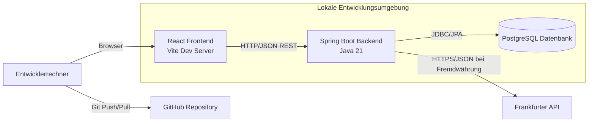
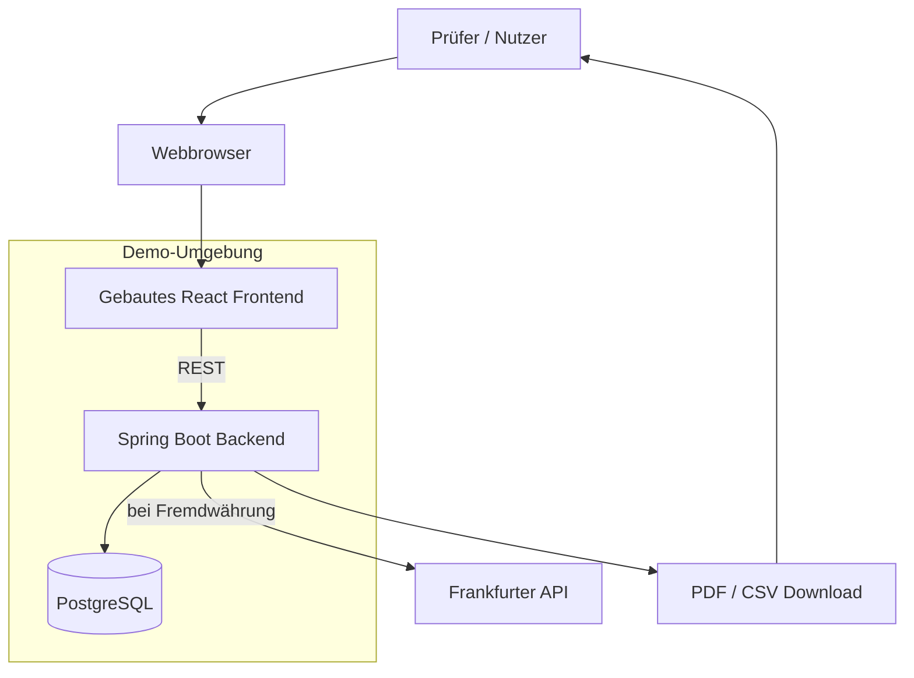
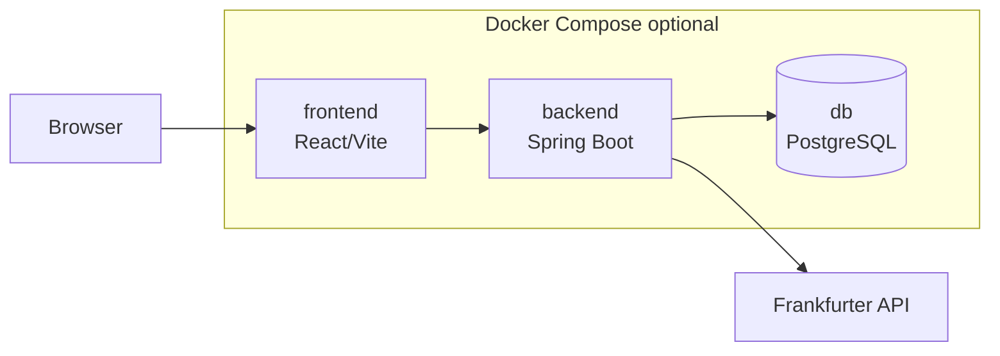

# 7 Verteilungssicht

Die Verteilungssicht ordnet die Bausteine aus [A05 — Building Block View](A05-building-block-view.md) den vorgesehenen Ausführungsumgebungen zu. Für CampusSplit sind vor allem zwei Umgebungen relevant: die lokale Entwicklungsumgebung und eine Review-/Demo-Umgebung für Präsentation und Abnahme im Hochschulprojekt.

Eine produktive Hochverfügbarkeitsumgebung ist nicht Bestandteil des Projektumfangs. CampusSplit wird als Hochschulprojekt entwickelt und muss nachvollziehbar lokal startbar, testbar und präsentierbar sein. Die Inbetriebnahmebedingungen sind fachlich in [`S3 — Inbetriebnahme`](../Spezifikation/S3_Inbetriebnahme.md) beschrieben.

---

## 7.1 Infrastruktur Level 1

### 7.1.1 Lokale Entwicklungsumgebung

Die lokale Entwicklungsumgebung unterstützt die arbeitsteilige Entwicklung von Frontend, Backend und Datenbank.



| Element | Realisierung | Zweck |
|---|---|---|
| Entwicklerrechner | Lokale Installation oder IDE-Umgebung | Entwicklung, Test und Start der Anwendung. |
| React Frontend | Vite Dev Server, z. B. Port `5173` | Darstellung der Dialoge aus B1. |
| Spring Boot Backend | Java 21, z. B. Port `8080` | REST-API, Fachlogik, Validierung, Autorisierung, Export. |
| PostgreSQL | Lokale PostgreSQL-Instanz oder Docker-Container | Dauerhafte Speicherung der Anwendungsdaten. |
| Frankfurter API | Externer REST-Dienst | Wechselkurse für Fremdwährungsausgaben. |
| GitHub | Repository des Projektteams | Versionierung von Spezifikation, Architektur und Code. |

**Zuordnung der Bausteine:**

| Architekturbaustein aus A05 | Laufzeitort |
|---|---|
| Browser Frontend | Browser des Nutzers, ausgeliefert durch Vite im Entwicklungsmodus. |
| REST API / Web Layer | Spring-Boot-Prozess. |
| Application Services | Spring-Boot-Prozess. |
| Domain Model und Money Logic | Spring-Boot-Prozess. |
| Persistence | Spring-Boot-Prozess plus PostgreSQL-Datenbank. |
| Export Module | Spring-Boot-Prozess; erzeugt PDF/CSV als Antwortdatei. |
| Currency Integration | Spring-Boot-Prozess; ruft externen Wechselkursdienst auf. |

---

### 7.1.2 Review- und Demo-Umgebung

Für Vorführung, Review und Abgabe kann CampusSplit lokal oder auf einem einfachen Server gestartet werden. Entscheidend ist, dass alle Kernfunktionen demonstrierbar sind: Registrierung/Anmeldung, Gruppen, Mitglieder, Ausgaben, Salden, Ausgleichsvorschläge und Export.



| Aspekt | Festlegung |
|---|---|
| Startbarkeit | Backend, Frontend und Datenbank müssen mit dokumentierten Schritten startbar sein. |
| Testdaten | Für die Präsentation können Beispielbenutzer, Gruppen, Ausgaben und Salden vorbereitet werden. |
| Externe API | Internetzugriff ist nur für Fremdwährungsausgaben nötig. Ausgaben in Gruppenwährung funktionieren ohne Wechselkursdienst. |
| Export | PDF/CSV wird auf Anforderung erzeugt und heruntergeladen. |
| Datenbestand | Kein Altdatenimport; CampusSplit startet als Greenfield-System. |

---

### 7.1.3 Optionale Containerisierung

Docker ist für CampusSplit sinnvoll, aber nicht zwingend fachlicher Bestandteil. Eine optionale Docker-Compose-Umgebung kann die Entwicklung vereinfachen.



| Service | Aufgabe | Typische Ports |
|---|---|---|
| `frontend` | React/Vite Entwicklungsserver | `5173` |
| `backend` | Spring Boot REST API | `8080` |
| `db` | PostgreSQL Datenbank | `5432` |

Vorteil der Containerisierung ist eine einheitliche Entwicklungsumgebung. Nachteil ist zusätzlicher Einrichtungsaufwand. Für das Hochschulprojekt reicht auch eine lokale PostgreSQL-Installation, solange die Startanleitung eindeutig ist.

---

## 7.2 Infrastruktur Level 2 — Build und Start

### 7.2.1 Backend

| Schritt | Ergebnis |
|---|---|
| Java 21 bereitstellen | Spring Boot kann gestartet werden. |
| Abhängigkeiten über Maven laden | Backend-Build ist reproduzierbar. |
| Konfiguration setzen | Datenbankzugang, Ports und optionale API-Konfiguration stehen bereit. |
| Datenbankschema erzeugen oder migrieren | Tabellen für Benutzer, Gruppen, Mitgliedschaften, Ausgaben usw. existieren. |
| Backend starten | REST-API ist erreichbar. |

Beispielhafte technische Struktur:

```text
backend/
├── pom.xml
├── src/main/java/de/thm/campussplit/
└── src/main/resources/application.yml
```

---

### 7.2.2 Frontend

| Schritt | Ergebnis |
|---|---|
| Node.js bereitstellen | Frontend-Abhängigkeiten können installiert werden. |
| Abhängigkeiten installieren | React/Vite-Projekt ist buildfähig. |
| API-Basis-URL konfigurieren | Frontend erreicht das Backend. |
| Entwicklungsserver oder Build starten | Dialoge sind im Browser nutzbar. |

Beispielhafte technische Struktur:

```text
frontend/
├── package.json
├── src/
└── vite.config.ts
```

---

### 7.2.3 Datenbank

| Aspekt | Festlegung |
|---|---|
| Datenbankprodukt | PostgreSQL |
| Zugriff | Backend über JDBC/Spring Data JPA |
| Persistente Daten | Benutzer, Gruppen, Mitgliedschaften, Ausgaben, Kostenanteile, Kategorien, ggf. Wechselkursdaten |
| Nicht persistent | Berechnete Salden und Ausgleichsvorschläge; sie werden aus Ausgaben und Kostenanteilen berechnet. |
| Migration aus Altsystem | Nicht vorgesehen; siehe S2. |

---

## 7.3 Konfiguration

Die Konfiguration muss zwischen Entwicklungsumgebung und Demo-Umgebung unterscheidbar sein. Sensible Werte dürfen nicht im Repository stehen.

| Konfiguration | Beispiel | Ort |
|---|---|---|
| Backend-Port | `SERVER_PORT=8080` | Umgebungsvariable oder `application.yml` |
| Datenbank-URL | `jdbc:postgresql://localhost:5432/campussplit` | Umgebungsvariable |
| Datenbankbenutzer | `campussplit` | Umgebungsvariable |
| Datenbankpasswort | nicht im Klartext im Repo | Umgebungsvariable |
| Frontend API URL | `http://localhost:8080/api` | `.env` im Frontend |
| Wechselkurs-API Base URL | `https://api.frankfurter.dev` | Backend-Konfiguration |

---

## 7.4 Persistente und nicht persistente Flächen

| Bereich | Persistent? | Begründung |
|---|---:|---|
| PostgreSQL-Datenbank | Ja | Fachliche Daten müssen dauerhaft erhalten bleiben. |
| Logdateien | Teilweise | Fehleranalyse; keine sensiblen Inhalte. |
| PDF/CSV-Dateien | Nein | Werden bei Bedarf erzeugt und heruntergeladen, nicht dauerhaft verwaltet. |
| Frontend-Build-Artefakte | Nein | Können aus dem Quellcode neu erzeugt werden. |
| Wechselkursantworten | Optional | Können gespeichert werden, wenn Nachvollziehbarkeit für Fremdwährungsausgaben erforderlich ist. |

---

## 7.5 Qualitäts- und Sicherheitsaspekte

| Thema | Umsetzung in der Verteilung |
|---|---|
| Gruppenzugriff | Zugriff wird im Backend geprüft; Frontend-Ausblendung allein genügt nicht. |
| Passwörter | Passwort-Hashes werden in der Datenbank gespeichert, niemals Klartext. |
| Externe API | Frankfurter API wird nur vom Backend aufgerufen. |
| Personenbezogene Daten | Werden nicht an den Wechselkursdienst übertragen. |
| Export | Exportdateien enthalten keine Passwörter, Tokens oder technischen Interna. |
| Datenkonsistenz | Speichervorgänge für Ausgaben und Kostenanteile müssen transaktional erfolgen. |

---

## 7.6 Abgrenzung

Nicht Bestandteil dieser Verteilungssicht sind:

- produktive Hochverfügbarkeit,
- automatische Skalierung,
- Cloud-native Infrastruktur,
- Kubernetes,
- Zahlungsprovider-Deployment,
- Bankenschnittstellen,
- OCR- oder KI-Infrastruktur,
- detaillierte Betriebshandbücher.

Diese Themen sind für den Projektumfang von CampusSplit nicht notwendig.
