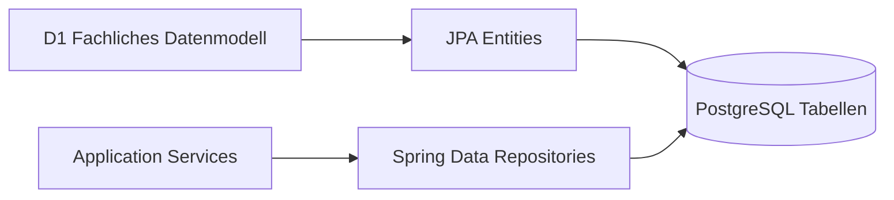
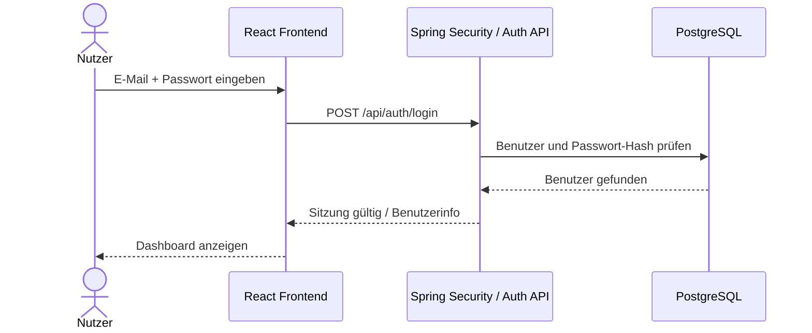
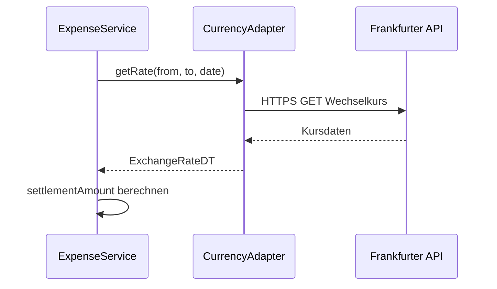

# 8 Querschnittskonzepte

Dieses Kapitel beschreibt Architekturkonzepte, die mehrere Bausteine gleichzeitig betreffen. Die fachlichen Strategien stehen in [`N2 — Querschnittskonzepte`](../Spezifikation/N2_Querschnittskonzepte.md). Dieses Kapitel übersetzt diese Strategien in eine geplante technische Realisierung für CampusSplit.

Da die Implementierung noch nicht vollständig vorliegt, beschreibt dieses Kapitel Zielstruktur, Verantwortlichkeiten und Regeln, die beim Programmieren einzuhalten sind. Konkrete Klassennamen sind als Architekturvorschlag zu verstehen und sollen bei der Umsetzung möglichst beibehalten werden.

---

## 8.1 Überblick

| Abschnitt | Konzept | Bezug zur Spezifikation |
|---|---|---|
| [8.2](#82-domänenmodell-und-persistenz) | Domänenmodell und Persistenz | D1, D2 |
| [8.3](#83-authentifizierung-und-sitzung) | Authentifizierung und Sitzung | N2.2 |
| [8.4](#84-autorisierung-und-gruppenrechte) | Autorisierung und Gruppenrechte | N2.3 |
| [8.5](#85-validierung) | Validierung | N2.4 |
| [8.6](#86-geldbetragsverarbeitung) | Geldbetragsverarbeitung | F3, D2, N2.5 |
| [8.7](#87-fremdwährung-und-wechselkursdienst) | Fremdwährung und Wechselkursdienst | S1, D1, D2 |
| [8.8](#88-fehlerbehandlung) | Fehlerbehandlung | N2.6 |
| [8.9](#89-logging) | Logging | N2.7 |
| [8.10](#810-exportsicherheit) | Exportsicherheit | B3, N2.8 |
| [8.11](#811-ui-architektur) | UI-Architektur | B1, N1 |
| [8.12](#812-testkonzept) | Testkonzept | F3, N1 |

---

## 8.2 Domänenmodell und Persistenz

Das fachliche Datenmodell aus D1 wird technisch durch JPA-Entities und PostgreSQL-Tabellen abgebildet. Salden und Ausgleichsvorschläge werden nicht als dauerhafte Stammdaten gespeichert, sondern aus Ausgaben und Kostenanteilen berechnet.



| Fachliche Entität | Technische Realisierung | Bemerkung |
|---|---|---|
| User | `UserEntity` / Tabelle `users` | Enthält E-Mail, Anzeigename und Passwort-Hash. |
| Group | `GroupEntity` / Tabelle `groups` | Enthält Name, Beschreibung, Gruppenwährung und Owner. |
| Membership | `MembershipEntity` / Tabelle `memberships` | Löst die n:m-Beziehung zwischen User und Group auf. |
| Expense | `ExpenseEntity` / Tabelle `expenses` | Enthält Zahler, Ersteller, Originalbetrag, Abrechnungsbetrag und Datum. |
| ExpenseShare | `ExpenseShareEntity` / Tabelle `expense_shares` | Enthält Kostenanteil je beteiligtem Mitglied. |
| Category | `CategoryEntity` / Tabelle `categories` | Optionale Klassifikation von Ausgaben. |
| Balance | DTO / berechnetes Ergebnis | Wird aus Expenses und ExpenseShares berechnet. |
| SettlementProposal | DTO / berechnetes Ergebnis | Wird aus Salden berechnet. |

### Persistenzregeln

| ID | Regel |
|---|---|
| PER-01 | Datenbankzugriffe erfolgen über Repositories oder klar abgegrenzte Persistenzkomponenten. |
| PER-02 | Fachliche Transaktionen, z. B. Ausgabe plus Kostenanteile, werden atomar gespeichert. |
| PER-03 | Salden werden nicht manuell gespeichert, damit keine widersprüchlichen Werte entstehen. |
| PER-04 | Fremdschlüssel sichern Beziehungen zwischen User, Group, Membership, Expense und ExpenseShare. |
| PER-05 | E-Mail-Adressen müssen eindeutig sein. |
| PER-06 | Ein Benutzer darf pro Gruppe höchstens eine Membership besitzen. |

---

## 8.3 Authentifizierung und Sitzung

CampusSplit schützt alle fachlichen Funktionen außer Registrierung und Anmeldung. Die technische Umsetzung erfolgt über Spring Security. Die genaue technische Ausgestaltung kann als Session-Cookie oder Token erfolgen; entscheidend ist, dass das Backend die Identität des angemeldeten Benutzers zuverlässig prüft.

Empfohlene Zielentscheidung für das Projekt: serverseitige Authentifizierung mit Spring Security und HTTP-only Session-Cookie. Dadurch muss das Frontend keine sensiblen Zugangstokens dauerhaft speichern.



| Regel | Umsetzung |
|---|---|
| AUTH-01 | Registrierung und Anmeldung sind öffentlich erreichbar. |
| AUTH-02 | Alle anderen REST-Endpunkte benötigen eine gültige Authentifizierung. |
| AUTH-03 | Passwörter werden nie im Klartext gespeichert. |
| AUTH-04 | Login-Fehler bleiben allgemein, z. B. „Anmeldedaten ungültig“. |
| AUTH-05 | Logout beendet die Sitzung oder macht das Token ungültig. |

---

## 8.4 Autorisierung und Gruppenrechte

Autorisierung wird nicht dem Frontend überlassen. Das Frontend darf Buttons ausblenden, aber das Backend entscheidet verbindlich, ob eine Aktion erlaubt ist.

| Anfrageart | Backend-Prüfung |
|---|---|
| Gruppe anzeigen | Ist der aktuelle Benutzer Mitglied der Gruppe? |
| Mitglied hinzufügen | Ist der aktuelle Benutzer ADMIN dieser Gruppe? |
| Ausgabe erfassen | Ist der aktuelle Benutzer Mitglied der Gruppe? |
| Ausgabe bearbeiten/löschen | Ist der aktuelle Benutzer Mitglied der Gruppe? |
| Salden anzeigen | Ist der aktuelle Benutzer Mitglied der Gruppe? |
| Export erzeugen | Ist der aktuelle Benutzer Mitglied der Gruppe? |

Empfohlener Service:

```text
MembershipGuard
├── requireMember(userId, groupId)
└── requireAdmin(userId, groupId)
```

### Architekturregel

Jeder gruppenbezogene Controller ruft vor der eigentlichen Fachlogik eine Membership-Prüfung auf. Dadurch wird verhindert, dass ein Benutzer über eine direkte REST-Anfrage auf fremde Gruppendaten zugreift.

---

## 8.5 Validierung

Validierung findet auf mehreren Ebenen statt. Das Frontend hilft durch direkte Hinweise, aber nur das Backend ist verbindlich.

| Ebene | Aufgabe | Beispiel |
|---|---|---|
| Frontend | Sofortige Bedienhinweise | Pflichtfelder markieren, Button deaktivieren. |
| Controller/Request DTO | Formale Eingabeprüfung | `@NotBlank`, `@Email`, `@Positive`, `@NotNull`. |
| Service | Fachliche Prüfung | Zahler muss Gruppenmitglied sein. |
| Datenbank | Integritätsprüfung | Unique Constraints, Foreign Keys. |

### Pflichtfelder je Bereich

| Bereich | Pflichtfelder |
|---|---|
| Registrierung | Name, E-Mail, Passwort |
| Anmeldung | E-Mail, Passwort |
| Gruppe erstellen | Gruppenname, Gruppenwährung |
| Mitglied hinzufügen | E-Mail-Adresse des Mitglieds |
| Ausgabe erfassen | Beschreibung, Betrag, Währung, Datum, Zahler, Beteiligte, Aufteilungsart |
| Ausgabe bearbeiten | Zu ändernde Felder plus gültige Ausgabe-ID |
| Export | Gruppe, Exportformat |

### Fehlerprinzip

Ungültige Eingaben erzeugen verständliche Fehlermeldungen. Es wird nichts teilweise gespeichert, wenn eine fachliche Prüfung fehlschlägt.

---

## 8.6 Geldbetragsverarbeitung

Geldlogik ist der kritischste Teil von CampusSplit. Deshalb liegt sie zentral im Backend und nicht im Frontend.

| Regel | Umsetzung |
|---|---|
| MONEY-01 | Kein `double` oder `float` für Geldbeträge. |
| MONEY-02 | Geldbeträge werden centgenau verarbeitet. |
| MONEY-03 | `MoneyAmountDT` besteht fachlich aus Betrag und Währung. |
| MONEY-04 | Kostenanteile müssen in Summe exakt dem Abrechnungsbetrag entsprechen. |
| MONEY-05 | Salden innerhalb einer Gruppe müssen in Summe 0,00 ergeben. |
| MONEY-06 | Rundungsdifferenzen werden deterministisch verteilt. |

Empfohlene technische Umsetzung:

```text
Money
├── amountInCents: long
└── currency: CurrencyCode
```

Alternativ kann `BigDecimal` verwendet werden, wenn konsequent mit fester Skalierung und Rundungsregeln gearbeitet wird. Für das Projekt ist eine centbasierte Darstellung einfacher testbar.

### Verantwortliche Services

| Service | Aufgabe |
|---|---|
| `SplitService` | Berechnet Kostenanteile einer Ausgabe. |
| `BalanceService` | Berechnet Salden je Gruppenmitglied. |
| `SettlementService` | Berechnet Ausgleichsvorschläge zwischen Debitoren und Kreditoren. |

---

## 8.7 Fremdwährung und Wechselkursdienst

Fremdwährungsausgaben werden über den Wechselkursdienst aus S1 behandelt. Die externe API wird ausschließlich vom Backend aufgerufen.



| Regel | Umsetzung |
|---|---|
| FX-01 | API-Aufruf nur, wenn Originalwährung und Gruppenwährung verschieden sind. |
| FX-02 | Es werden nur Währungscodes und Datum übertragen, keine personenbezogenen Daten. |
| FX-03 | Ohne gültigen Kurs wird keine Fremdwährungsausgabe gespeichert. |
| FX-04 | Originalbetrag, Originalwährung, Kurs und Abrechnungsbetrag bleiben nachvollziehbar. |
| FX-05 | Die eigentliche Umrechnung und Rundung erfolgt in CampusSplit. |

Empfohlener Adapter:

```text
CurrencyRateClient
└── getRate(fromCurrency, toCurrency, date): ExchangeRate
```

---

## 8.8 Fehlerbehandlung

Fehler werden einheitlich behandelt, damit Benutzer keine technischen Details sehen und Daten konsistent bleiben.

| Fehlerart | Beispiel | Verhalten |
|---|---|---|
| Validierungsfehler | Betrag fehlt oder ist negativ | 400/422 mit verständlicher Feldmeldung. |
| Authentifizierungsfehler | Nicht angemeldet | 401 oder Weiterleitung zur Anmeldung. |
| Autorisierungsfehler | Zugriff auf fremde Gruppe | 403, keine Daten werden geliefert. |
| Nicht gefunden | Gruppe existiert nicht | 404. |
| Externe API nicht erreichbar | Wechselkursdienst antwortet nicht | Verständliche Fehlermeldung, keine Speicherung mit erfundenem Kurs. |
| Technischer Fehler | Datenbankfehler | Allgemeine Fehlermeldung, technische Details nur im Log. |

### Architekturregel

Controller geben keine Stacktraces, SQL-Fehler oder internen Klassennamen an das Frontend weiter. Technische Details bleiben im Log.

---

## 8.9 Logging

Logging dient der Fehleranalyse, darf aber keine sensiblen Daten offenlegen.

| Darf geloggt werden | Darf nicht geloggt werden |
|---|---|
| Zeitpunkt eines Fehlers | Klartextpasswörter |
| Fehlerkategorie | Passwort-Hashes |
| Endpunkt oder Use Case | Session-IDs oder Tokens |
| technische Ursache in allgemeiner Form | personenbezogene Detaildaten aus Ausgaben |
| Benutzer-ID, wenn für Analyse nötig | vollständige Exportinhalte |

Empfohlene Regel: Logs sollen bei Fehlern helfen, aber nicht zu einer zweiten Datenbank mit sensiblen Inhalten werden.

---

## 8.10 Exportsicherheit

PDF- und CSV-Export sind ausgehende Datenflüsse. Deshalb gelten besondere Regeln.

| Regel | Umsetzung |
|---|---|
| EXP-01 | Export nur für Gruppen, in denen der Benutzer Mitglied ist. |
| EXP-02 | Exportdaten werden aus aktuellen Gruppen-, Ausgaben-, Anteil- und Saldendaten erzeugt. |
| EXP-03 | Export enthält keine Passwörter, Hashes, Sessions, Tokens oder technischen Interna. |
| EXP-04 | Export erzeugt keine fachliche Zustandsänderung. |
| EXP-05 | PDF ist für menschliches Lesen gedacht, CSV für tabellarische Weiterverarbeitung. |

Empfohlene technische Trennung:

```text
ExportController
└── ExportService
    ├── ExportDataAssembler
    ├── PdfExportWriter
    └── CsvExportWriter
```

---

## 8.11 UI-Architektur

Das Frontend setzt die Dialoge aus B1 als React-Seiten und wiederverwendbare Komponenten um. Fachliche Entscheidungen liegen nicht im Frontend, sondern im Backend.

| UI-Bereich | Architekturregel |
|---|---|
| Pages | Eine Seite je größerem Dialogbereich, z. B. Dashboard, Gruppendetail, Ausgabe erfassen. |
| Components | Wiederverwendbare UI-Elemente wie Formularfeld, Mitgliederliste, Ausgabenkarte. |
| API Client | Kapselt REST-Aufrufe, damit Endpunkte nicht überall im Code verteilt sind. |
| Types | TypeScript-Typen für API-Requests und Responses. |
| Utils | Kleine Hilfsfunktionen für Anzeige, z. B. Geldbetrag formatieren. |

Empfohlene Struktur:

```text
frontend/src/
├── api/
├── components/
├── pages/
├── types/
└── utils/
```

---

## 8.12 Testkonzept

Tests konzentrieren sich zuerst auf die fachlich riskanten Stellen.

| Testart | Fokus |
|---|---|
| Unit-Tests | SplitService, BalanceService, SettlementService, Money-Rundung. |
| Integrationstests | Repository-Zugriffe, Transaktionen, REST-Endpunkte. |
| API-Tests | Auth, Gruppenrechte, Ausgabenerfassung, Export. |
| Frontend-Tests | Formularverhalten und wichtige Seitenzustände. |
| Manuelle Tests | Demo-Szenarien für Review und Präsentation. |

### Besonders wichtige Testfälle

| ID | Testfall |
|---|---|
| T-01 | 10,00 auf 3 Personen ergibt 3,34 / 3,33 / 3,33. |
| T-02 | Summe aller Kostenanteile entspricht exakt dem Abrechnungsbetrag. |
| T-03 | Summe aller Salden einer Gruppe ist 0,00. |
| T-04 | Nicht-Mitglieder können keine Gruppendaten sehen. |
| T-05 | MEMBER kann kein neues Mitglied hinzufügen. |
| T-06 | Fremdwährungsausgabe ohne gültigen Kurs wird nicht gespeichert. |
| T-07 | Export enthält keine sensiblen Daten. |

---

## 8.13 Abgrenzung

Nicht Bestandteil der Querschnittskonzepte sind:

- vollständige Implementierung einzelner Klassen,
- detaillierte SQL-Migrationen,
- konkrete CSS- oder Layoutvorgaben,
- produktive Monitoring-Infrastruktur,
- Zahlungs- oder Bank-Sicherheitskonzepte,
- KI-Sicherheitskonzepte zur Laufzeit.

Diese Themen sind für CampusSplit nicht notwendig oder gehören in spätere Implementierungsdetails.
