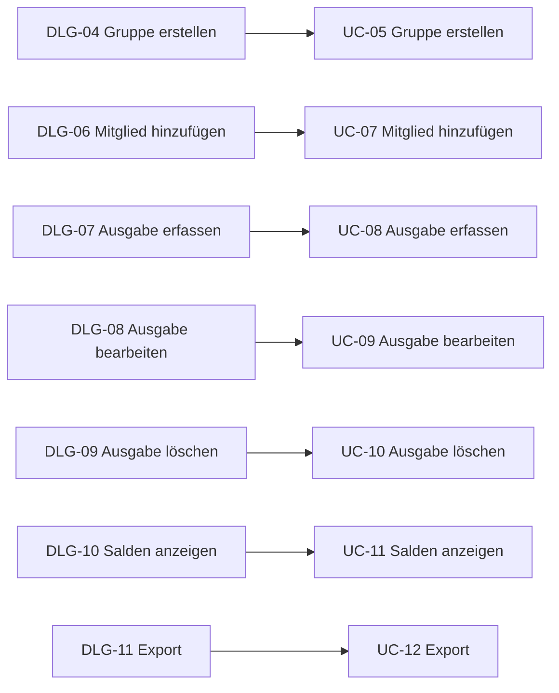
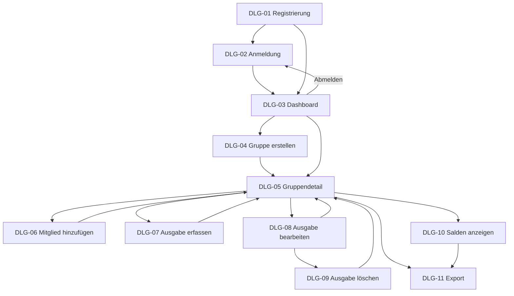

# B1 — Dialogspezifikation

B1 beschreibt die Dialoge, über die man mit CampusSplit arbeitet. Ein Dialog ist eine Bildschirmansicht mit einem klaren Zweck, zum Beispiel „Ausgabe erfassen“ oder „Salden anzeigen“.

Jeder Dialog gehört zu einem Use Case aus [F2 — Anwendungsfälle](F2-anwendungsf%C3%A4lle.md). Wie die Dialoge später genau aussehen (Farben, Layout oder verwendetes Framework), wird hier nicht festgelegt. UC-03 (Abmelden) bekommt keinen eigenen Dialog, dazu mehr in [B1.9](#b19-rollen-und-abmeldung).

## B1.1 Übersicht

| ID | Dialog | Use Case | Wer hat Zugriff |
|---|---|---|---|
| DLG-01 | Registrierung | [UC-01](F2-anwendungsf%C3%A4lle.md#uc-01--registrieren) | Gast |
| DLG-02 | Anmeldung | [UC-02](F2-anwendungsf%C3%A4lle.md#uc-02--anmelden) | Gast |
| DLG-03 | Dashboard | [UC-04](F2-anwendungsf%C3%A4lle.md#uc-04--dashboard-anzeigen) | Benutzer |
| DLG-04 | Gruppe erstellen | [UC-05](F2-anwendungsf%C3%A4lle.md#uc-05--gruppe-erstellen) | Benutzer |
| DLG-05 | Gruppendetail | [UC-06](F2-anwendungsf%C3%A4lle.md#uc-06--gruppe-anzeigen) | Gruppenmitglied |
| DLG-06 | Mitglied hinzufügen | [UC-07](F2-anwendungsf%C3%A4lle.md#uc-07--mitglied-zur-gruppe-hinzuf%C3%BCgen) | Gruppenadministrator |
| DLG-07 | Ausgabe erfassen | [UC-08](F2-anwendungsf%C3%A4lle.md#uc-08--ausgabe-erfassen) | Gruppenmitglied |
| DLG-08 | Ausgabe bearbeiten | [UC-09](F2-anwendungsf%C3%A4lle.md#uc-09--ausgabe-bearbeiten) | Gruppenmitglied |
| DLG-09 | Ausgabe löschen (Bestätigung) | [UC-10](F2-anwendungsf%C3%A4lle.md#uc-10--ausgabe-l%C3%B6schen) | Gruppenmitglied |
| DLG-10 | Salden anzeigen | [UC-11](F2-anwendungsf%C3%A4lle.md#uc-11--salden-anzeigen) | Gruppenmitglied |
| DLG-11 | Export | [UC-12](F2-anwendungsf%C3%A4lle.md#uc-12--ausgaben%C3%BCbersicht-exportieren) | Gruppenmitglied |

Die Akteure und ihre Zuordnung zu den Use Cases sind im [Use-Case-Diagramm in F2.8](F2-anwendungsf%C3%A4lle.md#f28-use-case-diagramm) dargestellt.

### Zuordnung Dialoge und Use Cases

Das Diagramm zeigt die direkte Zuordnung der wichtigsten Dialoge zu den zugehörigen Use Cases.



## B1.2 Zugriff

### DLG-01 — Registrierung

Ein Gast legt ein Konto an.

| Feld | Pflicht | Prüfung |
|---|---|---|
| Name | Ja | darf nicht leer sein |
| E-Mail | Ja | gültiges Format, noch nicht vergeben |
| Passwort | Ja | Regeln gemäß [N2.4 — Validierung](N2_Querschnittskonzepte_%28ZO%29.md#n24-validierung) |

Aktionen: „Registrieren“ → [UC-01](F2-anwendungsf%C3%A4lle.md#uc-01--registrieren), „Zur Anmeldung“ → DLG-02 / [UC-02](F2-anwendungsf%C3%A4lle.md#uc-02--anmelden).

Mögliche Fehler: Pflichtfeld leer, E-Mail-Format ungültig, E-Mail schon vergeben oder Passwort erfüllt die Vorgaben nicht.

Nach erfolgreicher Registrierung geht es entsprechend [UC-01](F2-anwendungsf%C3%A4lle.md#uc-01--registrieren) weiter.

### DLG-02 — Anmeldung

| Feld | Pflicht | Prüfung |
|---|---|---|
| E-Mail | Ja | gültiges E-Mail-Format |
| Passwort | Ja | darf nicht leer sein |

Aktionen: „Anmelden“ → [UC-02](F2-anwendungsf%C3%A4lle.md#uc-02--anmelden), „Registrieren“ → DLG-01 / [UC-01](F2-anwendungsf%C3%A4lle.md#uc-01--registrieren).

Bei falschen Zugangsdaten zeigt das System eine allgemeine Fehlermeldung, ohne zu verraten, ob E-Mail oder Passwort falsch war. Siehe [AUTH-05 in N2.2](N2_Querschnittskonzepte_%28ZO%29.md#n22-authentifizierung-und-sitzung).

Erfolgreich → DLG-03 Dashboard.

## B1.3 Übersicht

### DLG-03 — Dashboard

Startseite nach dem Login. Zeigt alle Gruppen mit Kurzsaldo („bekommt zurück“ / „schuldet“ / „ausgeglichen“). Gibt es noch keine Gruppe, erscheint ein Hinweis zum Erstellen einer neuen Gruppe.

Aktionen:

- „Neue Gruppe erstellen“ → DLG-04 / [UC-05](F2-anwendungsf%C3%A4lle.md#uc-05--gruppe-erstellen)
- Gruppe anklicken → DLG-05 / [UC-06](F2-anwendungsf%C3%A4lle.md#uc-06--gruppe-anzeigen)
- „Abmelden“ → DLG-02 / [UC-03](F2-anwendungsf%C3%A4lle.md#uc-03--abmelden)

## B1.4 Gruppenverwaltung

### DLG-04 — Gruppe erstellen

| Feld | Pflicht | Prüfung |
|---|---|---|
| Gruppenname | Ja | darf nicht leer sein |
| Beschreibung | Nein | optional |

Aktionen: „Gruppe erstellen“ → [UC-05](F2-anwendungsf%C3%A4lle.md#uc-05--gruppe-erstellen), „Abbrechen“ → zurück ohne Speichern.

Nach dem Speichern öffnet sich direkt die neue Gruppe (DLG-05). Wer die Gruppe erstellt, wird automatisch Administrator. Die Rechte stehen in [N2.3 — Autorisierung und Gruppenrechte](N2_Querschnittskonzepte_%28ZO%29.md#n23-autorisierung-und-gruppenrechte).

### DLG-05 — Gruppendetail

Die zentrale Seite einer Gruppe: Name, Mitgliederliste mit Rollenkennzeichnung, Ausgabenliste sowie Zugriff auf Salden und Export.

Aktionen:

- „Ausgabe hinzufügen“ → DLG-07 / [UC-08](F2-anwendungsf%C3%A4lle.md#uc-08--ausgabe-erfassen)
- Ausgabe anklicken → DLG-08 / [UC-09](F2-anwendungsf%C3%A4lle.md#uc-09--ausgabe-bearbeiten)
- „Mitglied hinzufügen“ → DLG-06 / [UC-07](F2-anwendungsf%C3%A4lle.md#uc-07--mitglied-zur-gruppe-hinzuf%C3%BCgen), nur für Admins
- „Salden anzeigen“ → DLG-10 / [UC-11](F2-anwendungsf%C3%A4lle.md#uc-11--salden-anzeigen)
- „Exportieren“ → DLG-11 / [UC-12](F2-anwendungsf%C3%A4lle.md#uc-12--ausgaben%C3%BCbersicht-exportieren)

Wer kein Mitglied der Gruppe ist, hat keinen Zugriff. Siehe [N2.3](N2_Querschnittskonzepte_%28ZO%29.md#n23-autorisierung-und-gruppenrechte).

### DLG-06 — Mitglied hinzufügen

Ein Administrator gibt die E-Mail-Adresse der Person ein, die zur Gruppe hinzugefügt werden soll.

| Feld | Pflicht | Prüfung |
|---|---|---|
| E-Mail | Ja | Konto muss existieren; Person darf noch kein Mitglied sein |

Aktionen: „Mitglied hinzufügen“ → [UC-07](F2-anwendungsf%C3%A4lle.md#uc-07--mitglied-zur-gruppe-hinzuf%C3%BCgen), „Abbrechen“ → DLG-05.

Wer kein Admin ist, kommt nicht an diesen Dialog. Siehe [AUT-04 in N2.3](N2_Querschnittskonzepte_%28ZO%29.md#n23-autorisierung-und-gruppenrechte).

## B1.5 Ausgabenverwaltung

### DLG-07 — Ausgabe erfassen

| Feld | Pflicht | Prüfung / Verhalten |
|---|---|---|
| Beschreibung | Ja | darf nicht leer sein |
| Betrag | Ja | gültiger Geldbetrag nach [D2.3 — MoneyAmountDT](D2_Datentypenverzeichnis_%28ZO%29.md#d23-moneyamountdt) |
| Datum | Ja | gültiges Datum |
| Kategorie | Nein | optional |
| Zahler | Ja | muss zulässiges Gruppenmitglied sein |
| Beteiligte | Ja | mindestens eine Person |
| Aufteilungsart | Ja | `EQUAL` oder `CUSTOM_AMOUNT`, siehe [D2.6 — SplitMethodDT](D2_Datentypenverzeichnis_%28ZO%29.md#d26-splitmethoddt) |
| Kostenanteil pro Person | bei `CUSTOM_AMOUNT` | Summe muss zum Gesamtbetrag passen |

Bei `CUSTOM_AMOUNT` gibt es pro ausgewählter Person ein eigenes Betragsfeld. Zusätzlich wird angezeigt, wie viel vom Gesamtbetrag noch verteilt werden muss.

#### Einfaches Mockup

```text
+--------------------------------------------------+
| Ausgabe erfassen                                 |
+--------------------------------------------------+
| Beschreibung *  [____________________________]   |
| Betrag *        [__________] EUR                 |
| Datum *         [__/__/____]                     |
| Kategorie       [ auswählen                 v ]  |
|                                                  |
| Bezahlt von *   [ auswählen                 v ]  |
| Beteiligte *    [x] Anna  [x] Max  [ ] Lisa     |
|                                                  |
| Aufteilung *    (x) Gleichmäßig                  |
|                 ( ) Eigene Beträge               |
|                                                  |
|                 [Abbrechen]  [Ausgabe speichern] |
+--------------------------------------------------+
```

Bei „Eigene Beträge“ werden zusätzliche Betragsfelder für die ausgewählten Beteiligten eingeblendet. Das Mockup zeigt nur die benötigten Elemente und legt kein endgültiges Layout fest.

Aktionen: „Ausgabe speichern“ → [UC-08](F2-anwendungsf%C3%A4lle.md#uc-08--ausgabe-erfassen), „Abbrechen“ → DLG-05.

Mögliche Fehler: Betrag ungültig, kein Zahler gewählt, Zahler nicht zulässig, keine Beteiligten ausgewählt oder Summe der Anteile passt nicht zum Gesamtbetrag. Die allgemeinen Prüfungen stehen in [N2.4 — Validierung](N2_Querschnittskonzepte_%28ZO%29.md#n24-validierung), die Regeln zu Geldbeträgen in [N2.5 — Geldbetragsverarbeitung](N2_Querschnittskonzepte_%28ZO%29.md#n25-geldbetragsverarbeitung).

Nach dem Speichern zurück zu DLG-05. Ausgaben- und Saldenanzeige werden aktualisiert.

### DLG-08 — Ausgabe bearbeiten

Wie [DLG-07](#dlg-07--ausgabe-erfassen), aber vorausgefüllt mit den bestehenden Werten.

Aktionen: „Änderungen speichern“ → [UC-09](F2-anwendungsf%C3%A4lle.md#uc-09--ausgabe-bearbeiten), „Löschen“ → DLG-09 / [UC-10](F2-anwendungsf%C3%A4lle.md#uc-10--ausgabe-l%C3%B6schen), „Abbrechen“ → DLG-05.

### DLG-09 — Ausgabe löschen (Bestätigung)

Zeigt, was gelöscht wird: Beschreibung, Betrag und Datum. Zusätzlich wird darauf hingewiesen, dass die zugehörigen Kostenanteile mitgelöscht werden.

Aktionen: „Endgültig löschen“ → [UC-10](F2-anwendungsf%C3%A4lle.md#uc-10--ausgabe-l%C3%B6schen), „Abbrechen“ → zurück zu DLG-08.

## B1.6 Saldenverwaltung

### DLG-10 — Salden anzeigen

Zeigt pro Mitglied den Saldo mit klarer Beschriftung: „bekommt X € zurück“, „schuldet X €“ oder „ausgeglichen“. Dazu kommen Ausgleichsvorschläge, also wer wem wie viel zahlen sollte.

Die Berechnung der Salden und Ausgleichsvorschläge ist in [F3 — Anwendungsfunktionen](F3-anwendungsfunktionen.md), insbesondere [AF-02](F3-anwendungsfunktionen.md#af-02--gruppensalden-berechnen) und [AF-03](F3-anwendungsfunktionen.md#af-03--ausgleichsvorschl%C3%A4ge-berechnen), beschrieben.

Die eigentliche Zahlung findet außerhalb von CampusSplit statt.

#### Einfaches Mockup

```text
+--------------------------------------------------+
| Salden                                           |
+--------------------------------------------------+
| Anna        bekommt 24,50 EUR zurück             |
| Max         schuldet 14,50 EUR                   |
| Lisa        schuldet 10,00 EUR                   |
|                                                  |
| Ausgleichsvorschläge                             |
| Max  -> Anna     14,50 EUR                       |
| Lisa -> Anna     10,00 EUR                       |
|                                                  |
|                         [Exportieren] [Zur Gruppe]|
+--------------------------------------------------+
```

Sind noch keine Ausgaben vorhanden, zeigt der Dialog einen leeren Zustand statt einer leeren Tabelle.

Aktionen: „Zur Gruppe“ → DLG-05 / [UC-06](F2-anwendungsf%C3%A4lle.md#uc-06--gruppe-anzeigen), „Exportieren“ → DLG-11 / [UC-12](F2-anwendungsf%C3%A4lle.md#uc-12--ausgaben%C3%BCbersicht-exportieren).

## B1.7 Export

### DLG-11 — Export

| Feld | Pflicht | Verhalten |
|---|---|---|
| Format | Ja | PDF oder CSV, siehe [D2.7 — ExportFormatDT](D2_Datentypenverzeichnis_%28ZO%29.md#d27-exportformatdt) |
| Zeitraum von | Nein | optional |
| Zeitraum bis | Nein | optional |

Aktionen: „Export erstellen“ → [UC-12](F2-anwendungsf%C3%A4lle.md#uc-12--ausgaben%C3%BCbersicht-exportieren), „Abbrechen“ → zurück zur Gruppe.

Klappt die Erzeugung nicht, gibt es eine verständliche Fehlermeldung und der Export kann erneut gestartet werden. Was genau in der Datei steht, ist in [B3 — Druck- und Exportausgaben](B3_Druckausgaben.md) beschrieben.

## B1.8 Dialogfluss



## B1.9 Rollen und Abmeldung

Ab DLG-03 gilt: Nur Gruppenmitglieder sehen die Inhalte einer Gruppe, und nur Admins sehen den Button „Mitglied hinzufügen“. Die Regeln stehen in [N2.3 — Autorisierung und Gruppenrechte](N2_Querschnittskonzepte_%28ZO%29.md#n23-autorisierung-und-gruppenrechte).

Die Abmeldung ([UC-03](F2-anwendungsf%C3%A4lle.md#uc-03--abmelden)) hat keinen eigenen Dialog. Sie ist als Aktion „Abmelden“ in der Navigation verfügbar und führt zu DLG-02.

## B1.10 Nicht Bestandteil von B1

<<<<<<< Updated upstream
Layout, Farben, konkretes UI-Framework, Pixelmaße, REST-Endpunkte hinter den Dialogen und das alles gehört in die Architektur. Was genau im PDF/CSV-Export steht, steht in B3, nicht hier.
=======
Layout, Farben, konkretes UI-Framework, Pixelmaße und technische REST-Endpunkte werden hier nicht festgelegt. Die fachlichen Exportinhalte stehen in [B3](B3_Druckausgaben.md).
>>>>>>> Stashed changes

## B1.11 Querverweise

| Baustein | Relevanz |
|---|---|
| [F2 — Anwendungsfälle](F2-anwendungsf%C3%A4lle.md) | Use Cases zu den Dialogen und das Use-Case-Diagramm |
| [F3 — Anwendungsfunktionen](F3-anwendungsfunktionen.md) | Berechnungen und Anwendungsfunktionen |
| [D1 — Datenmodell](D1_Datenmodell_%28ZO%29.md) | Datenobjekte, die in den Dialogen verwendet werden |
| [D2 — Datentypenverzeichnis](D2_Datentypenverzeichnis_%28ZO%29.md) | Datentypen wie MoneyAmountDT, SplitMethodDT und ExportFormatDT |
| [B3 — Druck- und Exportausgaben](B3_Druckausgaben.md) | Inhalt des Exports aus DLG-11 |
| [N1 — Nichtfunktionale Anforderungen](N1_Nichtfunktionale%20Anforderungen_%28ZO%29.md) | Anforderungen an Bedienbarkeit und Darstellung |
| [N2 — Querschnittskonzepte](N2_Querschnittskonzepte_%28ZO%29.md) | Zugriff, Validierung, Geldbeträge und Fehlerbehandlung |

## Eingesetzte KI-Werkzeuge

Claude (Anthropic) und ChatGPT (OpenAI) wurden unterstützend für Formulierungen, Strukturierung und die Prüfung von Querverweisen verwendet.

Die fachlichen Inhalte wurden anschließend mit den vorhandenen Use Cases und den übrigen Spezifikationsbausteinen abgeglichen.
