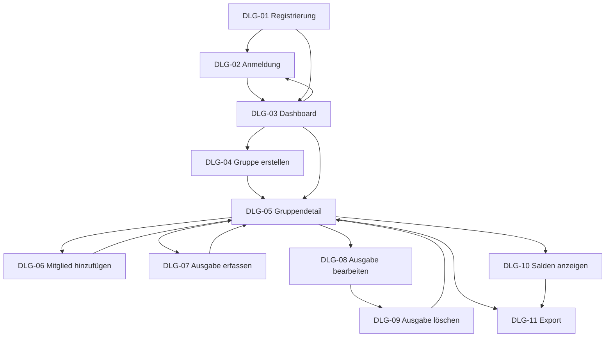

# B1 — Dialogspezifikation

B1 beschreibt die Dialoge, über die man mit CampusSplit arbeitet. Ein Dialog ist eine Bildschirmansicht mit einem klaren Zweck zum Beispiel „Ausgabe erfassen" oder „Salden anzeigen".

Jeder Dialog gehört zu einem Use Case aus F2. Wie die Dialoge aussehen (Farben, Layout, welches Framework) steht hier nicht drin – das ist Sache der Architektur. UC-03 (Abmelden) bekommt keinen eigenen Dialog, dazu mehr in B1.9.

## B1.1 Übersicht

| ID | Dialog | Use Case | Wer hat Zugriff |
|---|---|---|---|
| DLG-01 | Registrierung | UC-01 | Gast |
| DLG-02 | Anmeldung | UC-02 | Gast |
| DLG-03 | Dashboard | UC-04 | Benutzer |
| DLG-04 | Gruppe erstellen | UC-05 | Benutzer |
| DLG-05 | Gruppendetail | UC-06 | Gruppenmitglied |
| DLG-06 | Mitglied hinzufügen | UC-07 | Gruppenadministrator |
| DLG-07 | Ausgabe erfassen | UC-08 | Gruppenmitglied |
| DLG-08 | Ausgabe bearbeiten | UC-09 | Gruppenmitglied |
| DLG-09 | Ausgabe löschen (Bestätigung) | UC-10 | Gruppenmitglied |
| DLG-10 | Salden anzeigen | UC-11 | Gruppenmitglied |
| DLG-11 | Export | UC-12 | Gruppenmitglied |

## B1.2 Zugriff

### DLG-01 — Registrierung

Ein Gast legt ein Konto an: Name, E-Mail, Passwort. Button „Registrieren", daneben ein Link zur Anmeldung.

Mögliche Fehler: Pflichtfeld leer, E-Mail-Format ungültig, E-Mail schon vergeben, Passwort zu schwach.

Nach erfolgreicher Registrierung geht's weiter zu DLG-02 oder direkt zu DLG-03.

### DLG-02 — Anmeldung

Eingabe von E-Mail und Passwort, Button „Anmelden", Link zur Registrierung.

Bei falschen Zugangsdaten zeigt das System eine allgemeine Fehlermeldung – ohne zu verraten, ob E-Mail oder Passwort falsch war (AUTH-05).

Erfolgreich → DLG-03 Dashboard.

## B1.3 Übersicht

### DLG-03 — Dashboard

Startseite nach dem Login. Zeigt alle Gruppen mit Kurzsaldo („bekommt zurück" / „schuldet" / „ausgeglichen"). Gibt es noch keine Gruppe, erscheint ein Hinweis zum Erstellen einer neuen Gruppe.

Aktionen: „Neue Gruppe erstellen" (→ DLG-04), eine Gruppe anklicken (→ DLG-05), „Abmelden" (→ DLG-02).

## B1.4 Gruppenverwaltung

### DLG-04 — Gruppe erstellen

Formular mit Gruppenname (Pflicht) und Beschreibung (optional). Button „Gruppe erstellen".

Fehler: Name fehlt oder ist zu lang.

Nach dem Speichern öffnet sich direkt die neue Gruppe (DLG-05). Wer erstellt, wird automatisch Administrator.

### DLG-05 — Gruppendetail

Die zentrale Seite einer Gruppe: Name, Mitgliederliste (mit Rollenkennzeichnung ADMIN/MEMBER), Ausgabenliste, und Zugriff auf Salden und Export.

Aktionen: „Ausgabe hinzufügen" (→ DLG-07), eine Ausgabe anklicken zum Bearbeiten (→ DLG-08), „Mitglied hinzufügen" – nur sichtbar für Admins (→ DLG-06), „Salden anzeigen" (→ DLG-10), „Exportieren" (→ DLG-11).

Wer kein Mitglied der Gruppe ist, hat keinen Zugang :  Zugriff verweigert.

### DLG-06 — Mitglied hinzufügen

Ein Administrator gibt die E-Mail-Adresse der Person ein, die zur Gruppe soll. System prüft, ob dazu ein Konto existiert.

Fehler: kein Konto mit dieser E-Mail gefunden; Person ist schon Mitglied (dann passiert einfach nichts). Wer kein Admin ist, kommt gar nicht an diesen Dialog (AUT-04).

## B1.5 Ausgabenverwaltung

### DLG-07 — Ausgabe erfassen

Formular mit: Beschreibung, Betrag, Datum, Kategorie (optional), Zahler (Dropdown, nur Gruppenmitglieder), Beteiligte (Mehrfachauswahl), Aufteilungsart (`EQUAL` oder `CUSTOM_AMOUNT`). Bei `CUSTOM_AMOUNT` gibt es pro ausgewählter Person ein eigenes Betragsfeld, dazu eine Live-Anzeige, wie viel noch fehlt.

Fehler: Betrag ungültig, kein Zahler gewählt, Zahler kein Gruppenmitglied, keine Beteiligten ausgewählt, Summe der Anteile passt nicht zum Gesamtbetrag.

Nach dem Speichern zurück zu DLG-05, Ausgaben- und Saldenanzeige sind aktuell.

### DLG-08 — Ausgabe bearbeiten

Wie DLG-07, aber vorausgefüllt mit den bestehenden Werten. Zusätzlich ein „Löschen"-Button, der zu DLG-09 führt.

### DLG-09 — Ausgabe löschen (Bestätigung)

Zeigt, was gelöscht wird (Beschreibung, Betrag, Datum), plus Warnung, dass auch die Kostenanteile mitgelöscht werden. „Endgültig löschen" oder „Abbrechen".

## B1.6 Saldenverwaltung

### DLG-10 — Salden anzeigen

Zeigt pro Mitglied den Saldo mit klarer Beschriftung: „bekommt X € zurück", „schuldet X €" oder „ausgeglichen". Dazu Ausgleichsvorschläge (wer sollte wem wie viel zahlen). Hinweis, dass die eigentliche Zahlung außerhalb von CampusSplit passiert.

Sind noch keine Ausgaben da, zeigt der Dialog einen leeren Zustand statt einer leeren Tabelle.

## B1.7 Export

### DLG-11 — Export

Auswahl des Formats (PDF oder CSV) und optional ein Zeitraum. Button „Export erstellen".

Klappt die Erzeugung nicht, gibt's eine verständliche Fehlermeldung, und man kann es nochmal versuchen. Was genau in der Datei drinsteht, steht in B3.

## B1.8 Dialogfluss

## B1.9 Rollen und Abmeldung

Ab DLG-03 gilt: Nur Gruppenmitglieder sehen die Inhalte einer Gruppe, und nur Admins sehen den Button „Mitglied hinzufügen" (siehe N2.3).

Die Abmeldung (UC-03) hat keinen eigenen Dialog. Sie ist einfach ein Button „Abmelden" in der Navigation, überall dort verfügbar, wo man angemeldet ist, und führt direkt zu DLG-02.

## B1.10 Nicht Bestandteil von B1

Layout, Farben, konkretes UI-Framework, Pixelmaße, REST-Endpunkte hinter den Dialogen und das alles gehört in die Architektur. Was genau im PDF/CSV-Export steht, steht in B3, nicht hier.

## B1.11 Querverweise

| Baustein | Relevanz |
|---|---|
| F2 | Jeder Dialog gehört zu genau einem Use Case (außer UC-03). |
| D1 / D2 | Liefern die Datenobjekte und Datentypen, die in den Dialogen angezeigt und erfasst werden. |
| B3 | Beschreibt, was der über DLG-11 erzeugte Export enthält. |
| N1 | Fordert responsives, verständliches Verhalten der Dialoge. |
| N2 | Regelt Zugriff, Sichtbarkeit von Aktionen und Fehlermeldungen. |

## Eingesetzte KI-Werkzeuge

Claude (Anthropic) Für die Verbindung und Expandierung unterschiedliche Ideen und Bausteine sowie die saubere Formulierung

Entwurf gegen die eigenen Use Cases geprüft von Momosan009.
