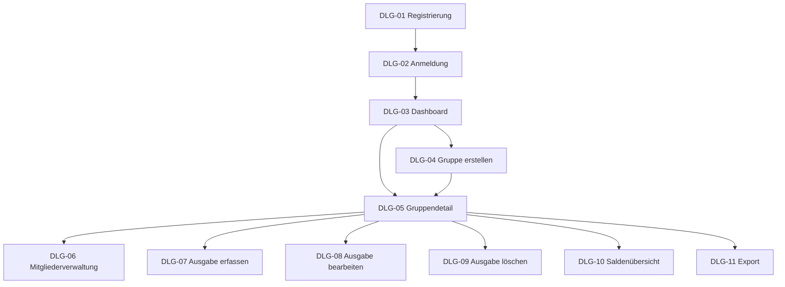

# B1 — Ergänzung: Maskenübersicht, Pflichtfelder und Use-Case-Auslöser

Diese Ergänzung setzt die Review-Hinweise zu B1 um, ohne die bestehende Datei `B1_Dialogspezifikation.md` zu überschreiben.

Im Review wurde angemerkt, dass der Überblick weiter nach oben gehört, Buttons klarer Use Cases auslösen sollen und Pflichtfelder pro Maske sichtbarer werden müssen.

---

## 1. Dialogüberblick

| Maske | Zweck | Wichtigster Use Case |
|---|---|---|
| DLG-01 Registrierung | Benutzerkonto erstellen | UC-01 Registrieren |
| DLG-02 Anmeldung | Benutzer anmelden | UC-02 Anmelden |
| DLG-03 Dashboard | Gruppenübersicht anzeigen | UC-04 Dashboard anzeigen |
| DLG-04 Gruppe erstellen | Neue Gruppe anlegen | UC-05 Gruppe erstellen |
| DLG-05 Gruppendetail | Gruppe, Mitglieder, Ausgaben und Salden anzeigen | UC-06 Gruppe anzeigen |
| DLG-06 Mitgliederverwaltung | Mitglied hinzufügen | UC-07 Mitglied zur Gruppe hinzufügen |
| DLG-07 Ausgabe erfassen | Neue Ausgabe anlegen | UC-08 Ausgabe erfassen |
| DLG-08 Ausgabe bearbeiten | Bestehende Ausgabe ändern | UC-09 Ausgabe bearbeiten |
| DLG-09 Ausgabe löschen | Ausgabe entfernen | UC-10 Ausgabe löschen |
| DLG-10 Saldenübersicht | Debitoren, Kreditoren und Ausgleichsvorschläge anzeigen | UC-11 Salden anzeigen |
| DLG-11 Export | PDF-/CSV-Ausgabe erzeugen | UC-12 Ausgabenübersicht exportieren |

---

## 2. Navigation als Mermaid-Diagramm

---

## 3. Buttons lösen Use Cases aus

| Maske | Button/Aktion | Ausgelöster Use Case | Ergebnis |
|---|---|---|---|
| Registrierung | Registrieren | UC-01 | Benutzerkonto wird angelegt. |
| Anmeldung | Anmelden | UC-02 | Sitzung wird erstellt; Dashboard wird geöffnet. |
| Dashboard | Neue Gruppe | UC-05 | Gruppenerstellungsmaske wird geöffnet. |
| Dashboard | Gruppe öffnen | UC-06 | Gruppendetail wird angezeigt. |
| Gruppendetail | Mitglied hinzufügen | UC-07 | Mitgliederverwaltung wird geöffnet. |
| Gruppendetail | Ausgabe hinzufügen | UC-08 | Ausgabeformular wird geöffnet. |
| Gruppendetail | Ausgabe bearbeiten | UC-09 | Bearbeitungsformular wird geöffnet. |
| Gruppendetail | Ausgabe löschen | UC-10 | Bestätigungsdialog wird geöffnet. |
| Gruppendetail | Salden anzeigen | UC-11 | Saldenübersicht wird geöffnet. |
| Gruppendetail | Exportieren | UC-12 | Exportmaske wird geöffnet. |
| Export | Export erzeugen | UC-12 | PDF- oder CSV-Datei wird erzeugt. |

---

## 4. Pflichtfelder pro Maske

| Maske | Pflichtfelder | Validierungsregel |
|---|---|---|
| DLG-01 Registrierung | Name, E-Mail, Passwort | E-Mail eindeutig; Passwort nicht leer. |
| DLG-02 Anmeldung | E-Mail, Passwort | Zugangsdaten müssen gültig sein. |
| DLG-04 Gruppe erstellen | Gruppenname, Gruppenwährung | Gruppenname darf nicht leer sein. |
| DLG-06 Mitgliederverwaltung | E-Mail-Adresse des neuen Mitglieds | Benutzer muss existieren und darf noch nicht Mitglied sein. |
| DLG-07 Ausgabe erfassen | Beschreibung, Betrag, Originalwährung, Datum, Zahler, Beteiligte, Aufteilungsart | Betrag > 0; Zahler und Beteiligte sind Gruppenmitglieder. |
| DLG-08 Ausgabe bearbeiten | Beschreibung, Betrag, Originalwährung, Datum, Zahler, Beteiligte, Aufteilungsart | Summe der Kostenanteile entspricht dem Abrechnungsbetrag. |
| DLG-11 Export | Exportformat | Format muss PDF oder CSV sein. |

---

## 5. Warn- und Fehlermeldungen

| Situation | Art | Benutzerhinweis |
|---|---|---|
| Pflichtfeld fehlt | Validierungsfehler | Bitte füllen Sie das Pflichtfeld aus. |
| Betrag ist 0 oder negativ | Validierungsfehler | Der Betrag muss größer als 0,00 sein. |
| Keine Beteiligten ausgewählt | Validierungsfehler | Bitte wählen Sie mindestens ein Gruppenmitglied aus. |
| Kostenanteile passen nicht zur Summe | Validierungsfehler | Die Summe der Anteile muss dem Abrechnungsbetrag entsprechen. |
| Fremdwährung benötigt Kurs | Warnhinweis | Für diese Ausgabe wird ein Wechselkurs benötigt. |
| Wechselkursdienst nicht erreichbar | Fehler | Der Wechselkurs konnte nicht ermittelt werden. Bitte versuchen Sie es erneut. |
| Benutzer ist kein Gruppenmitglied | Autorisierungsfehler | Sie haben keinen Zugriff auf diese Gruppe. |
| Export kann nicht erzeugt werden | Fehler | Der Export konnte nicht erstellt werden. |
| Ausgabe löschen | Warnung/Bestätigung | Diese Aktion kann nicht automatisch rückgängig gemacht werden. |

---

## 6. Besondere Eingaben bei Fremdwährung

Wenn eine Ausgabe nicht in der Gruppenwährung erfasst wird, zeigt die Maske zusätzliche Informationen an.

| Feld | Bedeutung | Pflicht? |
|---|---|---|
| Originalbetrag | Betrag, der tatsächlich bezahlt wurde | ja |
| Originalwährung | Währung der tatsächlichen Ausgabe | ja |
| Gruppenwährung | Währung der Gruppenabrechnung | ja, aus Gruppe übernommen |
| Wechselkurs | Kurs zwischen Originalwährung und Gruppenwährung | automatisch über S1 |
| Abrechnungsbetrag | Umgerechneter Betrag in Gruppenwährung | automatisch berechnet |

---

## 7. Kurze Abgrenzung

B1 beschreibt die fachliche Bedienung und die sichtbaren Eingaben. B1 beschreibt nicht:

| Nicht Bestandteil | Gehört zu |
|---|---|
| REST-Endpunkte | S1 / Architektur |
| Datenbankschema | D1 / Architektur |
| Berechnungsalgorithmus | F3 |
| Konkretes CSS-Layout | Implementierung |
| Technische Exportbibliothek | Architektur / Implementierung |

---

## 8. Querverweise

| Baustein | Relevanz |
|---|---|
| F2 | Use Cases werden durch Buttons und Dialogaktionen ausgelöst. |
| F3 | Berechnet Kostenanteile, Salden und Ausgleichsvorschläge. |
| D1/D2 | Definieren Datenobjekte und Datentypen für Eingabefelder. |
| S1 | Wechselkursdienst wird bei Fremdwährungsausgaben genutzt. |
| B3 | Exportmaske führt zu PDF- oder CSV-Ausgaben. |
| N2 | Validierung, Fehlerbehandlung und Geldbetragsverarbeitung gelten dialogübergreifend. |
