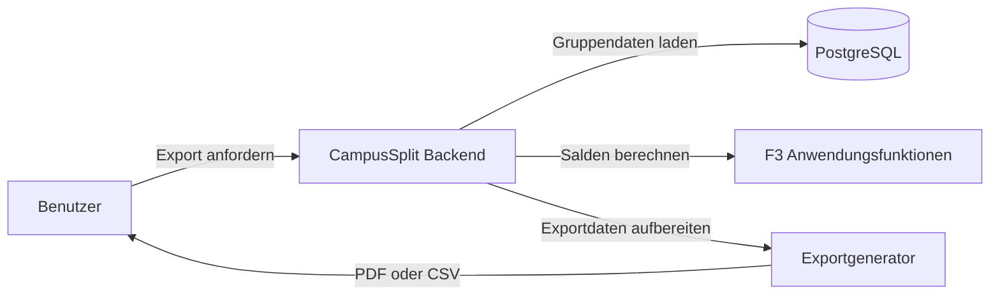

# B3 — Ergänzung: Export-Datenfluss und Exportumfang

Diese Ergänzung setzt den Review-Hinweis um, dass Exporte ausführlicher beschrieben werden sollen und PDF/CSV als Datenfluss sichtbar sein müssen. Die vorhandene Datei `B3_Druckausgaben.md` bleibt unverändert bestehen.

---

## 1. Einordnung

CampusSplit erzeugt Exportdateien auf ausdrückliche Benutzeraktion. Ein Export ist ein ausgehender Datenfluss aus CampusSplit zum Benutzer.

Der Export verändert keine gespeicherten Daten.

---

## 2. Exportvarianten

| Export | Format | Zweck | Zielgruppe |
|---|---|---|---|
| Gruppenausgabenübersicht | PDF | Lesbare Abrechnung zum Speichern oder Ausdrucken | Gruppenmitglieder |
| Gruppenausgabenliste | CSV | Tabellarische Weiterverarbeitung | Gruppenmitglieder |

---

## 3. Datenbasis des Exports

| Datenquelle | Verwendete Daten | Herkunft |
|---|---|---|
| Gruppe | Gruppenname, Gruppenwährung | D1 `Group` |
| Mitglieder | Namen und Rollen | D1 `User`, `Membership` |
| Ausgaben | Beschreibung, Datum, Zahler, Betrag, Währung | D1 `Expense` |
| Kostenanteile | Beteiligte Mitglieder und Anteil | D1 `ExpenseShare` |
| Salden | Debitor/Kreditor und Betrag | F3 AF-02 |
| Ausgleichsvorschläge | Wer zahlt an wen welchen Betrag | F3 AF-03 |
| Fremdwährung | Originalbetrag, Originalwährung, Kurs, Abrechnungsbetrag | S1/D1/D2 |

---

## 4. PDF-Inhalt

| Abschnitt im PDF | Inhalt |
|---|---|
| Kopfbereich | Gruppenname, Exportdatum, Gruppenwährung, optionaler Zeitraum |
| Mitglieder | Liste der Gruppenmitglieder |
| Ausgaben | Datum, Beschreibung, Kategorie, Zahler, Originalbetrag, Abrechnungsbetrag |
| Kostenanteile | Beteiligte Personen und jeweiliger Anteil |
| Salden | Debitoren, Kreditoren und ausgeglichene Mitglieder |
| Ausgleichsvorschläge | Konkrete Vorschläge zur manuellen Zahlung |
| Hinweis | CampusSplit führt keine Zahlungen aus. |

---

## 5. CSV-Spalten

| Spalte | Bedeutung |
|---|---|
| `group_name` | Name der Gruppe |
| `group_currency` | Währung der Gruppenabrechnung |
| `expense_date` | Datum der Ausgabe |
| `description` | Beschreibung der Ausgabe |
| `category` | Kategorie der Ausgabe |
| `payer` | Zahler der Ausgabe |
| `original_amount` | Ursprünglich bezahlter Betrag |
| `original_currency` | Ursprüngliche Währung |
| `exchange_rate` | Verwendeter Wechselkurs, falls relevant |
| `settlement_amount` | Betrag in Gruppenwährung |
| `participant` | Beteiligtes Mitglied |
| `share_amount` | Kostenanteil in Gruppenwährung |

---

## 6. Exportregeln

| ID | Regel |
|---|---|
| EXP-01 | Ein Export bezieht sich auf genau eine Gruppe. |
| EXP-02 | Nur Gruppenmitglieder dürfen einen Export ihrer Gruppe erzeugen. |
| EXP-03 | Exporte sind Momentaufnahmen des aktuellen Datenstandes. |
| EXP-04 | Exporte verändern keine Daten. |
| EXP-05 | Salden und Ausgleichsvorschläge werden aus F3 übernommen. |
| EXP-06 | Bei Fremdwährungsausgaben werden Originalbetrag und Abrechnungsbetrag dargestellt. |
| EXP-07 | Exporte enthalten keine Passwörter, Passwort-Hashes oder Sessiondaten. |
| EXP-08 | Technische IDs werden nicht exportiert, sofern sie keinen fachlichen Nutzen für Benutzer haben. |

---

## 7. Fehlerfälle

| Fehlerfall | Verhalten |
|---|---|
| Benutzer ist kein Gruppenmitglied | Export wird verweigert. |
| Gruppe existiert nicht | Fehlermeldung wird angezeigt. |
| Keine Ausgaben vorhanden | Export wird mit leerer Ausgabenliste und Hinweis erzeugt. |
| Wechselkursdaten fehlen bei Fremdwährung | Export weist auf fehlende Umrechnungsdaten hin oder verhindert die Ausgabe. |
| PDF/CSV kann technisch nicht erzeugt werden | Benutzer erhält verständliche Fehlermeldung. |

---

## 8. Querverweise

| Baustein | Relevanz |
|---|---|
| B1 | Export wird über den Exportdialog ausgelöst. |
| F3 | Exportdaten, Salden und Ausgleichsvorschläge werden dort vorbereitet. |
| D1/D2 | Datenmodell und Datentypen liefern die Datenbasis. |
| S1 | Wechselkursdienst liefert Daten für Fremdwährungsausgaben. |
| N2 | Exportsicherheit und Fehlerbehandlung gelten für alle Exportformate. |
