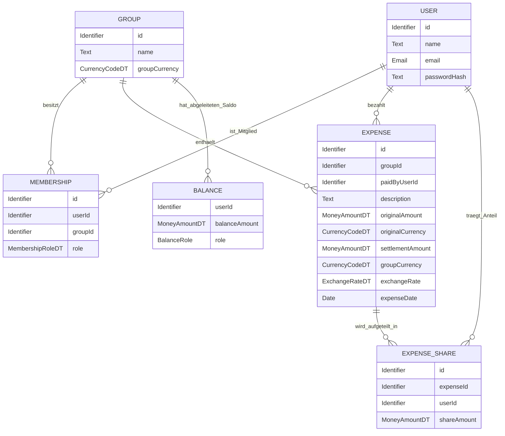

# D1/D2/F3 — Konsistenzergänzung zu Datenstruktur, Geldaufteilung und Währung

Diese Ergänzung setzt Review-Hinweise zu Datenstruktur, Geldaufteilung, Debitor/Kreditor, Rundung und Währungsbehandlung um. Die bestehenden Dateien D1, D2 und F3 bleiben unverändert bestehen.

---

## 1. Ziel der Ergänzung

| Review-Hinweis | Umsetzung in dieser Datei |
|---|---|
| Diagramm und Datenstruktur zu mager | Fachliche Kernstruktur wird tabellarisch und mit Mermaid ergänzt. |
| Kreditor/Debitor einführen | Begriffe werden in die Saldenlogik aufgenommen. |
| Geld aufteilen richtig machen | Kostenanteile, Rundung und Salden werden präzisiert. |
| D1.3 und F3 sauber verlinken | Abgeleitete Daten werden eindeutig den Anwendungsfunktionen AF-01 bis AF-03 zugeordnet. |
| Many / n:m-Beziehungen besser darstellen | Membership und ExpenseShare werden als Auflösungstabellen erklärt. |
| MoneyAmount könnte Currency enthalten | Entscheidung zur Kombination aus Geldbetrag und Währung wird dokumentiert. |

---

## 2. Zentrale Datenstruktur



`BALANCE` ist keine dauerhaft gespeicherte Entität, sondern eine abgeleitete Sicht aus `Expense` und `ExpenseShare`.

---

## 3. Auflösung der n:m-Beziehungen

| Fachliche Beziehung | Problem | Auflösung im Datenmodell |
|---|---|---|
| Benutzer können in mehreren Gruppen sein; Gruppen haben mehrere Benutzer | n:m-Beziehung | `Membership` verbindet `User` und `Group`. |
| Eine Ausgabe kann mehrere Beteiligte haben; ein Benutzer kann an vielen Ausgaben beteiligt sein | n:m-Beziehung | `ExpenseShare` verbindet `Expense` und `User`. |

Dadurch bleiben Rollen, Kostenanteile und Zugriffsrechte eindeutig modellierbar.

---

## 4. Debitor und Kreditor

Für die Saldenanzeige werden die Begriffe Debitor und Kreditor verwendet.

| Begriff | Bedeutung in CampusSplit | Beispiel |
|---|---|---|
| Debitor / Schuldner | Mitglied mit negativem Saldo | Person schuldet Geld. |
| Kreditor / Gläubiger | Mitglied mit positivem Saldo | Person bekommt Geld zurück. |
| Ausgeglichen | Mitglied mit Saldo 0,00 | Keine offene Forderung oder Verbindlichkeit. |

Die Begriffe beziehen sich nur auf die interne Abrechnung. CampusSplit führt keine echten Zahlungen aus.

---

## 5. Saubere Verlinkung D1.3 ↔ F3

| Abgeleitete Information in D1.3 | Zuständige Anwendungsfunktion in F3 | Beschreibung |
|---|---|---|
| Kostenanteile je Ausgabe | AF-01 Kostenanteile berechnen | Zerlegt eine Ausgabe in Anteile je Beteiligtem. |
| Gruppensalden | AF-02 Gruppensalden berechnen | Berechnet je Mitglied `gezahlt - eigener Anteil`. |
| Debitor/Kreditor-Rolle | AF-02 Gruppensalden berechnen | Leitet aus dem Vorzeichen des Saldos die Rolle ab. |
| Ausgleichsvorschläge | AF-03 Ausgleichsvorschläge berechnen | Erzeugt Vorschläge Debitor zahlt an Kreditor. |
| Exportdaten | AF-04 Exportdaten aufbereiten | Bereitet Ausgaben, Anteile, Salden und Vorschläge für PDF/CSV auf. |

---

## 6. Geldaufteilung und Rundung

### 6.1 Grundregel

Jede Ausgabe besitzt einen Abrechnungsbetrag in der Gruppenwährung. Nur dieser Betrag wird für Kostenanteile, Salden und Ausgleichsvorschläge verwendet.

```text
Summe aller Kostenanteile = Abrechnungsbetrag der Ausgabe
```

### 6.2 Beispiel gleichmäßige Aufteilung

| Gesamtbetrag | Beteiligte | Ergebnis |
|---:|---:|---|
| 30,00 € | 3 | 10,00 €, 10,00 €, 10,00 € |
| 10,00 € | 3 | 3,34 €, 3,33 €, 3,33 € |

Die Verteilung muss deterministisch sein. Bei gleicher Eingabe entsteht immer dieselbe Aufteilung.

### 6.3 Rundungsregel

| Schritt | Regel |
|---|---|
| 1 | Betrag wird in Cent oder mit exaktem Dezimaltyp verarbeitet. |
| 2 | Grundanteil wird für alle Beteiligten berechnet. |
| 3 | Rundungsdifferenz wird centweise verteilt. |
| 4 | Die Reihenfolge der Verteilung ist deterministisch, z. B. nach Mitglieds-ID oder stabiler Teilnehmerreihenfolge. |
| 5 | Die Summe aller Anteile muss exakt dem Gesamtbetrag entsprechen. |

---

## 7. MoneyAmount und Currency

Im Review wurde angemerkt, dass `MoneyAmount` die Währung enthalten könnte. Für CampusSplit wird folgende fachliche Entscheidung festgehalten:

| Variante | Bewertung |
|---|---|
| MoneyAmount enthält nur Betrag; Currency ist separates Attribut | Für D1/D2 gut nachvollziehbar und leicht tabellarisch darstellbar. |
| MoneyAmount enthält Betrag und Währung gemeinsam | Fachlich kompakter, aber in Tabellen und Validierungsregeln schwerer sichtbar. |

### Entscheidung

CampusSplit verwendet fachlich ein Wertpaar aus Betrag und Währung. In D1 kann dieses Paar weiterhin als zwei Attribute dargestellt werden:

```text
originalAmount + originalCurrency
settlementAmount + groupCurrency
```

Damit bleibt sichtbar:

- welcher Betrag ursprünglich eingegeben wurde,
- in welcher Währung er eingegeben wurde,
- welcher Betrag für die Gruppenabrechnung verwendet wird,
- in welcher Gruppenwährung Salden berechnet werden.

---

## 8. Fremdwährung und Wechselkurs

Wenn eine Ausgabe in einer anderen Währung als der Gruppenwährung erfasst wird, wird der Wechselkursdienst aus S1 verwendet.

| Feld | Bedeutung |
|---|---|
| `originalAmount` | Eingetragener Betrag der Ausgabe |
| `originalCurrency` | Ursprüngliche Währung der Ausgabe |
| `exchangeRate` | Verwendeter Wechselkurs |
| `settlementAmount` | Umgerechneter Betrag in Gruppenwährung |
| `groupCurrency` | Währung, in der Salden geführt werden |

### Beispiel

| Feld | Wert |
|---|---|
| Originalbetrag | 30,00 USD |
| Gruppenwährung | EUR |
| Wechselkurs | 0,86 |
| Abrechnungsbetrag | 25,80 EUR |

Kostenanteile und Salden werden aus dem Abrechnungsbetrag berechnet.

---

## 9. Invarianten

| ID | Regel |
|---|---|
| INV-MONEY-01 | Eine Ausgabe muss einen positiven Originalbetrag besitzen. |
| INV-MONEY-02 | Jede Ausgabe besitzt eine Originalwährung. |
| INV-MONEY-03 | Jede Gruppe besitzt eine Gruppenwährung. |
| INV-MONEY-04 | Bei gleicher Original- und Gruppenwährung entspricht der Abrechnungsbetrag dem Originalbetrag. |
| INV-MONEY-05 | Bei abweichender Währung muss ein Wechselkurs vorhanden sein. |
| INV-MONEY-06 | Die Summe aller Kostenanteile entspricht exakt dem Abrechnungsbetrag. |
| INV-MONEY-07 | Die Summe aller Gruppensalden beträgt exakt 0,00 in der Gruppenwährung. |
| INV-MONEY-08 | Debitoren haben negative Salden; Kreditoren haben positive Salden. |

---

## 10. Querverweise

| Baustein | Relevanz |
|---|---|
| D1 | Entitäten und abgeleitete Informationen. |
| D2 | MoneyAmountDT, CurrencyCodeDT und mögliche ExchangeRateDT-Ergänzung. |
| F3 | Berechnung von Kostenanteilen, Salden, Debitor/Kreditor und Ausgleichsvorschlägen. |
| B1 | Eingabe von Betrag, Währung und Beteiligten. |
| B3 | Export von Originalbetrag, Abrechnungsbetrag, Wechselkurs und Salden. |
| S1 | Einbindung des Wechselkursdienstes. |
| N2 | Querschnittliche Geldbetragsverarbeitung und Validierung. |
