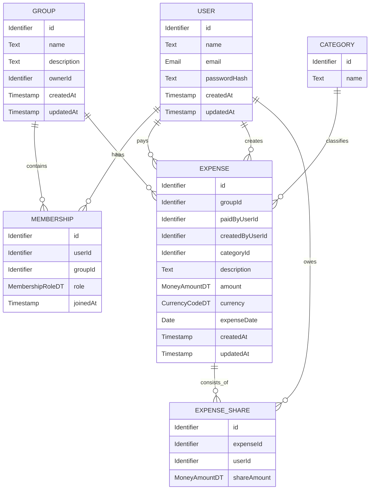

# D1 - Datenmodell

D1 beschreibt das fachliche Datenmodell von CampusSplit. Der Baustein legt fest, welche Informationen das System verarbeitet und wie diese Informationen fachlich miteinander zusammenhängen.

Das Datenmodell beschreibt keine konkrete Datenbankstruktur. Physische Tabellen, Spaltentypen, Indizes, Migrationen, ORM-Mapping und technische Persistenzentscheidungen gehören zur Architektur- und Implementierungsdokumentation.

Im Mittelpunkt von CampusSplit stehen Benutzer:innen, Gruppen, Gruppenmitgliedschaften, Ausgaben und Kostenanteile. Aus diesen Daten werden Salden und Ausgleichsvorschläge berechnet.

## D1.1 Überblick

CampusSplit verwaltet gemeinsame Ausgaben innerhalb von Gruppen.

Ein Benutzer kann Mitglied mehrerer Gruppen sein. Eine Gruppe kann mehrere Mitglieder enthalten. Innerhalb einer Gruppe können Ausgaben erfasst werden. Jede Ausgabe besitzt einen Zahler und wird über Kostenanteile auf beteiligte Gruppenmitglieder verteilt.

Salden und Ausgleichsvorschläge werden nicht dauerhaft als eigene Entitäten gespeichert. Sie werden aus Ausgaben und Kostenanteilen berechnet.

## D1.2 CampusSplit-Daten

## D1.2 CampusSplit-Daten

### User

User repräsentiert eine registrierte Person, die CampusSplit nutzt.

| Attribut     | Typ        | Beschreibung                                                         |
| ------------ | ---------- | ---------------------------------------------------------------------|
| id           | [Identifier](D2_-_Datentypenverzeichnis.md#identifier) | Eindeutige Kennung des Benutzers.                                    |
| name         | Text       | Anzeigename des Benutzers.                                           |
| email        | Email      | E-Mail-Adresse zur Anmeldung und Identifikation.                     |
| passwordHash | Text       | Gehashter Passwortwert. Das Klartextpasswort wird nicht gespeichert. |
| createdAt    | Timestamp  | Zeitpunkt der Erstellung des Benutzerkontos.                         |
| updatedAt    | Timestamp  | Zeitpunkt der letzten Änderung des Benutzerkontos.                   |

### Beziehungen

- Ein [User](#user) kann Mitglied in mehreren [Group](#group)n sein.
- Ein [User](#user) kann [Group](#group)n erstellen.
- Ein [User](#user) kann [Expense](#expense)n bezahlen.
- Ein [User](#user) kann [Expense](#expense)n erfassen.
- Ein [User](#user) kann [ExpenseShare](#expenseshare)s an Ausgaben besitzen.

### Invarianten

- Jede E-Mail-Adresse darf nur einem Benutzerkonto zugeordnet sein.
- Ein Benutzer kann nur auf Gruppen zugreifen, in denen er Mitglied ist.
- Das Passwort wird niemals im Klartext gespeichert.
- Ein Benutzer darf innerhalb derselben Gruppe nur eine Mitgliedschaft besitzen.

### Group

Group repräsentiert eine Gruppe, in der gemeinsame Ausgaben verwaltet werden.

Beispiele:

- Wohngemeinschaft
- Reisegruppe
- studentische Projektgruppe
- gemeinsame Haushalts- oder Freizeitgruppe

| Attribut    | Typ           | Beschreibung                                           |
| ----------- | ------------- | --------------------------------------------------------|
| id          | [Identifier](D2_-_Datentypenverzeichnis.md#identifier)    | Eindeutige Kennung der Gruppe.                         |
| name        | Text          | Name der Gruppe.                                       |
| description | Text \[0..1\] | Optionale Beschreibung der Gruppe.                     |
| ownerId     | [Identifier](D2_-_Datentypenverzeichnis.md#identifier)    | Verweis auf den [User](#user), der die Gruppe erstellt hat. |
| createdAt   | Timestamp     | Zeitpunkt der Erstellung der Gruppe.                   |
| updatedAt   | Timestamp     | Zeitpunkt der letzten Änderung der Gruppe.             |

### Beziehungen

- Eine [Group](#group) besitzt mehrere [Membership](#membership)-Einträge.
- Eine [Group](#group) kann mehrere [Expense](#expense)-Einträge enthalten.
- Eine [Group](#group) besitzt genau einen Ersteller ([User](#user)).
- Eine [Group](#group) kann mehrere [Category](#category)n für Ausgaben verwenden.

### Invarianten

- Eine Gruppe muss einen Namen besitzen.
- Der Ersteller einer Gruppe muss Mitglied dieser Gruppe sein.
- Der Ersteller einer Gruppe erhält initial die Rolle ADMIN.
- Jede Gruppe muss mindestens ein Mitglied besitzen.
- Jede Gruppe muss mindestens einen ADMIN besitzen.
- Ausgaben dürfen nur innerhalb einer bestehenden Gruppe erfasst werden.

### Membership

Membership repräsentiert die Mitgliedschaft eines Benutzers in einer Gruppe.

Diese Entität löst die n:m-Beziehung zwischen [User](#user) und [Group](#group) auf.

| Attribut | Typ              | Beschreibung                              |
| -------- | ---------------- | -------------------------------------------|
| id       | [Identifier](D2_-_Datentypenverzeichnis.md#identifier)       | Eindeutige Kennung der Mitgliedschaft.    |
| userId   | [Identifier](D2_-_Datentypenverzeichnis.md#identifier)       | Verweis auf den [User](#user).                 |
| groupId  | [Identifier](D2_-_Datentypenverzeichnis.md#identifier)       | Verweis auf die [Group](#group).                   |
| role     | [MembershipRoleDT](D2_-_Datentypenverzeichnis.md#membershiproledt) | Rolle des Benutzers innerhalb der Gruppe. |
| joinedAt | Timestamp        | Zeitpunkt des Beitritts zur Gruppe.       |

### Beziehungen

- Eine [Membership](#membership) gehört genau zu einem [User](#user).
- Eine [Membership](#membership) gehört genau zu einer [Group](#group).
- Eine [Group](#group) besitzt eine oder mehrere Mitgliedschaften.
- Ein [User](#user) besitzt null, eine oder mehrere Mitgliedschaften.

### Invarianten

- Ein Benutzer darf innerhalb derselben Gruppe nur eine Mitgliedschaft besitzen.
- Nur Gruppenmitglieder dürfen Gruppendaten, Ausgaben und Salden sehen.
- Nur Gruppenadministrator:innen dürfen neue Mitglieder hinzufügen.
- Die Rolle eines Mitglieds gilt ausschließlich innerhalb der jeweiligen Gruppe.

### Expense

Expense repräsentiert eine gemeinsame Ausgabe innerhalb einer Gruppe.

Beispiele:

- Einkauf
- Unterkunft
- Fahrtkosten
- Projektmaterial
- Restaurantbesuch
- Freizeitaktivität

| Attribut        | Typ                 | Beschreibung                                          |
| ---------------- | ------------------- | -------------------------------------------------------|
| id              | [Identifier](D2_-_Datentypenverzeichnis.md#identifier)          | Eindeutige Kennung der Ausgabe.                       |
| groupId         | [Identifier](D2_-_Datentypenverzeichnis.md#identifier)          | [Group](#group), zu der die Ausgabe gehört.                    |
| paidByUserId    | [Identifier](D2_-_Datentypenverzeichnis.md#identifier)          | [User](#user), der die Ausgabe bezahlt hat.                |
| createdByUserId | [Identifier](D2_-_Datentypenverzeichnis.md#identifier)          | [User](#user), der die Ausgabe in CampusSplit erfasst hat. |
| categoryId      | [Identifier](D2_-_Datentypenverzeichnis.md#identifier) \[0..1\] | Optionale [Category](#category) der Ausgabe.                      |
| description     | Text                | Beschreibung der Ausgabe.                             |
| amount          | [MoneyAmountDT](D2_-_Datentypenverzeichnis.md#moneyamountdt)       | Gesamtbetrag der Ausgabe.                             |
| currency        | [CurrencyCodeDT](D2_-_Datentypenverzeichnis.md#currencycodedt)      | Währung der Ausgabe, in der ersten Version EUR.       |
| expenseDate     | Date                | Datum der Ausgabe.                                    |
| createdAt       | Timestamp           | Zeitpunkt der Erfassung.                              |
| updatedAt       | Timestamp           | Zeitpunkt der letzten Änderung.                       |

### Beziehungen

- Eine [Expense](#expense) gehört genau zu einer [Group](#group).
- Eine [Expense](#expense) hat genau einen Zahler ([User](#user)).
- Eine [Expense](#expense) hat genau einen erfassenden Benutzer ([User](#user)).
- Eine [Expense](#expense) besitzt mindestens einen [ExpenseShare](#expenseshare).
- Eine [Expense](#expense) kann optional einer [Category](#category) zugeordnet sein.

### Invarianten

- Der Betrag einer Ausgabe muss größer als 0.00 sein.
- Die Währung einer Ausgabe ist in der ersten Version EUR.
- Der Zahler muss Mitglied der zugehörigen Gruppe sein.
- Der erfassende Benutzer muss Mitglied der zugehörigen Gruppe sein.
- Eine Ausgabe muss mindestens einen Kostenanteil besitzen.
- Die Summe aller Kostenanteile muss exakt dem Gesamtbetrag der Ausgabe entsprechen.
- Eine Ausgabe darf nur von einem Mitglied der zugehörigen Gruppe eingesehen, erstellt, bearbeitet oder gelöscht werden.

### ExpenseShare

ExpenseShare repräsentiert den Kostenanteil eines Gruppenmitglieds an einer bestimmten Ausgabe.

Eine Ausgabe kann auf alle oder nur auf ausgewählte Mitglieder einer Gruppe aufgeteilt werden.

| Attribut    | Typ           | Beschreibung                                      |
| ------------ | ------------- | ---------------------------------------------------|
| id          | [Identifier](D2_-_Datentypenverzeichnis.md#identifier)    | Eindeutige Kennung des Kostenanteils.             |
| expenseId   | [Identifier](D2_-_Datentypenverzeichnis.md#identifier)    | Verweis auf die zugehörige [Expense](#expense).               |
| userId      | [Identifier](D2_-_Datentypenverzeichnis.md#identifier)    | [User](#user), dem dieser Kostenanteil zugeordnet ist. |
| shareAmount | [MoneyAmountDT](D2_-_Datentypenverzeichnis.md#moneyamountdt) | Anteil des Benutzers an der Ausgabe.              |

### Beziehungen

- Ein [ExpenseShare](#expenseshare) gehört genau zu einer [Expense](#expense).
- Ein [ExpenseShare](#expenseshare) gehört genau zu einem [User](#user).
- Eine [Expense](#expense) besitzt einen oder mehrere Kostenanteile.
- Ein [User](#user) kann an mehreren Ausgaben beteiligt sein.

### Invarianten

- Der Benutzer des Kostenanteils muss Mitglied der Gruppe sein, zu der die Ausgabe gehört.
- Ein Kostenanteil darf nicht negativ sein.
- Pro Ausgabe darf ein Benutzer höchstens einen Kostenanteil besitzen.
- Die Summe aller Kostenanteile einer Ausgabe muss exakt dem Gesamtbetrag der Ausgabe entsprechen.
- Ein Kostenanteil beschreibt keine tatsächliche Zahlung, sondern nur den fachlichen Anteil an einer Ausgabe.

### Category

Category repräsentiert eine Kategorie zur fachlichen Einordnung einer Ausgabe.

Beispiele:

- Lebensmittel
- Unterkunft
- Fahrtkosten
- Freizeit
- Haushalt
- Sonstiges

| Attribut | Typ        | Beschreibung                      |
| -------- | ---------- | ------------------------------------|
| id       | [Identifier](D2_-_Datentypenverzeichnis.md#identifier) | Eindeutige Kennung der Kategorie. |
| name     | Text       | Name der Kategorie.               |

### Beziehungen

- Eine [Category](#category) kann mehreren [Expense](#expense)n zugeordnet sein.
- Eine [Expense](#expense) kann maximal einer [Category](#category) zugeordnet sein.

### Invarianten

- Der Kategoriename darf nicht leer sein.
- Kategorien dienen nur der fachlichen Ordnung.
- Kategorien beeinflussen keine Kostenaufteilung.
- Kategorien beeinflussen keine Saldenberechnung.

## D1.3 Abgeleitete Informationen

Einige Informationen werden in CampusSplit nicht dauerhaft als eigene Entitäten gespeichert. Sie werden aus bestehenden Daten berechnet.

### Balance

Balance beschreibt den aktuellen Saldo eines Gruppenmitglieds innerhalb einer Gruppe.

Ein Saldo zeigt, ob ein Mitglied Geld zurückbekommt oder Geld schuldet.

| Wert            | Bedeutung                         |
| --------------- | --------------------------------- |
| Positiver Saldo | Das Mitglied bekommt Geld zurück. |
| Negativer Saldo | Das Mitglied schuldet Geld.       |
| Saldo 0.00      | Das Mitglied ist ausgeglichen.    |

Der Saldo wird aus Expense und ExpenseShare berechnet.

Saldo = Summe gezahlter Beträge - Summe eigener Kostenanteile

### Beispiel

| Mitglied | Gezahlt | Eigener Kostenanteil | Saldo   |
| -------- | ------- | -------------------- | ------- |
| Person A | 30.00   | 10.00                | +20.00  |
| Person B | 0.00    | 10.00                | \-10.00 |
| Person C | 0.00    | 10.00                | \-10.00 |

Die Summe aller Salden einer Gruppe muss 0.00 ergeben.

Die Berechnung wird in F3 als Anwendungsfunktion AF-02 Gruppensalden berechnen beschrieben.

### SettlementProposal

SettlementProposal beschreibt einen Ausgleichsvorschlag zwischen zwei Gruppenmitgliedern.

Ein Ausgleichsvorschlag ist keine echte Zahlung. Er zeigt nur, welche Zahlung sinnvoll wäre, um offene Salden auszugleichen.

| Bestandteil | Beschreibung                      |
| ----------- | --------------------------------- |
| Schuldner   | Benutzer mit negativem Saldo.     |
| Gläubiger   | Benutzer mit positivem Saldo.     |
| Betrag      | Vorgeschlagener Ausgleichsbetrag. |

### Beispiel

| Schuldner | Gläubiger | Betrag |
| --------- | --------- | ------ |
| Person B  | Person A  | 10.00  |
| Person C  | Person A  | 10.00  |

Ausgleichsvorschläge werden aus berechneten Salden abgeleitet und nicht dauerhaft gespeichert.

Die Berechnung wird in F3 als Anwendungsfunktion AF-03 Ausgleichsvorschläge berechnen beschrieben.

### ExportDocument

ExportDocument beschreibt eine erzeugte Ausgabenübersicht.

Eine Exportdatei wird auf Anforderung erstellt und dem Benutzer als Download bereitgestellt.

Mögliche Formate:

- PDF
- CSV

Ein Export kann folgende Informationen enthalten:

- Gruppenname
- Exportdatum
- Zeitraum
- Mitgliederliste
- Ausgabenliste
- Zahler je Ausgabe
- Kostenanteile
- Saldenübersicht
- Ausgleichsvorschläge

Exportdateien werden in der ersten Version nicht dauerhaft als eigene fachliche Entität gespeichert.

Die fachliche Aufbereitung der Exportdaten wird in F3 als Anwendungsfunktion AF-04 Exportdaten aufbereiten beschrieben.

## D1.4 Kardinalitäten

| Beziehung                    | Kardinalität | Beschreibung                                                      |
| ---------------------------- | ------------ | ----------------------------------------------------------------- |
| User - Membership            | 1:n          | Ein Benutzer kann Mitglied mehrerer Gruppen sein.                 |
| Group - Membership           | 1:n          | Eine Gruppe kann mehrere Mitglieder besitzen.                     |
| User - Group                 | n:m          | Benutzer und Gruppen sind über Membership miteinander verbunden.  |
| Group - Expense              | 1:n          | Eine Gruppe kann mehrere Ausgaben enthalten.                      |
| User - Expense als Zahler    | 1:n          | Ein Benutzer kann mehrere Ausgaben bezahlen.                      |
| User - Expense als Ersteller | 1:n          | Ein Benutzer kann mehrere Ausgaben erfassen.                      |
| Expense - ExpenseShare       | 1:n          | Eine Ausgabe wird in einen oder mehrere Kostenanteile aufgeteilt. |
| User - ExpenseShare          | 1:n          | Ein Benutzer kann an mehreren Ausgaben beteiligt sein.            |
| Category - Expense           | 1:n          | Eine Kategorie kann mehreren Ausgaben zugeordnet sein.            |

## D1.5 Datenmodell-Invarianten

Die folgenden Invarianten gelten über mehrere Entitäten hinweg.

| ID     | Invariante                                                                                       |
| ------ | ------------------------------------------------------------------------------------------------ |
| INV-01 | Ein Benutzer darf eine Gruppe nur sehen, wenn er Mitglied dieser Gruppe ist.                     |
| INV-02 | Ein Benutzer darf eine Ausgabe nur sehen, wenn er Mitglied der zugehörigen Gruppe ist.           |
| INV-03 | Der Zahler einer Ausgabe muss Mitglied der zugehörigen Gruppe sein.                              |
| INV-04 | Jeder Kostenanteil muss einem Mitglied der zugehörigen Gruppe gehören.                           |
| INV-05 | Die Summe aller Kostenanteile einer Ausgabe muss exakt dem Gesamtbetrag der Ausgabe entsprechen. |
| INV-06 | Die Summe aller Salden innerhalb einer Gruppe muss 0.00 ergeben.                                 |
| INV-07 | Jede Gruppe muss mindestens einen Administrator besitzen.                                        |
| INV-08 | Jede E-Mail-Adresse darf nur einem Benutzerkonto zugeordnet sein.                                |
| INV-09 | Passwörter werden niemals im Klartext gespeichert.                                               |
| INV-10 | Tatsächliche Zahlungen werden nicht in CampusSplit verarbeitet.                                  |

## D1.6 Nicht Bestandteil von D1

Folgende Themen sind bewusst nicht Bestandteil des D1-Datenmodells:

| Thema                       | Begründung                                                                                     |
| --------------------------- | ---------------------------------------------------------------------------------------------- |
| Physisches Datenbankschema  | Tabellen, Spalten, Indizes und Migrationen gehören zur Architektur und Implementierung.        |
| ORM-Mapping                 | Technische Abbildung von Objekten auf Datenbanktabellen ist Implementierung.                   |
| REST-Endpunkte              | Schnittstellen werden in S1 und in der Architektur beschrieben.                                |
| Sessions und Tokens         | Technische Authentifizierungsdetails sind Querschnittskonzepte und keine fachlichen Entitäten. |
| Passwörter im Klartext      | Werden niemals gespeichert und daher nicht modelliert.                                         |
| Tatsächliche Zahlungen      | CampusSplit berechnet offene Beträge, verarbeitet aber keine Zahlungen.                        |
| Bankdaten                   | Bankintegration ist nicht Teil des Projektumfangs.                                             |
| Zahlungsanbieter            | PayPal, Kreditkarten oder ähnliche Dienste sind nicht vorgesehen.                              |
| Persistente Exportdateien   | Exporte werden erzeugt und heruntergeladen, aber nicht dauerhaft als Fachobjekte gespeichert.  |
| Historie externer Zahlungen | Zahlungen erfolgen außerhalb von CampusSplit und werden nicht nachverfolgt.                    |
| Mehrwährungsdaten           | Die erste Version verwendet ausschließlich Euro.                                               |

## D1.7 Querverweise

| Baustein | Relevanz für D1                                                                                                                   |
| -------- | --------------------------------------------------------------------------------------------------------------------------------- |
| P1       | Definiert Ziele, Zielgruppen, Projektumfang, Nichtziele und Rahmenbedingungen.                                                    |
| P2       | Beschreibt Webbrowser, CampusSplit, Datenbank und Exportdateien als relevante Systeme.                                            |
| F1       | Aktivitäten A5 bis A10 erzeugen oder nutzen Ausgaben, Kostenanteile, Salden und Exporte.                                          |
| F2       | Use Cases UC-05 bis UC-12 lesen oder schreiben zentrale Entitäten dieses Datenmodells.                                            |
| F3       | Kostenanteile, Salden, Ausgleichsvorschläge und Exportdaten werden aus D1-Entitäten berechnet.                                    |
| D2       | Definiert fachliche Datentypen wie Identifier, MoneyAmountDT, CurrencyCodeDT, MembershipRoleDT, SplitMethodDT und ExportFormatDT. |
| B1       | Dialoge verwenden die hier beschriebenen Datenobjekte in Anzeigen, Formularen und Übersichten.                                    |
| B3       | Druck- und Exportausgaben nutzen Ausgaben, Kostenanteile, Salden und Ausgleichsvorschläge.                                        |
| S1       | Schnittstellen greifen auf die hier beschriebenen Daten zu.                                                                       |
| N1       | Sicherheits-, Konsistenz- und Performanceanforderungen wirken auf Speicherung und Berechnung.                                     |
| N2       | Authentifizierung, Autorisierung, Validierung und Fehlerbehandlung greifen auf diese Entitäten zu.                                |
| E2       | Das Glossar definiert Begriffe wie Benutzer, Gruppe, Ausgabe, Kostenanteil, Saldo, Schuldner und Gläubiger.                       |
