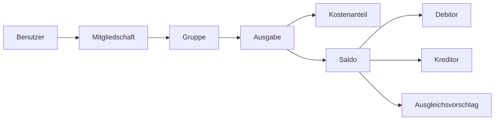

# E2 — Glossar

E2 erklärt zentrale Begriffe, die in der Spezifikation von **CampusSplit** verwendet werden. Das Glossar soll helfen, Begriffe einheitlich zu verwenden und Missverständnisse zu vermeiden.

Die Begriffe sind alphabetisch sortiert. Ausführliche Anforderungen stehen nicht im Glossar, sondern in den jeweiligen Bausteinen.

---

## E2.1 Zentrale Begriffszusammenhänge

Das folgende Diagramm zeigt die wichtigsten fachlichen Begriffe im Zusammenhang. Es ersetzt nicht das Datenmodell in [D1 — Datenmodell](D1_Datenmodell.md).

---

## E2.2 Begriffe

### Administrator

Ein Administrator ist ein Benutzer mit erweiterten Rechten innerhalb einer Gruppe. Er kann zum Beispiel Mitglieder hinzufügen oder Gruppendaten verwalten. Die genauen Regeln stehen in [N2 — Querschnittskonzepte](N2_Querschnittskonzepte.md).

### Anmeldung

Die Anmeldung ist der Vorgang, bei dem sich ein registrierter Benutzer mit seinen Zugangsdaten bei CampusSplit einloggt. Nach erfolgreicher Anmeldung kann der Benutzer geschützte Funktionen nutzen. Siehe auch [UC-02 in F2](F2-anwendungsf%C3%A4lle.md#uc-02--anmelden).

### Anwendungsfall

Ein Anwendungsfall beschreibt eine Aktion, die ein Benutzer mit CampusSplit ausführen kann. Beispiele sind Registrierung, Anmeldung, Gruppe erstellen oder Ausgabe erfassen. Die Anwendungsfälle werden in [F2 — Anwendungsfälle](F2-anwendungsf%C3%A4lle.md) beschrieben.

### Anwendungsfunktion

Eine Anwendungsfunktion beschreibt eine fachliche Funktion des Systems. Dazu gehören zum Beispiel Kostenaufteilung, Saldenberechnung oder Exportaufbereitung. Die Funktionen stehen in [F3 — Anwendungsfunktionen](F3-anwendungsfunktionen.md).

### Anwendungsschnittstelle

Die Anwendungsschnittstelle beschreibt die Kommunikation zwischen Teilen der Anwendung, zum Beispiel zwischen Benutzeroberfläche und Anwendungslogik. In P2 wird sie nur grob beschrieben. Konkrete technische Details gehören nicht in das Glossar.

### Aufteilungsart

Die Aufteilungsart legt fest, wie eine Ausgabe auf Gruppenmitglieder verteilt wird. In der ersten Version wird vor allem die Aufteilung auf beteiligte Mitglieder betrachtet. Genauere Regeln stehen in [F3 — Anwendungsfunktionen](F3-anwendungsfunktionen.md).

### Ausgabe

Eine Ausgabe ist ein Geldbetrag, der innerhalb einer Gruppe erfasst wird. Zu einer Ausgabe gehören mindestens ein Betrag, eine Beschreibung, ein Datum, ein Zahler und die beteiligten Mitglieder. Im Datenmodell wird sie in [D1 — Datenmodell](D1_Datenmodell.md) beschrieben.

### Ausgabenübersicht

Eine Ausgabenübersicht fasst die Ausgaben und offenen Beträge einer Gruppe zusammen. Sie kann als PDF oder CSV exportiert werden. Der Export wird in [B3 — Druck- und Exportausgaben](B3_Druckausgaben.md) beschrieben.

### Ausgleichsvorschlag

Ein Ausgleichsvorschlag zeigt, welche Zahlung sinnvoll wäre, um offene Beträge auszugleichen. Er ist nur ein Vorschlag und keine echte Zahlung. Die Berechnung wird in [F3 — Anwendungsfunktionen](F3-anwendungsfunktionen.md#af-03--ausgleichsvorschl%C3%A4ge-berechnen) beschrieben.

### Authentifizierung

Authentifizierung bedeutet, dass das System die Identität eines Benutzers prüft. In CampusSplit passiert das bei der Anmeldung. Die Regeln dazu stehen in [N2 — Querschnittskonzepte](N2_Querschnittskonzepte.md#n22-authentifizierung-und-sitzung).

### Autorisierung

Autorisierung bedeutet, dass geprüft wird, ob ein angemeldeter Benutzer eine bestimmte Aktion ausführen darf. Bei CampusSplit hängt das vor allem von der Gruppenmitgliedschaft und Rolle ab. Die Regeln stehen in [N2 — Querschnittskonzepte](N2_Querschnittskonzepte.md#n23-autorisierung-und-gruppenrechte).

### Benutzer

Ein Benutzer ist eine registrierte Person, die CampusSplit verwendet. Ein Benutzer kann Gruppen erstellen, Mitglied in Gruppen sein, Ausgaben erfassen und Salden ansehen.

### Benutzeroberfläche

Die Benutzeroberfläche ist der sichtbare Teil der Anwendung im Browser. Über sie kann der Benutzer mit CampusSplit arbeiten. Die Dialoge werden in [B1 — Dialogspezifikation](B1_Dialogspezifikation.md) beschrieben.

### CSV

CSV ist ein Exportformat für tabellarische Daten. In CampusSplit kann eine Ausgabenübersicht als CSV-Datei exportiert werden. Die Inhalte stehen in [B3 — Druck- und Exportausgaben](B3_Druckausgaben.md).

### Dashboard

Das Dashboard ist die Übersichtsseite nach der Anmeldung. Dort sieht ein Benutzer seine Gruppen und wichtige Informationen zu offenen Beträgen.

### Datenbank

Die Datenbank speichert die Daten von CampusSplit dauerhaft. Dazu gehören Benutzer, Gruppen, Mitgliedschaften, Ausgaben und Kostenanteile. Der Zusammenhang wird in [P2 — Architekturüberblick](P2_Architekturueberblick.md) und [D1 — Datenmodell](D1_Datenmodell.md) beschrieben.

### Datenfluss

Ein Datenfluss beschreibt, wie Daten zwischen Beteiligten oder Systemteilen übertragen werden. Bei CampusSplit ist der PDF- oder CSV-Export ein Datenfluss, aber kein eigenes aktives Nachbarsystem.

### Datenmigration

Datenmigration bedeutet, dass Daten aus einem alten System in ein neues System übernommen werden. Für CampusSplit ist das in der ersten Version nicht vorgesehen, weil das Projekt neu entwickelt wird. Ein eigener Baustein S2 ist für CampusSplit daher nicht anwendbar.

### Debitor

Ein Debitor ist ein Gruppenmitglied, das laut Saldenberechnung noch Geld schuldet. Ein negativer Saldo bedeutet, dass das Mitglied Debitor ist.

### Dialog

Ein Dialog ist eine Ansicht oder Maske in CampusSplit, zum Beispiel Anmeldung, Gruppe erstellen oder Ausgabe erfassen. Die Dialoge stehen in [B1 — Dialogspezifikation](B1_Dialogspezifikation.md).

### Export

Ein Export erzeugt eine Ausgabenübersicht als Datei. In der ersten Version sind PDF und CSV vorgesehen. Der Export verändert keine gespeicherten Daten.

### Gast

Ein Gast ist eine Person, die noch nicht angemeldet ist. Ein Gast kann sich registrieren oder anmelden.

### Geldbetrag

Ein Geldbetrag ist ein Betrag in Euro. Er wird für Ausgaben, Kostenanteile, Salden und Ausgleichsvorschläge verwendet. Genauere Datentypen stehen in [D2 — Datentypenverzeichnis](D2_Datentypenverzeichnis.md).

### Gruppe

Eine Gruppe fasst mehrere Benutzer zusammen, die gemeinsame Ausgaben verwalten. Beispiele sind Wohngemeinschaften, Reisen oder studentische Projekte.

### Gruppenmitglied

Ein Gruppenmitglied ist ein Benutzer, der einer Gruppe zugeordnet ist. Gruppenmitglieder können Gruppendaten, Ausgaben und Salden der jeweiligen Gruppe sehen.

### Gruppenersteller

Der Gruppenersteller ist der Benutzer, der eine neue Gruppe anlegt. Er kann in der ersten Version Mitglieder zur Gruppe hinzufügen.

### Kostenanteil

Ein Kostenanteil beschreibt, welcher Teil einer Ausgabe auf ein bestimmtes Gruppenmitglied entfällt. Die Summe der Kostenanteile gehört zur jeweiligen Ausgabe.

### Kreditor

Ein Kreditor ist ein Gruppenmitglied, das laut Saldenberechnung Geld zurückbekommt. Ein positiver Saldo bedeutet, dass das Mitglied Kreditor ist.

### Mitgliedschaft

Eine Mitgliedschaft verbindet einen Benutzer mit einer Gruppe. Über die Mitgliedschaft kann auch festgelegt werden, welche Rolle ein Benutzer innerhalb der Gruppe hat.

### Nachbarsystem

Ein Nachbarsystem ist ein System außerhalb von CampusSplit, mit dem CampusSplit kommuniziert. Für CampusSplit sind vor allem Browser und Datenbank relevant. PDF- und CSV-Dateien werden als Datenfluss betrachtet. Details stehen in [P2 — Architekturüberblick](P2_Architekturueberblick.md) und [S1 — Nachbarsysteme](S1_Nachbarsysteme.md).

### Nichtziel

Ein Nichtziel beschreibt bewusst ausgeschlossene Funktionen. Dazu gehören zum Beispiel echte Zahlungsabwicklung, Bankanbindung oder eine eigene mobile App. Die Nichtziele stehen in [P1 — Ziele und Rahmenbedingungen](P1_Ziele_und_Rahmenbedingungen.md#p15-nichtziele).

### PDF

PDF ist ein Exportformat für eine lesbare Ausgabenübersicht. Es ist vor allem für das Anzeigen, Speichern oder Weitergeben der Übersicht geeignet.

### Persistenz

Persistenz bedeutet, dass Daten dauerhaft gespeichert werden. Dadurch bleiben Benutzer, Gruppen und Ausgaben auch nach dem Schließen der Anwendung erhalten.

### Rolle

Eine Rolle beschreibt, welche Rechte ein Benutzer innerhalb einer Gruppe hat. In CampusSplit wird zwischen normalen Gruppenmitgliedern und Benutzern mit erweiterten Rechten unterschieden.

### Saldo

Ein Saldo zeigt, ob ein Gruppenmitglied Geld zurückbekommt oder noch Geld schuldet. Ein positiver Saldo bedeutet Kreditor, ein negativer Saldo bedeutet Debitor.

### Schnittstelle

Eine Schnittstelle beschreibt eine Verbindung zwischen CampusSplit und einem angrenzenden System oder Systemteil. Schnittstellen werden im Architekturüberblick und genauer in [S1 — Nachbarsysteme](S1_Nachbarsysteme.md) betrachtet.

### Sitzung

Eine Sitzung entsteht nach erfolgreicher Anmeldung. Sie hält den Benutzer während der Nutzung angemeldet, bis er sich abmeldet oder die Sitzung endet.

### Systemgrenze

Die Systemgrenze legt fest, was zu CampusSplit gehört und was außerhalb liegt. Zum System gehören zum Beispiel Benutzerverwaltung, Gruppenverwaltung, Ausgabenverwaltung, Saldenberechnung und Exportfunktion. Siehe [P2 — Architekturüberblick](P2_Architekturueberblick.md#p26-systemgrenze).

### Validierung

Validierung ist die Prüfung von Eingaben, bevor sie gespeichert oder verarbeitet werden. Zum Beispiel darf ein Betrag nicht leer oder ungültig sein. Regeln zur Validierung stehen in [N2 — Querschnittskonzepte](N2_Querschnittskonzepte.md#n24-validierung).

### Währung

Die Währung beschreibt, in welcher Geldeinheit Beträge angegeben werden. In der ersten Version verwendet CampusSplit Euro.

### Zahler

Der Zahler ist das Gruppenmitglied, das eine Ausgabe bezahlt hat. Der Zahler muss Mitglied der Gruppe sein, zu der die Ausgabe gehört.

### Zahlungsabwicklung

Zahlungsabwicklung bedeutet, dass ein System echte Zahlungen ausführt oder Zahlungsanbieter einbindet. Das ist nicht Teil von CampusSplit. CampusSplit berechnet nur offene Beträge und Ausgleichsvorschläge.

---

## E2.3 Nicht Bestandteil des Glossars

Das Glossar erklärt nur Begriffe. Es ersetzt keine fachlichen Anforderungen und keine technische Beschreibung.

| Thema | Steht in |
|---|---|
| Ziele und Projektumfang | [P1](P1_Ziele_und_Rahmenbedingungen.md) |
| Architekturüberblick | [P2](P2_Architekturueberblick.md) |
| Geschäftsprozesse | [F1](F1-geschaeftsprozesse.md) |
| Anwendungsfälle | [F2](F2-anwendungsf%C3%A4lle.md) |
| Anwendungsfunktionen | [F3](F3-anwendungsfunktionen.md) |
| Datenmodell | [D1](D1_Datenmodell.md) |
| Datentypen | [D2](D2_Datentypenverzeichnis.md) |
| Dialoge | [B1](B1_Dialogspezifikation.md) |
| Exportausgaben | [B3](B3_Druckausgaben.md) |
| Nachbarsysteme | [S1](S1_Nachbarsysteme.md) |
| Inbetriebnahme | [S3](S3_Inbetriebnahme.md) |
| Nichtfunktionale Anforderungen | [N1](N1_Nichtfunktionale%20Anforderungen.md) |
| Querschnittskonzepte | [N2](N2_Querschnittskonzepte.md) |

---

## E2.4 Eingesetzte KI-Werkzeuge

ChatGPT (OpenAI) wurde unterstützend für Formulierungen, Kürzung, Strukturierung und Prüfung der Querverweise verwendet. Die fachlichen Inhalte wurden anschließend mit dem Projektkontext und den übrigen Spezifikationsbausteinen abgeglichen.

