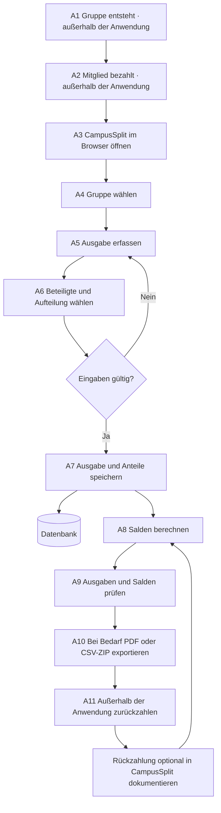

# F1 - Geschäftsprozesse

Ein Geschäftsprozess beschreibt eine zeitlich und logisch geordnete Folge von Aktivitäten aus fachlicher Sicht. Dabei wird der Prozess unabhängig von einer konkreten technischen Implementierung betrachtet.

CampusSplit ist ein unterstützendes IT-System innerhalb dieses Prozesses. Der Prozess beginnt bereits bevor ein Benutzer die Anwendung öffnet, nämlich mit einer gemeinsamen Ausgabe innerhalb einer Gruppe. Er endet nicht zwingend in CampusSplit, sondern erst dann, wenn die Gruppe die offenen Beträge nachvollzogen oder außerhalb des Systems ausgeglichen hat. Die technische Umsetzung dieser realen Abläufe in die Softwarearchitektur wird in den folgenden Kapiteln konkretisiert.

## F1.1 Prozess: Gemeinsame Ausgaben erfassen und ausgleichen

CampusSplit unterstützt einen zentralen, zweiteiligen Geschäftsprozess. Die kontinuierliche. Digitale Erfassung von Gemeinschaftsausgaben und den anschließenden Ausgleich der entstandenen Verbindlichkeiten innerhalb der Gruppe. In der Praxis sieht das so aus, dass eine Person eine Ausgabe für mehrere Gruppenmitglieder bezahlt. Anschließend wird diese Ausgabe dokumentiert, auf die beteiligten Personen verteilt und in Form von Salden sichtbar gemacht.

CampusSplit übernimmt dabei den Teil der strukturierten Erfassung, Berechnung und Darstellung. Die tatsächliche Zahlung zwischen den Gruppenmitgliedern erfolgt außerhalb der Anwendung.

## F1.1.1 Akteure

| Akteur                    | Typ       | Rolle                                                                                 |
| ------------------------- | --------- | ------------------------------------------------------------------------------------- |
| Zahlendes Gruppenmitglied | Mensch    | Bezahlt eine Ausgabe und erfasst sie anschließend in CampusSplit.                     |
| Weitere Gruppenmitglieder | Mensch    | Sind an der Ausgabe beteiligt und prüfen ihre offenen Salden.                         |
| Gruppenadministrator      | Mensch    | Erstellt Gruppen und verwaltet Gruppenmitglieder.                                     |
| Webbrowser                | IT-System | Stellt die Benutzeroberfläche bereit und übermittelt Benutzereingaben an CampusSplit. |
| CampusSplit               | IT-System | Speichert Gruppen, Ausgaben und Kostenanteile und berechnet Salden.                   |
| Datenbank                 | IT-System | Speichert Benutzer, Gruppen, Ausgaben, Kostenanteile und Salden dauerhaft.            |
| Exportdatei               | Artefakt  | Enthält eine Ausgabenübersicht als PDF oder CSV.                                      |

CampusSplit, der Webbrowser und die Datenbank werden hier ebenfalls als Akteure betrachtet, da sie am fachlichen Ablauf beteiligt sind.

## F1.1.2 Aktivitäten

Die folgenden Aktivitäten sind in zeitlicher Reihenfolge dargestellt.

| Nr. | Aktivität                                                                         | Unterstützung            | Hinweise                                                                                                     |
| --- | --------------------------------------------------------------------------------- | ------------------------ | ------------------------------------------------------------------------------------------------------------ |
| A1  | Eine Gruppe entsteht, z. B. WG, Reisegruppe oder studentisches Projekt.           | manuell                  | Vor CampusSplit; die Gruppe existiert fachlich bereits.                                                      |
| A2  | Ein Gruppenmitglied bezahlt eine gemeinsame Ausgabe.                              | manuell                  | Zum Beispiel Einkauf, Unterkunft, Material oder Fahrtkosten.                                                 |
| A3  | Das zahlende Mitglied öffnet CampusSplit im Webbrowser.                           | Webbrowser → CampusSplit | Einstiegspunkt in den systemgestützten Teil des Prozesses.                                                   |
| A4  | Das Mitglied wählt die betroffene Gruppe aus.                                     | CampusSplit              | Die Anwendung zeigt vorhandene Gruppen des Benutzers an.                                                     |
| A5  | Das Mitglied erfasst die Ausgabe mit Beschreibung, Betrag, Datum und Zahler.      | CampusSplit              | Die Eingaben werden validiert.                                                                               |
| A6  | Das Mitglied wählt die beteiligten Personen und die Art der Kostenaufteilung aus. | CampusSplit              | Beispielsweise gleichmäßige Aufteilung oder individuelle Anteile.                                            |
| A7  | CampusSplit speichert die Ausgabe und die Kostenanteile.                          | CampusSplit → Datenbank  | Die Daten werden dauerhaft gespeichert.                                                                      |
| A8  | CampusSplit berechnet die Salden der Gruppenmitglieder.                           | CampusSplit              | Es wird ermittelt, wer wem welchen Betrag schuldet.                                                          |
| A9  | Gruppenmitglieder prüfen ihre Ausgaben und Salden.                                | Webbrowser → CampusSplit | Transparenz über offene Forderungen und Verbindlichkeiten.                                                   |
| A10 | Bei Bedarf wird eine Ausgabenübersicht exportiert.                                | CampusSplit              | Export als PDF oder CSV.                                                                                     |
| A11 | Gruppenmitglieder gleichen offene Beträge außerhalb von CampusSplit aus.          | manuell                  | Zum Beispiel per Überweisung, PayPal oder Barzahlung. Diese Zahlung wird nicht durch CampusSplit ausgeführt. |

A1, A2 und A11 liegen bewusst außerhalb der eigentlichen Systemgrenze. Sie zeigen, dass CampusSplit den Prozess unterstützt, aber nicht den gesamten finanziellen Ausgleich übernimmt.

## F1.1.3 Dokumente und Artefakte

| Dokument / Artefakt | Entsteht in | Format                                                   |
| ------------------- | ----------- | -------------------------------------------------------- |
| Reale Ausgabe       | A2          | Fachliches Ereignis außerhalb des Systems                |
| Ausgabeneintrag     | A5-A7       | Strukturierter Datensatz                                 |
| Kostenanteile       | A6-A7       | Strukturierte Datensätze pro beteiligte Person           |
| Saldenübersicht     | A8-A9       | Berechnete Übersicht innerhalb der Anwendung             |
| Exportdatei         | A10         | PDF oder CSV                                             |
| Zahlungsnachweis    | A11         | Außerhalb von CampusSplit, nicht Bestandteil des Systems |

## F1.1.4 Datenspeicher

| Speicher                                | Verantwortlich                 | Enthält                                                                                     |
| --------------------------------------- | ------------------------------ | ------------------------------------------------------------------------------------------- |
| Anwendungsdatenbank                     | CampusSplit / Entwicklungsteam | Benutzer, Gruppen, Mitgliedschaften, Ausgaben, Kostenanteile und berechnungsrelevante Daten |
| Lokaler Download-Speicher des Benutzers | Benutzer                       | Exportierte PDF- oder CSV-Dateien                                                           |
| Externe Zahlungswege                    | Benutzer                       | Tatsächliche Zahlungen zwischen Gruppenmitgliedern, nicht durch CampusSplit verwaltet       |

Die Anwendungsdatenbank ist der zentrale Datenspeicher von CampusSplit. Externe Zahlungswege sind nicht Teil des Systems.

## F1.1.5 Aktivitätsdiagramm

Das folgende Aktivitätsdiagramm zeigt den fachlichen Ablauf des Prozesses. Es unterscheidet zwischen manuellen Aktivitäten, browsergestützter Bedienung, CampusSplit-Verarbeitung und Datenhaltung.

Die Schritte A1, A2 und A11 sind fachliche Aktivitäten außerhalb der Anwendung. Die Schritte A3 bis A10 bilden den von CampusSplit unterstützten Teil des Geschäftsprozesses.

## F1.2 Rolle der Kostenaufteilung

Die Art der Kostenaufteilung ist ein Parameter des Geschäftsprozesses und kein eigener Prozess.

CampusSplit kann verschiedene Formen der Aufteilung unterstützen:

- gleichmäßige Aufteilung auf alle beteiligten Mitglieder
- individuelle Beträge pro Mitglied
- Ausschluss einzelner Gruppenmitglieder von einer Ausgabe

Die gewählte Aufteilungsart beeinflusst die Berechnung der Kostenanteile und Salden, verändert aber nicht den grundsätzlichen Geschäftsprozess.

Das bedeutet: Eine Ausgabe wird immer erfasst, Beteiligte werden ausgewählt, Kostenanteile werden gespeichert und Salden werden berechnet. Nur die Berechnungsregel unterscheidet sich.

## F1.3 Grenzen des Geschäftsprozesses

Folgende Aktivitäten und Themen sind bewusst nicht Teil des durch CampusSplit unterstützten Prozesses:

| Bereich                                     | Begründung                                                                           |
| ------------------------------------------- | ------------------------------------------------------------------------------------ |
| Zahlungsabwicklung                          | CampusSplit berechnet offene Beträge, führt aber keine Zahlungen aus.                |
| Bankintegration                             | Bankkonten oder Zahlungsanbieter werden nicht angebunden.                            |
| Automatische Rechnungserkennung             | OCR oder Fotoauswertung ist nicht vorgesehen.                                        |
| Mehrwährungsmanagement                      | Die erste Version geht von Euro als einheitlicher Währung aus.                       |
| Rechtliche Prüfung von Ausgaben             | Die Verantwortung für die Richtigkeit der Eingaben liegt bei den Gruppenmitgliedern. |
| Synchronisation mit externen Finanzsystemen | CampusSplit ist ein eigenständiges System ohne externe Finanzschnittstellen.         |

## F1.4 Vermiedene Fehlmuster

Dieser Baustein beschreibt den fachlichen Geschäftsprozess und nicht die technische Implementierung.

Daher gilt:

- F1 ist keine technische Ablaufbeschreibung.
- F1 enthält keine Klassen, Tabellen oder REST-Endpunkte.
- F1 ersetzt nicht die Use Cases in F2.
- F1 ersetzt nicht die Anwendungsfunktionen in F3.
- F1 beschreibt auch Aktivitäten außerhalb der Systemgrenze, damit der fachliche Zusammenhang sichtbar wird.

Technische Details werden in der Architekturdokumentation und in den späteren Bausteinen beschrieben.

## F1.5 Querverweise

| Baustein | Relevanz für F1                                                                                                            |
| -------- | -------------------------------------------------------------------------------------------------------------------------- |
| P1       | Beschreibt Ziele, Stakeholder, Umfang, Nichtziele und Rahmenbedingungen des Projekts.                                      |
| P2       | Beschreibt die Nachbarsysteme Webbrowser, CampusSplit, Datenbank und Exportdateien.                                        |
| F2       | Beschreibt die konkreten Use Cases, welche die Aktivitäten A3 bis A10 realisieren.                                         |
| F3       | Beschreibt wiederverwendbare Anwendungsfunktionen wie Validierung, Kostenaufteilung, Saldenberechnung und Exporterzeugung. |
| D1       | Beschreibt das Datenmodell für Benutzer, Gruppen, Ausgaben und Kostenanteile.                                              |
| D2       | Beschreibt die fachlichen Datentypen und Attribute.                                                                        |
| B1       | Beschreibt die Dialoge für Gruppenübersicht, Ausgabenerfassung, Saldenanzeige und Export.                                  |
| S1       | Beschreibt Schnittstellen zu Nachbarsystemen, insbesondere Browser, Datenbank und Export.                                  |
| N1       | Beschreibt nichtfunktionale Anforderungen wie Sicherheit, Performance, Benutzbarkeit und Datenkonsistenz.                  |
