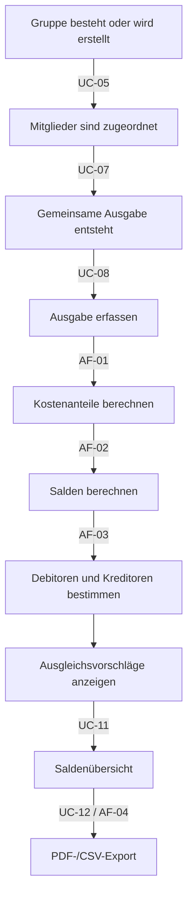

# F1/F2 — Ergänzung: Verlinkung, Use-Case-Überblick und Geldaufteilung

Diese Ergänzung setzt die Review-Hinweise zu F1 und F2 um. Die vorhandenen Dateien `F1-geschaeftsprozesse.md` und `F2-anwendungsfälle.md` bleiben unverändert bestehen.

---

## 1. Use-Case-Überblick

| ID | Use Case | Kurzbeschreibung | Primärer Dialog | Zentrale Daten |
|---|---|---|---|---|
| UC-01 | Registrieren | Benutzerkonto erstellen | DLG-01 | User |
| UC-02 | Anmelden | Sitzung starten | DLG-02 | User |
| UC-03 | Abmelden | Sitzung beenden | Navigation | Session |
| UC-04 | Dashboard anzeigen | Gruppenübersicht anzeigen | DLG-03 | Group, Membership |
| UC-05 | Gruppe erstellen | Neue Gruppe anlegen | DLG-04 | Group, Membership |
| UC-06 | Gruppe anzeigen | Gruppendaten, Mitglieder, Ausgaben anzeigen | DLG-05 | Group, User, Expense |
| UC-07 | Mitglied hinzufügen | Benutzer zur Gruppe hinzufügen | DLG-06 | Membership |
| UC-08 | Ausgabe erfassen | Ausgabe und Kostenanteile speichern | DLG-07 | Expense, ExpenseShare |
| UC-09 | Ausgabe bearbeiten | Ausgabe korrigieren | DLG-08 | Expense, ExpenseShare |
| UC-10 | Ausgabe löschen | Ausgabe entfernen | DLG-09 | Expense, ExpenseShare |
| UC-11 | Salden anzeigen | Debitoren, Kreditoren und Vorschläge anzeigen | DLG-10 | Balance, SettlementProposal |
| UC-12 | Export erzeugen | PDF oder CSV erstellen | DLG-11 | ExportDocument |

---

## 2. Geschäftsprozess mit Verweisen

---

## 3. Verlinkung F1.3 zu F2, F3 und D1

| Prozessschritt | Use Case | Anwendungsfunktion | Datenobjekte |
|---|---|---|---|
| Gruppe anlegen | UC-05 | — | Group, Membership |
| Mitglied hinzufügen | UC-07 | — | User, Membership |
| Ausgabe erfassen | UC-08 | AF-01 | Expense, ExpenseShare |
| Kosten aufteilen | UC-08/UC-09 | AF-01 | ExpenseShare |
| Salden berechnen | UC-11 | AF-02 | Expense, ExpenseShare, Balance |
| Ausgleich vorschlagen | UC-11 | AF-03 | Balance, SettlementProposal |
| Export erzeugen | UC-12 | AF-04 | ExportDocument |

---

## 4. Geldaufteilung richtig abbilden

Bei einer Ausgabe wird zwischen Zahler, Beteiligten, Debitoren und Kreditoren unterschieden.

| Begriff | Bedeutung |
|---|---|
| Zahler | Person, die die Ausgabe zunächst bezahlt hat. |
| Beteiligte | Personen, auf die die Ausgabe aufgeteilt wird. |
| Kostenanteil | Betrag, den eine beteiligte Person fachlich tragen muss. |
| Kreditor / Gläubiger | Person mit positivem Saldo, bekommt Geld zurück. |
| Debitor / Schuldner | Person mit negativem Saldo, schuldet Geld. |

### Beispiel

| Person | Gezahlt | Kostenanteil | Saldo | Rolle |
|---|---:|---:|---:|---|
| A | 30,00 € | 10,00 € | +20,00 € | Kreditor |
| B | 0,00 € | 10,00 € | -10,00 € | Debitor |
| C | 0,00 € | 10,00 € | -10,00 € | Debitor |

Ausgleichsvorschläge:

| Debitor | zahlt an Kreditor | Betrag |
|---|---|---:|
| B | A | 10,00 € |
| C | A | 10,00 € |

---

## 5. Querverweise

| Baustein | Relevanz |
|---|---|
| F1 | Geschäftsprozess und Ablauf. |
| F2 | Use Cases je Benutzeraktion. |
| F3 | Kostenanteile, Salden, Ausgleichsvorschläge und Exportdaten. |
| D1/D2 | Entitäten und Datentypen. |
| B1 | Dialoge, über die Use Cases ausgelöst werden. |
| B3 | Export als Abschluss des Prozesses. |
| N2 | Validierung, Fehlerbehandlung und Geldbetragsverarbeitung. |
