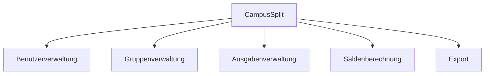

# P1 — Ziele und Rahmenbedingungen

Grundlagenbaustein der CampusSplit-Spezifikation nach Siedersleben. Dieser Baustein beschreibt, warum das System gebaut wird, für wen es gedacht ist und welche Rahmenbedingungen den Lösungsraum begrenzen.

---

## P1.1 Mission

CampusSplit ist eine Webanwendung zur Verwaltung gemeinsamer Ausgaben in Gruppen. Nutzer können Gruppen anlegen, Ausgaben erfassen, Kosten auf Gruppenmitglieder aufteilen und offene Beträge einsehen.

Das System soll den Aufwand reduzieren, der sonst durch Chatnachrichten, Tabellen oder manuelle Rechnungen entsteht. CampusSplit zeigt transparent, wer bezahlt hat, wer beteiligt ist und wer wem noch Geld schuldet.

Eine echte Zahlung findet nicht in CampusSplit statt. Die Anwendung dokumentiert Ausgaben, berechnet Salden und erstellt bei Bedarf eine Ausgabenübersicht als Export. Die fachlichen Abläufe stehen in [F1 — Geschäftsprozesse](F1-geschaeftsprozesse.md), die konkreten Anwendungsfälle in [F2 — Anwendungsfälle](F2-anwendungsf%23U00e4lle.md).

---

## P1.2 Ziele des Systems

| ID | Ziel |
|---|---|
| Z-01 | Nutzer können sich registrieren und anmelden. |
| Z-02 | Nutzer können Gruppen erstellen und verwalten. |
| Z-03 | Gruppenmitglieder können hinzugefügt werden. |
| Z-04 | Ausgaben können erfasst und einer Gruppe zugeordnet werden. |
| Z-05 | Kosten können auf beteiligte Mitglieder aufgeteilt werden. |
| Z-06 | Offene Beträge werden automatisch berechnet. |
| Z-07 | Kreditoren und Debitoren werden verständlich angezeigt. |
| Z-08 | Ausgabenübersichten können als PDF oder CSV exportiert werden. |
| Z-09 | Die Anwendung soll einfach bedienbar sein. |

Die Berechnung der offenen Beträge wird in [F3 — Anwendungsfunktionen](F3-anwendungsfunktionen.md) beschrieben. Die Dialoge zu den Zielen stehen in [B1 — Dialogspezifikation](B1_Dialogspezifikation.md).

---

## P1.3 Stakeholder und Benutzergruppen

| Rolle | Beschreibung | Interesse |
|---|---|---|
| Nutzer | Verwendet CampusSplit im Alltag. | Ausgaben verwalten. |
| Gruppenmitglied | Ist Mitglied einer Gruppe. | Eigene Salden sehen. |
| Gruppenadministrator | Verwaltet eine Gruppe. | Mitglieder hinzufügen. |
| Entwicklungsteam | Projektgruppe aus fünf Studierenden. | System umsetzen und dokumentieren. |
| Prüfer / Betreuer | Bewertet das Projekt. | Spezifikation nachvollziehen. |

Die Rollen innerhalb einer Gruppe werden nur so weit unterschieden, wie es für die erste Version nötig ist. Weitere Regeln zu Zugriff und Gruppenrechten stehen in [N2 — Querschnittskonzepte](N2_Querschnittskonzepte.md).

---

## P1.4 Projektumfang

Zum Umfang der ersten Version gehören die Kernfunktionen, die für gemeinsame Ausgaben notwendig sind.

| Bereich | Inhalt |
|---|---|
| Benutzer | Registrierung, Anmeldung und Sitzung |
| Gruppen | Gruppen erstellen, anzeigen und verwalten |
| Mitglieder | Mitglieder zu Gruppen hinzufügen |
| Ausgaben | Ausgaben erfassen, bearbeiten und löschen |
| Aufteilung | Kosten gleichmäßig oder manuell aufteilen |
| Salden | Kreditoren, Debitoren und offene Beträge berechnen |
| Export | Ausgabenübersicht als PDF oder CSV erzeugen |

Die Exportinhalte werden in [B3 — Druck- und Exportausgaben](B3_Druckausgaben.md) festgelegt. Das fachliche Datenmodell steht in [D1 — Datenmodell](D1_Datenmodell.md).

---

## P1.5 Nichtziele

Einige mögliche Funktionen werden bewusst nicht umgesetzt, damit der Projektumfang realistisch bleibt.

| ID | Nichtziel | Begründung |
|---|---|---|
| NZ-01 | Direkte Zahlungsabwicklung | Zahlungen finden außerhalb der Anwendung statt. |
| NZ-02 | Bankanbindung | Bankdaten sind für die Kernfunktion nicht nötig. |
| NZ-03 | Native mobile App | Eine Webanwendung reicht aus. |
| NZ-04 | Chatfunktion | Kommunikation ist nicht der Schwerpunkt. |
| NZ-05 | Automatische Belegerkennung | OCR oder KI würde den Umfang erhöhen. |
| NZ-06 | Datenmigration | CampusSplit wird neu entwickelt. |

Schnittstellen, externe Systeme und Datenflüsse werden nicht in P1 beschrieben. Sie gehören zu [P2 — Architekturüberblick](P2_Architekturueberblick.md) und [S1 — Nachbarsysteme](S1_Nachbarsysteme.md).

---

## P1.6 Rahmenbedingungen

CampusSplit wird im Rahmen eines Hochschulprojekts im vierten Semester entwickelt. Das Projektteam besteht aus fünf Studierenden.

Die Anwendung wird als Webanwendung geplant und mit Java in Visual Studio Code umgesetzt. Für die Nutzung wird ein aktueller Webbrowser benötigt. Daten wie Benutzer, Gruppen, Mitglieder und Ausgaben müssen dauerhaft gespeichert werden.

| ID | Rahmenbedingung |
|---|---|
| RB-01 | Umsetzung im Rahmen eines Hochschulprojekts. |
| RB-02 | Entwicklung durch fünf Studierende. |
| RB-03 | Umsetzung als Webanwendung. |
| RB-04 | Entwicklung mit Java und Visual Studio Code. |
| RB-05 | Nutzung über einen aktuellen Webbrowser. |
| RB-06 | Dauerhafte Speicherung der Anwendungsdaten. |
| RB-07 | Umfang muss für ein Semester realistisch bleiben. |

Technische Details wie konkrete API-Endpunkte, Datenbankprodukt oder Deployment werden nicht in P1 festgelegt. Sie werden in [P2 — Architekturüberblick](P2_Architekturueberblick.md), [S1 — Nachbarsysteme](S1_Nachbarsysteme.md) und [S3 — Inbetriebnahme](S3_Inbetriebnahme.md) genauer beschrieben.

---

## P1.7 Erfolgskriterien

Das Projekt gilt als erfolgreich, wenn die wichtigsten Funktionen nutzbar sind und die Berechnung der offenen Beträge nachvollziehbar funktioniert.

| ID | Erfolgskriterium |
|---|---|
| EK-01 | Nutzer können ein Konto erstellen. |
| EK-02 | Nutzer können sich anmelden. |
| EK-03 | Gruppen können erstellt und angezeigt werden. |
| EK-04 | Mitglieder können Gruppen zugeordnet werden. |
| EK-05 | Ausgaben können erfasst und gespeichert werden. |
| EK-06 | Salden werden korrekt berechnet. |
| EK-07 | Kreditoren und Debitoren werden verständlich angezeigt. |
| EK-08 | Eine Ausgabenübersicht kann exportiert werden. |
| EK-09 | Die Anwendung ist im Browser nutzbar. |

Nichtfunktionale Anforderungen wie Bedienbarkeit, Sicherheit und Zuverlässigkeit stehen in [N1 — Nichtfunktionale Anforderungen](N1_Nichtfunktionale%20Anforderungen.md).

---

## P1.8 Annahmen

Für die erste Version gelten folgende Annahmen:

| ID | Annahme |
|---|---|
| A-01 | Nutzer besitzen ein Gerät mit aktuellem Webbrowser. |
| A-02 | Gruppen haben eine überschaubare Anzahl an Personen. |
| A-03 | Ausgaben werden manuell eingetragen. |
| A-04 | Tatsächliche Zahlungen finden außerhalb der Anwendung statt. |
| A-05 | Salden werden aus Ausgaben und Kostenanteilen berechnet. |

Die Begriffe Ausgabe, Kostenanteil, Saldo, Kreditor und Debitor werden im [E2 — Glossar](E2_Glossar.md) erklärt.

---

## P1.9 Risiken

| ID | Risiko | Gegenmaßnahme |
|---|---|---|
| R-01 | Salden werden falsch berechnet. | Berechnung früh mit Beispielen testen. |
| R-02 | Der Projektumfang wird zu groß. | Fokus auf Kernfunktionen legen. |
| R-03 | Datenmodell passt nicht zu Funktionen. | D1 und F3 früh abgleichen. |
| R-04 | Schnittstellen passen nicht zusammen. | P2 und S1 früh abstimmen. |
| R-05 | Zeitprobleme im Team. | Aufgaben klar verteilen. |

---

## P1.10 Querverweise

| Baustein | Relevanz |
|---|---|
| [P2 — Architekturüberblick](P2_Architekturueberblick.md) | Systemkontext und grobe Struktur |
| [F2 — Anwendungsfälle](F2-anwendungsf%23U00e4lle.md) | Aktionen der Nutzer |
| [F3 — Anwendungsfunktionen](F3-anwendungsfunktionen.md) | Saldenberechnung und Exportlogik |
| [D1 — Datenmodell](D1_Datenmodell.md) | Fachliche Datenobjekte |
| [B1 — Dialogspezifikation](B1_Dialogspezifikation.md) | Dialoge der Anwendung |
| [B3 — Druck- und Exportausgaben](B3_Druckausgaben.md) | PDF- und CSV-Export |
| [S1 — Nachbarsysteme](S1_Nachbarsysteme.md) | Schnittstellen und externe Systeme |
| [N1 — Nichtfunktionale Anforderungen](N1_Nichtfunktionale%20Anforderungen.md) | Qualitätsanforderungen |
| [N2 — Querschnittskonzepte](N2_Querschnittskonzepte.md) | Zugriff, Validierung und Geldbeträge |

---

## Eingesetzte KI-Werkzeuge

ChatGPT (OpenAI) wurde unterstützend für Formulierungen, Strukturierung, Mermaid-Diagramme und die Prüfung der Querverweise verwendet. Die fachlichen Inhalte wurden mit den vorhandenen Spezifikationsbausteinen abgeglichen.
