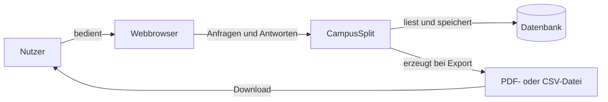
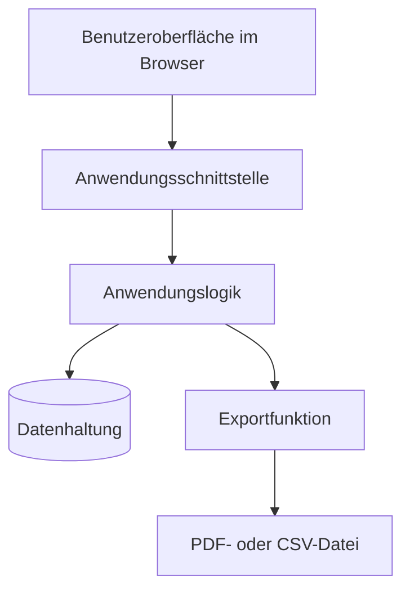
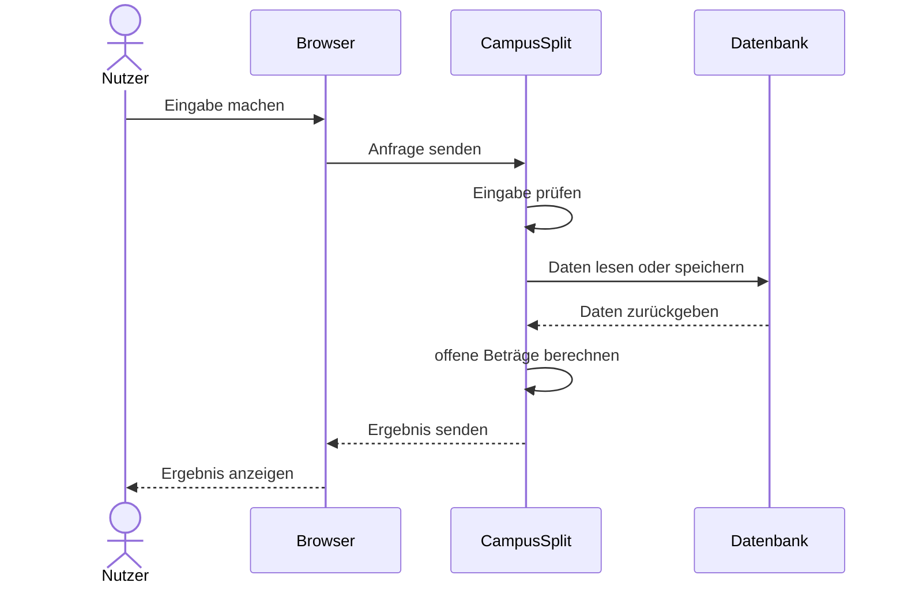
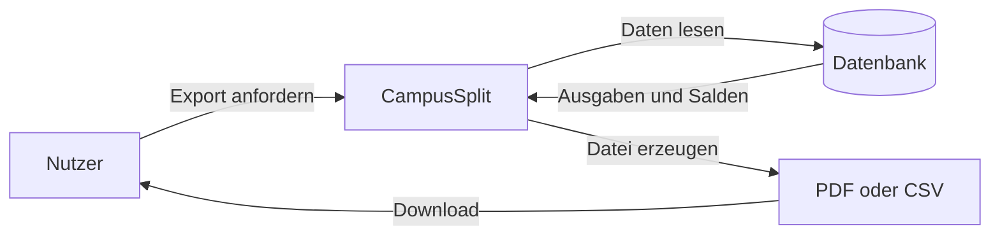
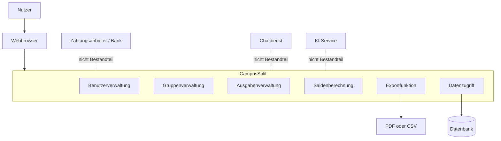

# P2 — Architekturüberblick

Dieser Baustein beschreibt grob, wie CampusSplit aufgebaut ist und mit welchen angrenzenden Systemen die Anwendung zusammenarbeitet. Es geht noch nicht um konkrete Klassen, Frameworks oder Datenbanktabellen, sondern um Systemkontext, Akteure, Schnittstellen und wichtige Datenflüsse.

---

## P2.1 Systemkontext

CampusSplit ist eine Webanwendung zur Verwaltung gemeinsamer Ausgaben. Nutzer greifen über einen Webbrowser auf die Anwendung zu. Die Anwendung verarbeitet Gruppen, Ausgaben, Kostenanteile und offene Beträge.

Die Daten werden dauerhaft in einer Datenbank gespeichert. PDF- und CSV-Dateien sind kein eigenes aktives Nachbarsystem, sondern ein ausgehender Datenfluss, der beim Export entsteht.

---

## P2.2 Akteure

Akteure sind Personen, die mit CampusSplit arbeiten. Sie sind nicht automatisch Nachbarsysteme.

| Akteur | Beschreibung |
|---|---|
| Gast | Kann sich registrieren oder anmelden. |
| Nutzer | Angemeldete Person mit Zugriff auf eigene Gruppen. |
| Gruppenmitglied | Sieht Gruppendaten, Ausgaben und Salden. |
| Gruppenersteller | Erstellt eine Gruppe und kann Mitglieder hinzufügen. |

Die fachlichen Use Cases dieser Akteure werden in [F2 — Anwendungsfälle](F2-anwendungsf%23U00e4lle.md) beschrieben. Regeln zu Zugriff und Rollen stehen in [N2 — Querschnittskonzepte](N2_Querschnittskonzepte.md).

---

## P2.3 Nachbarsysteme und Datenflüsse

CampusSplit hat in der ersten Version keine fachlichen externen Dienste wie Bankensysteme, Zahlungsanbieter oder KI-Services. Trotzdem gibt es technische Nachbarsysteme und Datenflüsse, die für die Anwendung wichtig sind.

| ID | Element | Einordnung | Beschreibung |
|---|---|---|---|
| NS-01 | Webbrowser | Nachbarsystem | Zugang zur Webanwendung. |
| NS-02 | Datenbank | Nachbarsystem / Persistenz | Speichert die Anwendungsdaten. |
| DF-01 | PDF-Export | Datenfluss | Erzeugte Datei für den Download. |
| DF-02 | CSV-Export | Datenfluss | Erzeugte Datei für den Download. |

Banken, Zahlungsanbieter, Chatdienste und KI-Services sind nicht Teil der ersten Version. PDF und CSV werden als Datenfluss betrachtet, weil dabei Dateien erzeugt werden, aber kein fremdes System aktiv angebunden wird. Detaillierte Schnittstellen werden in [S1 — Nachbarsysteme](S1_Nachbarsysteme.md) beschrieben.

---

## P2.4 Grobe Systemstruktur

CampusSplit wird grob in Benutzeroberfläche, Anwendungsschnittstelle, Anwendungslogik und Datenhaltung getrennt. Dadurch bleibt klar, welcher Teil welche Aufgabe übernimmt.

| Bereich | Aufgabe |
|---|---|
| Benutzeroberfläche | Formulare und Ansichten im Browser anzeigen. |
| Anwendungsschnittstelle | Eingaben zwischen Oberfläche und Logik übertragen. |
| Anwendungslogik | Regeln prüfen und offene Beträge berechnen. |
| Datenhaltung | Benutzer, Gruppen, Mitglieder und Ausgaben speichern. |
| Export | Ausgabenübersichten als PDF oder CSV erzeugen. |

Die Anwendungsschnittstelle ist hier nur grob gemeint. Konkrete Endpunkte oder technische Details gehören nicht in P2, sondern in die spätere Architektur oder Schnittstellendokumentation.

---

## P2.5 Wichtige Datenflüsse

Ein typischer Ablauf beginnt im Browser. CampusSplit verarbeitet die Eingabe, speichert benötigte Daten und gibt eine passende Ansicht zurück.

Der Export ist ein eigener Datenfluss. Dabei liest CampusSplit die benötigten Gruppen- und Ausgabendaten, bereitet sie auf und erzeugt daraus eine Datei.

Die fachliche Saldenberechnung steht in [F3 — Anwendungsfunktionen](F3-anwendungsfunktionen.md). Der genaue Inhalt der Exportdateien steht in [B3 — Druck- und Exportausgaben](B3_Druckausgaben.md).

---

## P2.6 Systemgrenze

Die Systemgrenze zeigt, was zu CampusSplit gehört und was außerhalb liegt.

Zur Anwendung gehören Benutzerverwaltung, Gruppenverwaltung, Ausgabenverwaltung, Saldenberechnung, Exportfunktion und Datenzugriff. Nicht dazu gehören echte Geldüberweisungen, Bankkonten, Chatdienste oder KI-Services.

---

## P2.7 Architekturziele

| ID | Architekturziel |
|---|---|
| AZ-01 | Oberfläche, Anwendungslogik und Datenhaltung sollen getrennt sein. |
| AZ-02 | Die Struktur soll für das Team verständlich bleiben. |
| AZ-03 | Die Saldenberechnung soll nachvollziehbar und testbar sein. |
| AZ-04 | Daten sollen dauerhaft gespeichert werden. |
| AZ-05 | Die Anwendung soll im Browser nutzbar sein. |
| AZ-06 | Die Struktur soll spätere Erweiterungen ermöglichen. |

---

## P2.8 Querverweise

| Baustein | Relevanz |
|---|---|
| [P1 — Ziele und Rahmenbedingungen](P1_Ziele_und_Rahmenbedingungen.md) | Ziele, Umfang und Nichtziele. |
| [F2 — Anwendungsfälle](F2-anwendungsf%23U00e4lle.md) | Aktionen der Akteure. |
| [F3 — Anwendungsfunktionen](F3-anwendungsfunktionen.md) | Kostenaufteilung und Saldenberechnung. |
| [D1 — Datenmodell](D1_Datenmodell.md) | Gespeicherte Datenobjekte. |
| [B3 — Druck- und Exportausgaben](B3_Druckausgaben.md) | PDF- und CSV-Export. |
| [S1 — Nachbarsysteme](S1_Nachbarsysteme.md) | Schnittstellen und Nachbarsysteme. |
| [N2 — Querschnittskonzepte](N2_Querschnittskonzepte.md) | Zugriff, Validierung und Fehlerbehandlung. |

## Eingesetzte KI-Werkzeuge

ChatGPT (OpenAI) wurde unterstützend für Formulierungen, Strukturierung, Mermaid-Diagramme und die Prüfung von Querverweisen verwendet. Die fachlichen Inhalte wurden anschließend mit dem Projektkontext und den übrigen Spezifikationsbausteinen abgeglichen.
