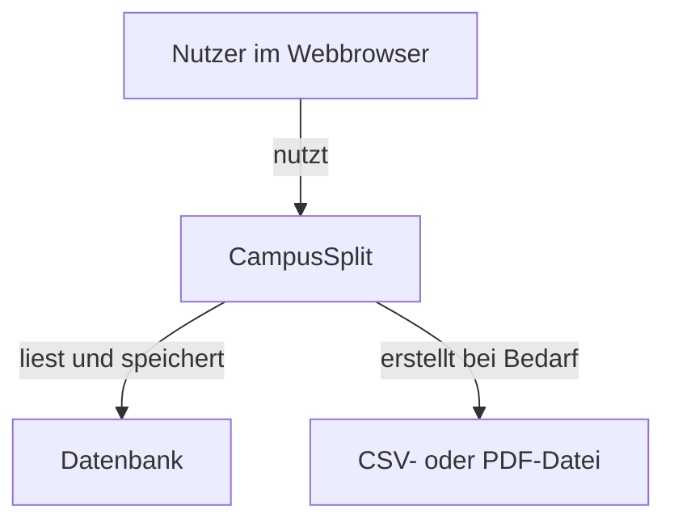
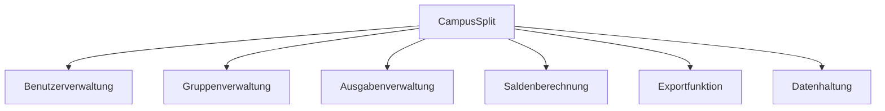
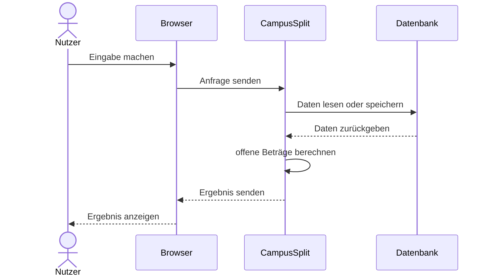
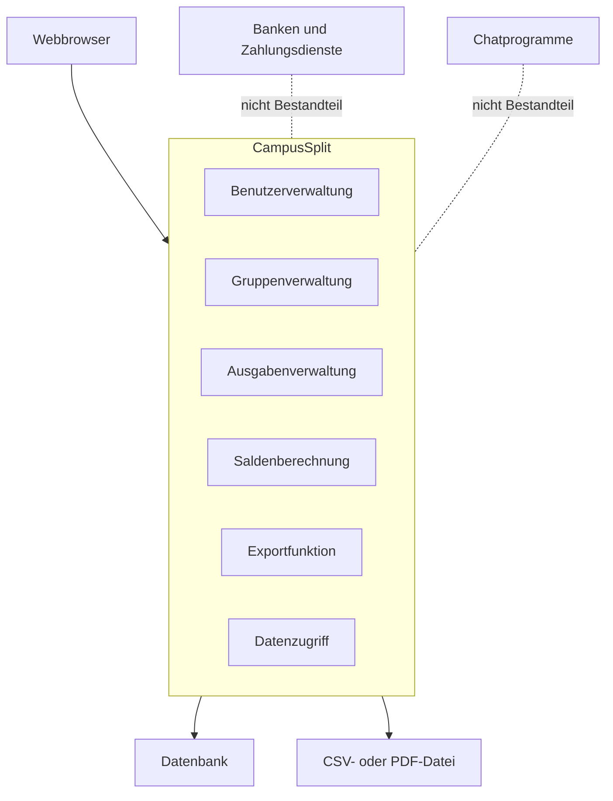

# P2 — Architekturüberblick

Dieser Baustein zeigt, wie CampusSplit grob aufgebaut ist und mit welchen Systemen die Anwendung zusammenhängt. Es geht hier nicht um die komplette technische Umsetzung, sondern um den Systemkontext, Nachbarsysteme und wichtige Datenflüsse.

---

## P2.1 Systemkontext

CampusSplit ist eine browserbasierte Webanwendung zur Verwaltung gemeinsamer Ausgaben. Nutzer greifen über einen Webbrowser auf das System zu. Die Anwendung verarbeitet Gruppen, Ausgaben und offene Beträge und speichert die Daten dauerhaft.

Bei Bedarf kann CampusSplit eine Ausgabenübersicht als CSV- oder PDF-Datei erstellen.

---

## P2.2 Nachbarsysteme

CampusSplit kommuniziert nur mit wenigen Nachbarsystemen. Dadurch bleibt die Systemlandschaft übersichtlich und passend zum Umfang des Projekts.

| ID | Nachbarsystem | Rolle | Kommunikation |
|---|---|---|---|
| NS-01 | Webbrowser | Oberfläche für die Nutzer | Sendet Eingaben an CampusSplit und zeigt Ergebnisse an |
| NS-02 | Datenbank | Speichert Anwendungsdaten | CampusSplit liest und schreibt Daten |
| NS-03 | CSV- oder PDF-Datei | Exportierte Ausgabenübersicht | Wird von CampusSplit auf Anforderung erstellt |

Externe Dienste wie Banken, Zahlungsanbieter, E-Mail-Dienste oder Social-Login sind in der ersten Version nicht vorgesehen.

---

## P2.3 Grobe Systemstruktur

CampusSplit besteht aus mehreren fachlichen Bereichen. Diese Aufteilung hilft dabei, die Anwendung verständlich zu strukturieren und die Arbeit im Team aufzuteilen.

| Bereich | Aufgabe |
|---|---|
| Benutzerverwaltung | Registrierung und Anmeldung |
| Gruppenverwaltung | Gruppen erstellen und Mitglieder verwalten |
| Ausgabenverwaltung | Ausgaben erfassen und anzeigen |
| Saldenberechnung | Offene Beträge berechnen |
| Exportfunktion | Ausgabenübersicht erstellen |
| Datenhaltung | Daten dauerhaft speichern |

---

## P2.4 Wichtige Datenflüsse

Ein typischer Ablauf in CampusSplit sieht so aus:

1. Ein Nutzer meldet sich an oder registriert sich.
2. Der Nutzer erstellt oder öffnet eine Gruppe.
3. Der Nutzer trägt eine Ausgabe ein.
4. CampusSplit speichert die Ausgabe.
5. CampusSplit berechnet die offenen Beträge.
6. Die Ergebnisse werden dem Nutzer angezeigt.
7. Optional wird eine Übersicht exportiert.

---

## P2.5 Systemgrenzen

Zur Anwendung CampusSplit gehören:

- Benutzerverwaltung
- Gruppenverwaltung
- Ausgabenverwaltung
- Saldenberechnung
- Exportfunktion
- Datenzugriff

Nicht zu CampusSplit gehören:

- der Webbrowser selbst
- das Betriebssystem der Nutzer
- tatsächliche Geldüberweisungen
- Bankkonten
- externe Zahlungsdienste
- Chatprogramme
- PDF-Reader oder Tabellenkalkulationsprogramme

---

## P2.6 Architekturziele

| ID | Architekturziel |
|---|---|
| AZ-01 | Benutzeroberfläche, Anwendungslogik und Datenhaltung sollen getrennt sein. |
| AZ-02 | Die Anwendung soll für das Team verständlich aufgebaut sein. |
| AZ-03 | Die Saldenberechnung soll nachvollziehbar und testbar sein. |
| AZ-04 | Daten sollen dauerhaft gespeichert werden. |
| AZ-05 | Die Anwendung soll über einen Webbrowser nutzbar sein. |
| AZ-06 | Die Struktur soll spätere Erweiterungen ermöglichen. |

---

## P2.7 Zusammenfassung

CampusSplit wird als einfache Webanwendung geplant. Die Nutzer greifen über den Browser auf das System zu. Die Anwendung verwaltet Gruppen und Ausgaben, berechnet offene Beträge und speichert die Daten dauerhaft.

Die wichtigsten Nachbarsysteme sind der Webbrowser, die Datenbank und die erzeugten Exportdateien. Externe Dienste wie Banken oder Zahlungsanbieter sind nicht Teil der ersten Version.
