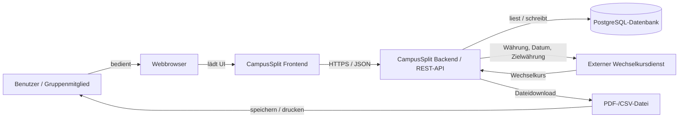
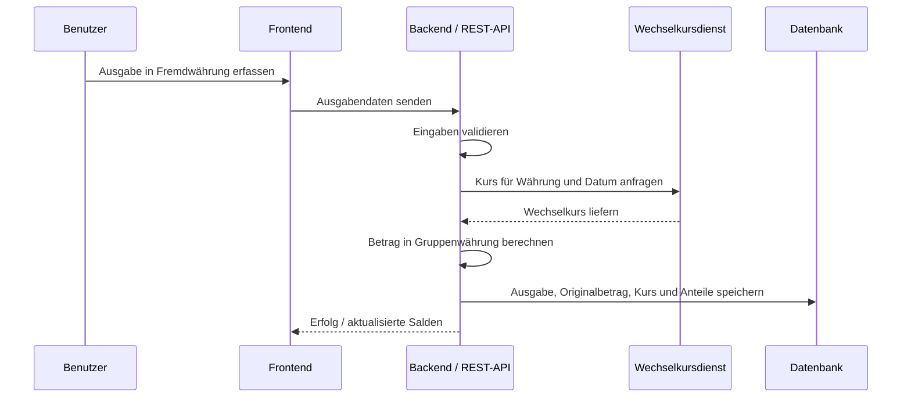

# P2 — Architekturüberblick (Review-Fassung)

Diese Datei ergänzt die vorhandene Projektgrundlagen-Datei und trennt P2 sauber von P1. Die ältere kombinierte Datei bleibt unverändert bestehen.

P2 beschreibt CampusSplit im Systemkontext. Der Baustein zeigt die wichtigsten Nachbarsysteme, Datenflüsse und Architekturziele auf Überblicksebene. Die interne technische Architektur wird später in der arc42-Dokumentation detailliert beschrieben.

---

## P2.1 Systemkontext

CampusSplit ist eine Webanwendung mit getrenntem Frontend und Backend. Benutzer:innen greifen über einen Webbrowser auf das Frontend zu. Das Frontend ruft die REST-API des Backends auf. Das Backend verarbeitet Fachlogik, Berechtigungen, Validierung, Saldenberechnung, Exporterzeugung und die Kommunikation mit der Datenbank sowie dem externen Wechselkursdienst.

---

## P2.2 Trennung der Verantwortlichkeiten

| Bestandteil | Verantwortung | Gehört zu CampusSplit? |
|------------|---------------|------------------------|
| Webbrowser | Darstellung und Bedienung der Weboberfläche | nein, Nachbarsystem/Zugangsweg |
| Frontend | Dialoge, Formulare, Navigation, Anzeige von Fehlern | ja |
| Backend / REST-API | Fachlogik, Validierung, Authentifizierung, Autorisierung, Saldenberechnung | ja |
| PostgreSQL-Datenbank | Persistente Speicherung der fachlichen Daten | ja, interne Persistenz |
| Externer Wechselkursdienst | Lieferung von Wechselkursen für Fremdwährungen | nein, externes Nachbarsystem |
| PDF-/CSV-Datei | Exportartefakt für Benutzer:innen | nein, ausgehender Datenfluss |

Die Datenbank wird nicht als externer Dienst bewertet, sondern als interne Persistenzkomponente der Anwendung. Dennoch muss ihre Trennung vom Backend im Architekturüberblick erkennbar sein.

---

## P2.3 Nachbarsysteme und Datenflüsse

| ID | Nachbarsystem / Datenfluss | Richtung | Daten | Zweck |
|---|-----------------------------|----------|-------|-------|
| NB-01 | Webbrowser | bidirektional | Formulardaten, Dialogdaten, Fehlermeldungen | Benutzerinteraktion |
| NB-02 | Externer Wechselkursdienst | bidirektional | Ausgangswährung, Zielwährung, Datum, Wechselkurs | Umrechnung von Fremdwährungsausgaben |
| DF-01 | PDF-Export | ausgehend | Gruppenname, Ausgaben, Kostenanteile, Salden, Ausgleichsvorschläge | Lesbare Abrechnung |
| DF-02 | CSV-Export | ausgehend | Tabellarische Ausgabendaten und Kostenanteile | Weiterverarbeitung |
| DF-03 | Datenbankzugriff | intern bidirektional | User, Group, Membership, Expense, ExpenseShare, Category | Persistenz |

PDF und CSV sind keine aktiven Nachbarsysteme, aber wichtige ausgehende Datenflüsse. Deshalb werden sie im Kontextdiagramm gezeigt und in B3 genauer beschrieben.

---

## P2.4 Interne REST-API

Die REST-API ist die zentrale Schnittstelle zwischen Frontend und Backend. Sie ist technisch intern zur Anwendung, aber für die Architektur wichtig, weil Frontend und Backend getrennt entwickelt werden.

| API-Bereich | Beispielhafte Operationen | Bezug |
|------------|---------------------------|-------|
| Auth API | Registrieren, Anmelden, Abmelden, aktueller Benutzer | UC-01 bis UC-03 |
| Groups API | Gruppen laden, Gruppe erstellen, Gruppe öffnen | UC-04 bis UC-06 |
| Members API | Mitglieder anzeigen, Mitglied hinzufügen | UC-07 |
| Expenses API | Ausgabe erfassen, bearbeiten, löschen, anzeigen | UC-08 bis UC-10 |
| Balances API | Salden und Ausgleichsvorschläge laden | UC-11 |
| Export API | PDF- oder CSV-Export erzeugen | UC-12 |
| Currency API intern | Fremdwährung prüfen und Umrechnung anstoßen | UC-08, UC-09, S1 |

---

## P2.5 Externer Wechselkursdienst

Für Fremdwährungsausgaben bindet CampusSplit einen externen Wechselkursdienst ein. Der Dienst liefert nur Wechselkurse. Die fachliche Entscheidung, wie der Betrag gespeichert, gerundet und in Salden übernommen wird, bleibt im Backend von CampusSplit.

Es werden keine personenbezogenen Daten an den Wechselkursdienst übertragen.

---

## P2.6 Architekturziele

| ID | Ziel | Begründung |
|---|------|------------|
| AO-01 | Klare Trennung von Frontend, Backend und Datenbank | Erleichtert Entwicklung, Tests und Review. |
| AO-02 | Fachlogik im Backend | Salden, Rundung und Autorisierung bleiben zentral und testbar. |
| AO-03 | REST-basierte Kommunikation | Passt zur getrennten Webanwendung. |
| AO-04 | Nachvollziehbare Geldverarbeitung | Originalbetrag, Währung, Kurs und Gruppenwährung bleiben erklärbar. |
| AO-05 | Begrenzte externe Abhängigkeit | Nur Wechselkursdienst; keine Zahlungs- oder Bank-API. |
| AO-06 | Export als Datenfluss | PDF/CSV dienen der Dokumentation, verändern aber keine Daten. |

---

## P2.7 Abgrenzung

| Thema | Einordnung |
|------|------------|
| Zahlungsanbieter | nicht Bestandteil der Architektur |
| Bankdaten | nicht Bestandteil der Architektur |
| OCR/KI-Belegerkennung | nicht Bestandteil der ersten Version |
| E-Mail-Benachrichtigungen | nicht Bestandteil der ersten Version |
| Native Mobile App | nicht Bestandteil; Browsernutzung genügt |
| Batch-Prozesse | nicht Bestandteil; siehe B2 |
| Datenmigration | nicht Bestandteil; siehe S2 |

---

## P2.8 Querverweise

| Baustein | Relevanz |
|---|---|
| P1 | Legt Ziele, Rahmenbedingungen und Nichtziele fest. |
| F2 | Use Cases lösen REST-API-Aufrufe und Wechselkursabfragen aus. |
| F3 | Fachlogik für Kostenanteile, Salden, Rundung und Umrechnung. |
| D1/D2 | Datenmodell und Datentypen für Beträge, Währungen und Kurse. |
| B1 | Dialoge erzeugen die Benutzeraktionen. |
| B3 | Beschreibt PDF- und CSV-Ausgaben als ausgehende Datenflüsse. |
| S1 | Detailliert die externe Wechselkurs-Schnittstelle. |
| N1/N2 | Beschreiben Qualitätsanforderungen, Validierung, Fehlerbehandlung und Geldbetragsverarbeitung. |
