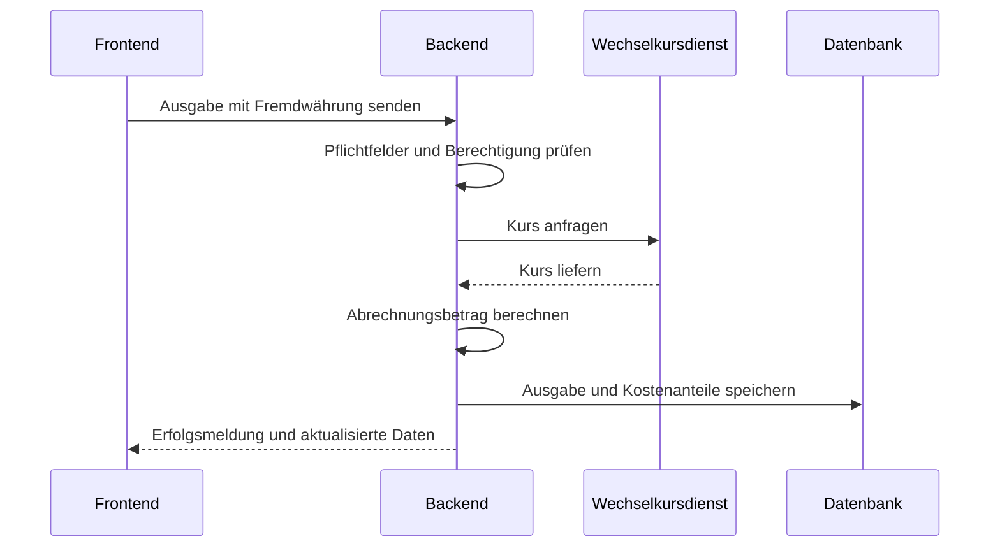
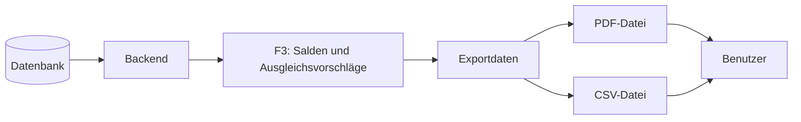

# S1 — Ergänzung: API und Nachbarsysteme

Diese Ergänzung setzt die Review-Hinweise „Nachbarsysteme zu leicht gemacht“, „API einbinden“, „Akteur fehlt“ und „PDF = Datenfluss“ um. Die vorhandene Datei `S1_Nachbarsysteme.md` bleibt unverändert bestehen.

---

## 1. Überblick

CampusSplit besitzt zwei Arten von Schnittstellen:

| Art | Beschreibung | Beispiel |
|---|---|---|
| Interne Anwendungsschnittstelle | Kommunikation zwischen Frontend und Backend | REST-API |
| Externe Nachbarsystem-Schnittstelle | Kommunikation mit einem System außerhalb von CampusSplit | Wechselkursdienst |
| Ausgehender Datenfluss | Erzeugte Datei für Benutzer:innen | PDF-/CSV-Export |

---

## 2. Akteure und beteiligte Systeme

| Akteur/System | Rolle | Typ |
|---|---|---|
| Benutzer / Gruppenmitglied | Bedient CampusSplit im Browser | menschlicher Akteur |
| Gruppenadministrator | Verwaltet Mitglieder einer Gruppe | menschlicher Akteur |
| CampusSplit Frontend | Stellt Dialoge und Formulare bereit | interne Komponente |
| CampusSplit Backend | Führt Fachlogik, Validierung und Schnittstellenaufrufe aus | interne Komponente |
| PostgreSQL-Datenbank | Speichert Anwendungsdaten | interne Persistenz |
| Externer Wechselkursdienst | Liefert Wechselkurse für Fremdwährungen | externes Nachbarsystem |
| PDF-/CSV-Datei | Ergebnis eines Exports | ausgehender Datenfluss |

KI-Werkzeuge wie ChatGPT oder Claude werden nur unterstützend für Dokumentation und Formulierung verwendet. Sie sind kein Laufzeit-Nachbarsystem von CampusSplit, solange die Anwendung selbst keine KI-API aufruft.

---

## 3. Interne REST-API

Die REST-API verbindet Frontend und Backend. Sie wird benötigt, weil CampusSplit als getrennte Webanwendung geplant ist.

| Bereich | Beispiel-Endpunkte | Zweck |
|---|---|---|
| Auth | `POST /api/auth/register`, `POST /api/auth/login`, `POST /api/auth/logout` | Registrierung und Anmeldung |
| Gruppen | `GET /api/groups`, `POST /api/groups`, `GET /api/groups/{id}` | Gruppenverwaltung |
| Mitglieder | `GET /api/groups/{id}/members`, `POST /api/groups/{id}/members` | Mitgliederverwaltung |
| Ausgaben | `GET /api/groups/{id}/expenses`, `POST /api/groups/{id}/expenses`, `PUT /api/groups/{id}/expenses/{expenseId}`, `DELETE /api/groups/{id}/expenses/{expenseId}` | Ausgabenverwaltung |
| Salden | `GET /api/groups/{id}/balances` | Salden und Ausgleichsvorschläge |
| Export | `GET /api/groups/{id}/export?format=pdf`, `GET /api/groups/{id}/export?format=csv` | Exportdateien erzeugen |
| Währungen | `POST /api/currency/convert` | Umrechnung von Fremdwährungsausgaben vorbereiten |

Die genaue technische Spezifikation der Endpunkte gehört in die Architektur- oder API-Dokumentation. Für S1 ist wichtig, welche fachlichen Daten die Schnittstelle trägt.

---

## 4. Externe Wechselkurs-Schnittstelle

| Aspekt | Inhalt |
|---|---|
| Operation | Wechselkurs für Ausgangswährung, Zielwährung und Datum ermitteln |
| Richtung | CampusSplit Backend → Wechselkursdienst → CampusSplit Backend |
| Protokoll | HTTPS / REST / JSON |
| Eingaben | Ausgangswährung, Zielwährung, Ausgabedatum |
| Ausgabe | Wechselkurs und Kursdatum |
| Personenbezogene Daten | werden nicht übertragen |
| Fehlerwirkung | Fremdwährungsausgabe wird nicht mit erfundenem Kurs gespeichert |

---

## 5. PDF/CSV als Datenfluss

PDF und CSV sind keine aktiven Systeme, aber sie sind wichtige Ausgaben von CampusSplit. Deshalb werden sie als Datenfluss dokumentiert.

| Datenfluss | Auslöser | Inhalt | Ziel |
|---|---|---|---|
| PDF-Export | Benutzer wählt Exportformat PDF | Lesbare Gruppenabrechnung | Download im Browser |
| CSV-Export | Benutzer wählt Exportformat CSV | Tabellarische Ausgaben- und Anteilsliste | Download im Browser |

---

## 6. Fehlerfälle an Schnittstellen

| Schnittstelle | Fehlerfall | Verhalten |
|---|---|---|
| REST-API Frontend/Backend | Ungültige Eingabe | Feldbezogene Fehlermeldung im Dialog |
| REST-API Frontend/Backend | Nicht angemeldet | Weiterleitung zur Anmeldung |
| REST-API Frontend/Backend | Keine Gruppenberechtigung | Zugriff wird verweigert |
| Wechselkursdienst | Dienst nicht erreichbar | Fremdwährungsausgabe wird nicht gespeichert; erneuter Versuch möglich |
| Wechselkursdienst | Währung nicht unterstützt | Benutzer erhält Hinweis |
| Exportdatenfluss | Exporterzeugung scheitert | Benutzer erhält verständliche Fehlermeldung |

---

## 7. Sicherheitsregeln

| ID | Regel |
|---|---|
| S1-SEC-01 | An den Wechselkursdienst werden keine Namen, E-Mail-Adressen, Gruppennamen oder Ausgabenbeschreibungen übertragen. |
| S1-SEC-02 | Passwörter, Passwort-Hashes und Sessiondaten verlassen CampusSplit nicht. |
| S1-SEC-03 | Exportdateien enthalten keine sicherheitsrelevanten Daten. |
| S1-SEC-04 | Der Browser entscheidet nicht über Berechtigungen; Berechtigungen werden im Backend geprüft. |

---

## 8. Querverweise

| Baustein | Relevanz |
|---|---|
| P2 | Systemkontext und Datenflüsse. |
| F2 | Use Cases lösen REST-API-Operationen aus. |
| F3 | Berechnung und Umrechnung. |
| D1/D2 | Datenobjekte und Datentypen. |
| B1 | Masken erzeugen die Eingaben. |
| B3 | Exportdatenfluss und Exportinhalte. |
| N1/N2 | Qualität, Sicherheit, Validierung und Fehlerbehandlung. |
