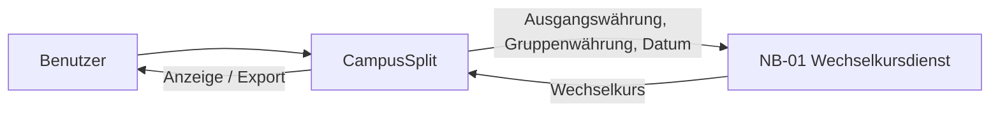

# S1 — Nachbarsysteme

S1 beschreibt die Systeme außerhalb von CampusSplit, mit denen Daten ausgetauscht werden. Der Browser, die interne Datenbank und erzeugte PDF-/CSV-Dateien werden hier nicht mehr als eigene Nachbarsysteme geführt:

- der Browser ist der Zugangsweg zur Webanwendung,
- die Datenbank gehört zur internen Persistenz,
- PDF und CSV sind Ausgaben von CampusSplit und werden in [B3 — Druck- und Exportausgaben](B3_Druckausgaben.md) beschrieben.

Für die Unterstützung von Fremdwährungen benötigt CampusSplit einen externen Wechselkursdienst.

## S1.1 Übersicht

| ID | Nachbarsystem | Zweck | Richtung | Schnittstelle |
|---|---|---|---|---|
| NB-01 | Frankfurter Wechselkursdienst | Wechselkurs für Fremdwährungsausgaben liefern | CampusSplit → Dienst → CampusSplit | HTTPS / REST / JSON |



Die Umrechnung wird nur benötigt, wenn die Währung einer Ausgabe von der Gruppenwährung abweicht. Die Eingabe im Dialog ist in [DLG-07 — Ausgabe erfassen](B1_Dialogspezifikation.md#dlg-07--ausgabe-erfassen) beschrieben.

## S1.2 NB-01 — Wechselkursdienst

Für die Wechselkurse wird die öffentliche **Frankfurter API** verwendet. Sie stellt aktuelle und historische Wechselkurse über eine REST-Schnittstelle bereit und benötigt für die öffentliche API keinen API-Key.

Dokumentation: <https://frankfurter.dev/>

CampusSplit nutzt den Dienst nur zum Ermitteln eines Kurses. Die eigentliche Berechnung des Abrechnungsbetrags findet in CampusSplit statt.

### Wann wird die Schnittstelle verwendet?

Die Schnittstelle wird aufgerufen, wenn:

1. eine Ausgabe in einer anderen Währung als der Gruppenwährung erfasst wird oder
2. bei einer Bearbeitung die Währung, der Betrag oder das Ausgabedatum so geändert wird, dass eine neue Umrechnung nötig ist.

Bei einer Ausgabe in der Gruppenwährung findet kein API-Aufruf statt.

Beispiel:

```text
Gruppenwährung: EUR
Ausgabe: 30,00 USD
Datum: 12.08.2026

CampusSplit benötigt den Kurs USD -> EUR für den 12.08.2026.
```

### Anfrage

Für ein Währungspaar kann die API beispielsweise so angesprochen werden:

```http
GET https://api.frankfurter.dev/v2/rate/USD/EUR?date=2026-08-12
```

Dabei werden nur die für den Wechselkurs notwendigen Daten übertragen:

| Wert | Beispiel | Bedeutung |
|---|---|---|
| Ausgangswährung | `USD` | Währung der Ausgabe |
| Zielwährung | `EUR` | Gruppenwährung |
| Datum | `2026-08-12` | Datum der Ausgabe |

Personenbezogene Daten, Gruppenname, Beschreibung der Ausgabe oder Mitgliederdaten werden nicht an den Wechselkursdienst übertragen.

### Antwort

Eine erfolgreiche Antwort enthält unter anderem Ausgangswährung, Zielwährung, Datum und Kurs.

Beispiel:

```json
{
  "date": "2026-08-12",
  "base": "USD",
  "quote": "EUR",
  "rate": 0.86
}
```

CampusSplit berechnet daraus den Abrechnungsbetrag:

```text
30,00 USD × 0,86 = 25,80 EUR
```

Der Originalbetrag bleibt als Fremdwährungsbetrag erkennbar. Salden und Ausgleichsvorschläge werden in der Gruppenwährung dargestellt. Die Darstellung im Export ist in [B3](B3_Druckausgaben.md) beschrieben.

## S1.3 Regeln für die Schnittstelle

| ID | Regel |
|---|---|
| FX-01 | Ein API-Aufruf ist nur nötig, wenn Originalwährung und Gruppenwährung verschieden sind. |
| FX-02 | Für die Umrechnung wird nach Möglichkeit der Kurs zum Datum der Ausgabe verwendet. |
| FX-03 | CampusSplit führt die eigentliche Multiplikation und Rundung selbst durch. |
| FX-04 | An den Wechselkursdienst werden keine personenbezogenen Daten oder Ausgabendetails übertragen. |
| FX-05 | Ohne erfolgreich ermittelten Kurs darf kein erfundener oder stillschweigend angenommener Wechselkurs verwendet werden. |
| FX-06 | Ein Fehler beim Wechselkursdienst darf keine unvollständig gespeicherte Fremdwährungsausgabe erzeugen. |
| FX-07 | Originalbetrag, Originalwährung und der verwendete Kurs müssen für die spätere Nachvollziehbarkeit erhalten bleiben. |
| FX-08 | Salden und Ausgleichsvorschläge werden in der Gruppenwährung berechnet und angezeigt. |

Die allgemeinen Regeln für Validierung und Fehlerbehandlung stehen in [N2.4 — Validierung](N2_Querschnittskonzepte_%28ZO%29.md#n24-validierung) und [N2.6 — Fehlerbehandlung](N2_Querschnittskonzepte_%28ZO%29.md#n26-fehlerbehandlung).

## S1.4 Fehlerfälle

| Fehlerfall | Verhalten |
|---|---|
| Wechselkursdienst nicht erreichbar | Benutzer erhält eine verständliche Fehlermeldung. Die Fremdwährungsausgabe wird nicht mit einem erfundenen Kurs gespeichert. |
| Zeitüberschreitung | Vorgang wird abgebrochen und kann erneut gestartet werden. |
| Währung wird vom Dienst nicht unterstützt | Benutzer erhält einen Hinweis, dass für diese Währung kein Kurs ermittelt werden konnte. |
| Ungültige Antwort | Antwort wird nicht für die Berechnung verwendet. |
| Für das gewählte Datum ist kein Kurs vorhanden | CampusSplit meldet, dass für das Datum kein verwendbarer Kurs ermittelt werden konnte. |

Ein Fehler bei der externen Schnittstelle darf bestehende Gruppen-, Ausgaben- oder Saldendaten nicht verändern.

## S1.5 Abgrenzung

Folgende Dinge sind **keine externen Nachbarsysteme** in dieser Spezifikation:

### Webbrowser

Der Browser ist der Zugangsweg zur Webanwendung und stellt die Dialoge aus [B1](B1_Dialogspezifikation.md) dar. Er wird deshalb nicht als eigenes Nachbarsystem geführt.

### Datenbank

Die Datenbank ist Teil der internen Persistenz von CampusSplit. Welches konkrete Datenbankprodukt verwendet wird und wie die Verbindung technisch umgesetzt ist, wird später in der Architektur festgelegt. Das fachliche Datenmodell steht in [D1](D1_Datenmodell_%28ZO%29.md).

### PDF- und CSV-Export

PDF und CSV sind erzeugte Dateien und kein eigenständiges System. Inhalt und Aufbau stehen in [B3](B3_Druckausgaben.md).

## S1.6 Nicht Bestandteil von S1

Nicht festgelegt werden:

- konkrete HTTP-Bibliothek im Backend,
- Cache-Strategie für Wechselkurse,
- interne Klassen oder Services für die API-Anbindung,
- Datenbankschema,
- konkrete Persistenztechnik,
- technische PDF-/CSV-Bibliotheken.

Diese Punkte gehören in die spätere Architektur beziehungsweise Implementierung.

## S1.7 Querverweise

| Baustein | Relevanz |
|---|---|
| [P1/P2 — Projektgrundlagen](Projektgrundlagen%20%28P1%26P2%29%20%28JM%29.md) | Systemgrenze und Projektumfang |
| [F2 — Anwendungsfälle](F2-anwendungsf%C3%A4lle.md) | Erfassen und Bearbeiten von Ausgaben |
| [F3 — Anwendungsfunktionen](F3-anwendungsfunktionen.md) | Fachliche Verarbeitung von Ausgaben und Salden |
| [D1 — Datenmodell](D1_Datenmodell_%28ZO%29.md) | Fachliche Datenobjekte |
| [D2 — Datentypenverzeichnis](D2_Datentypenverzeichnis_%28ZO%29.md) | Geldbeträge und Währungscodes |
| [B1 — Dialogspezifikation](B1_Dialogspezifikation.md) | Eingabe und Anzeige von Fremdwährungen |
| [B3 — Druck- und Exportausgaben](B3_Druckausgaben.md) | Export von Original- und Abrechnungsbeträgen |
| [N1 — Nichtfunktionale Anforderungen](N1_Nichtfunktionale%20Anforderungen_%28ZO%29.md) | Qualitätsanforderungen und Zuverlässigkeit |
| [N2 — Querschnittskonzepte](N2_Querschnittskonzepte_%28ZO%29.md) | Validierung, Geldbeträge und Fehlerbehandlung |

## Eingesetzte KI-Werkzeuge

Claude (Anthropic) und ChatGPT (OpenAI) wurden unterstützend bei Formulierungen und der Prüfung der Querverweise verwendet.

Die fachlichen Inhalte wurden anschließend mit den vorhandenen Spezifikationsbausteinen abgeglichen.
